Источником данных для приложения может быть всё что угодно — код, файл, или база данных. Если с первыми двумя вещами мы умеем работать, давайте научимся работать с базой данных.

## Создание проекта

Прежде чем брать данные из БД, нужно подготовиться — создать проект «Приложение WPF (.NET Framework)» и подключить базу данных SQL в проект. «Приложение WPF (Майкрософт)» нам не подойдёт, так как DataSet там не работает.

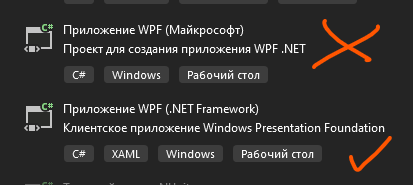

## Подключение к SQL Server

Для того, чтобы подключиться к БД, нужно в Visual Studio выбрать «Средства» → «Подключиться к базе данных». Перед нами появится окно «Сменить источник данных», если мы ещё ни разу не подключали БД до этого. Здесь нам нужно выбрать «Microsoft SQL Server». Поставщиком данных будет .NET Framework.

Если Visual Studio попросит что-то докачать, смело докачивайте — это модули по управлению БД.


Нажимаем ОК и перед нами появляется окно добавления подключения. Здесь мы указываем:

- **Имя сервера.** Его можно взять из MSSQL, в окне соединения с сервером (самое стартовое).
- (Опционально) **Выбрать проверку подлинности.** При проверке через Windows не придётся вводить пароль, при проверке SQL — придётся. Если у вас удалённый сервер, лучше выбрать проверку SQL. Логин по умолчанию `sa`.

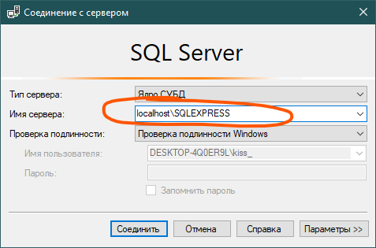

- **Выбрать базу данных.** Если первые два пункта заполнены верно, выпадающий список появится моментально. Если он не появляется — проверьте правильность первых двух пунктов. Внутри списка выберите к чему вы хотите подключиться.


В некоторых случаях, на всех следующих этапах могут появиться ошибки, если у вас MSSQL имеет сертификат доверенности. Для этого, в дополнительных настройках поставьте `TrustServerCertificate = True`. Лишним никогда не будет.

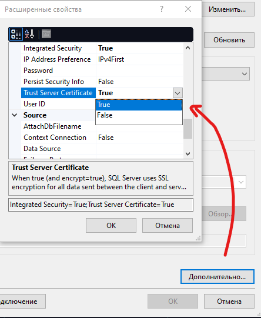

Нажимаем ОК и наше подключение будет сохранено в «Обозревателе серверов».


Для этого примера у меня есть база данных `ExampleDB`. Внутри неё 2 таблицы — `colour` и `human` с любимым цветом.

## Создание модели ADO.NET EDM

Теперь нам нужно создать объект, при помощи которого мы в коде будем работать с БД — Модель ADO.NET. Создаётся она как обычный файл внутри проекта, через ПКМ по проекту → Добавить → Создать элемент.

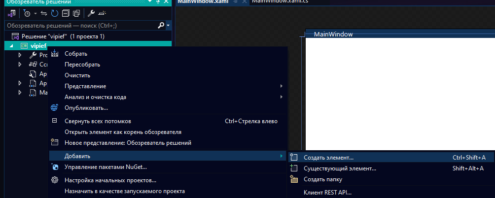

Модель ADO.NET можно найти как вручную, так и по-быстрому, на вкладке «Данные». Назвать можете как хотите, я назову также, как и базу данных — `ExampleDB`.

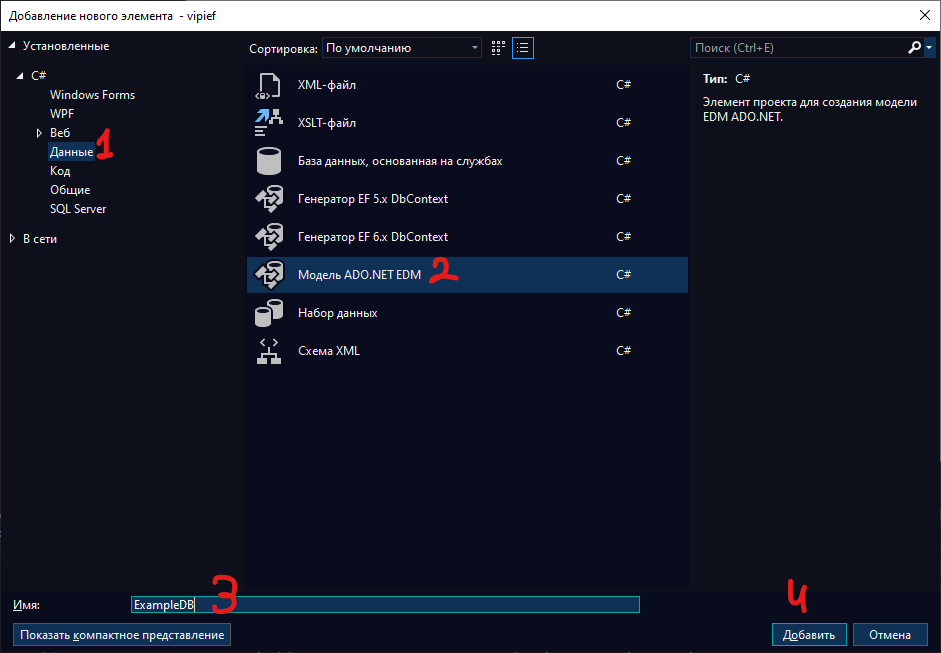

При создании этой модели Visual Studio спросит у вас, что именно вам нужно создать и по каким таблицам. В первом окне выбираем конструктор.

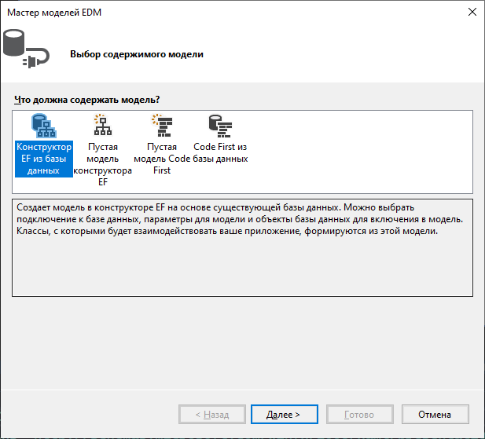

Потом он спросит — а какую БД использовать для создания моделей. Тут мы выбираем то самое подключение, которое создавали ранее. Если не создавали, нажмите на «Создать соединение» и вернитесь в начало лекции, там будет точно такое же окошко.

В строке подключения хранятся конфиденциальные данные, типа логина и пароля от сервера, даже если подключение шло через Windows. Правильным тоном будет всегда прятать эти данные, где бы то ни было, и сепаратировать их друг от дружки. Логин пароль отдельно, строка подключения отдельно, поэтому в радиобаттонах выберем первый пункт.

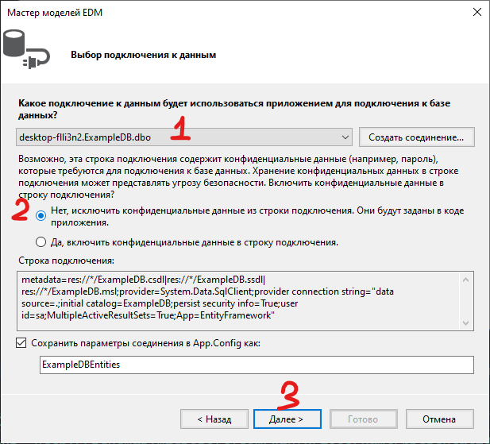

Версия должна подтянуться у вас автоматически, в зависимости от того, какая версия проекта у вас стоит, так что тут ничего не меняйте.

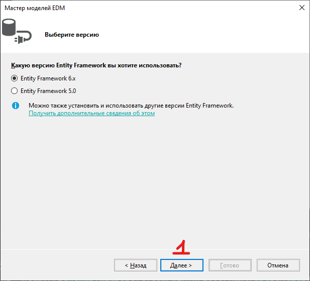

Далее он спросит вас, что нужно закинуть в WPF. Тут выбираете всё что нужно. Ни процедур, ни представлений у меня нет, так что я выберу только таблички.

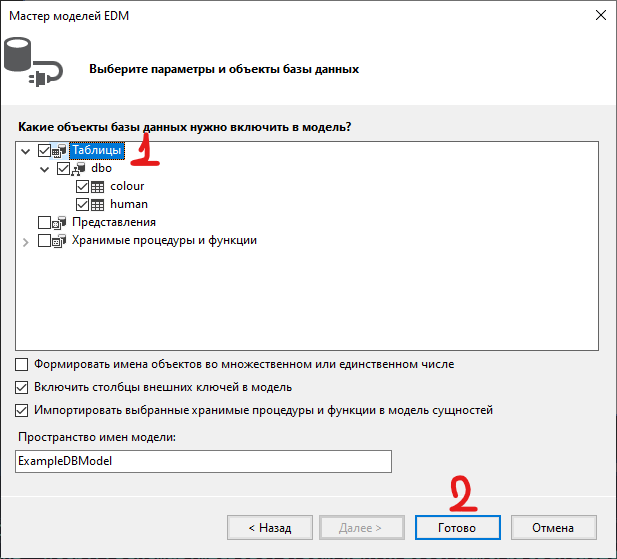

Нажимая готово, он начнёт создавать модель. Создавать он её будет а) долго, б) с постоянно всплывающими окнами, мол, «этот файл может взорвать ваш кампипуктер, взрывать?». С всплывающими окнами просто нажмите галочку «Больше не показывать» и «Да».

Никуда не нажимайте, пока не увидите более-менее похожую картинку с табличками, иначе ~~комп реально взорвётся~~ Visual Studio залагает и вылетит, и действия придётся делать заново.

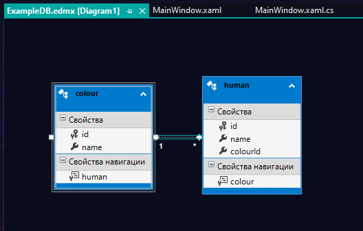

Если вам в будущем нужно будет обновить БД — ПКМ по свободной области → «Обновить модель из базы данных», и повторить действия выше. В мастере будет понятно куда тыкать, в зависимости от вашего выбора — добавить, изменить или удалить.

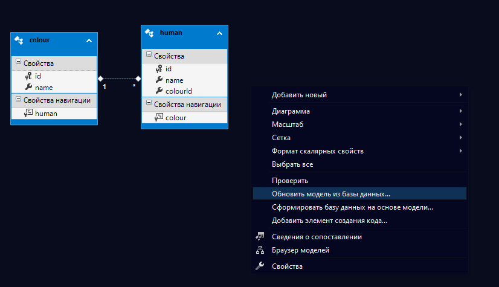

## Выгрузка данных в DataGrid

Для того, чтобы подтянуть данные из таблицы, давайте возьмём в пример табличку `colour`. Для её отображения, я тоже сделаю [DataGrid](/wpf/datagrid) в `MainWindow`, назвав её `ColourDgr`.

```xml
<Grid>
    <DataGrid x:Name="ColourDgr"/>
</Grid>
```

Чтобы подтянуть все данные из таблицы, мне нужна одна переменная, которая условно будет являться базой данных. Из неё я могу подтянуть любую табличку, представить её как коллекцию, и уже оттуда брать/добавлять/изменять/удалять данные. Делается это вот так:

- Создаётся переменная типа данных `<название бд>Entities` и как-нибудь называется. Я назвала `context`.
- Через эту переменную `context` берётся табличка (например, в БД-шке есть табличка `hihiHAHA`, брать вы её будете как `context.hihiHAHA`. Регистр важен).
- Табличка преобразовывается в лист и пихается в датагрид для отображения.

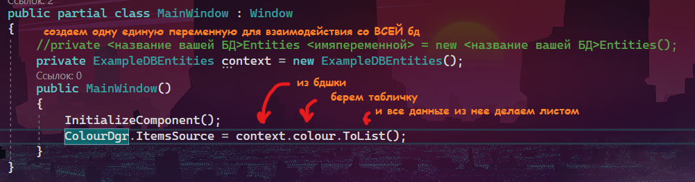

```csharp
public partial class MainWindow : Window
{
    // создаём одну единую переменную для взаимодействия со ВСЕЙ БД
    private ExampleDBEntities context = new ExampleDBEntities();

    public MainWindow()
    {
        InitializeComponent();
        ColourDgr.ItemsSource = context.colour.ToList();
    }
}
```

Уже на этом этапе можно запускать и увидеть результат. Единственное, можно увидеть фантомный столбец.

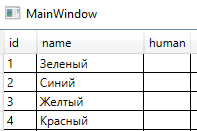

Он мне не нравится, я хочу его скрыть. Скрываем столбцы из DataGrid по той же схеме, как скрывали бы любые другие столбцы — находим файл с моделью и настраиваем у него `get;set`. В этом случае — ставим `private` у `get` (так нужно, чтобы и переменная не критовала, так как `virtual` может быть только с `get;set`, но и интерфейс её не отображал, потому что доступ только в этом файле).

> **ВАЖНО** — ЕСЛИ ВЫ ПОМЕНЯЕТЕ ТАБЛИЦЫ В ДИАГРАММЕ, ВАШИ ИЗМЕНЕНИЯ В МОДЕЛЯХ СЛЕТЯТ И ИХ НУЖНО СТАВИТЬ ЗАНОВО.

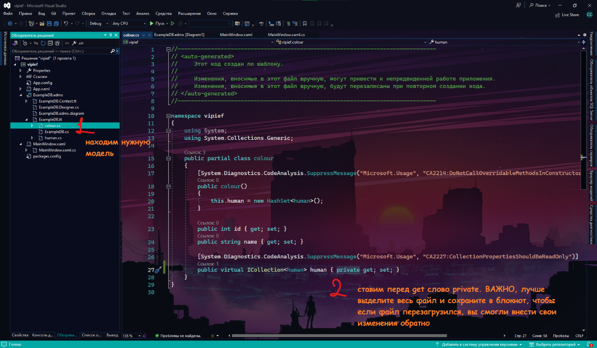

И фантомный столбец перестанет отображаться.

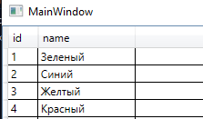

## Выгрузка данных в списки

Подобным образом данные можно выводить не только в таблицы, но и в [списки](/wpf/combobox-listbox) — обычный (`ListBox`) и выпадающий (`ComboBox`). Возьмём, например, выпадающий список. Назову его `ColourCbx`.

Чтобы вывести туда данные, необходимо также, через источник элементов (`ItemsSource`), присвоить им значения из таблицы. Мы укажем, что источник элементов равен листу данных из нашей таблички colour, как было с датагридом.

Однако теперь нам нужно ещё указать, какой именно столбец должен отобразиться. Сделаем мы это через `ColourCbx.DisplayMemberPath = "name"`.

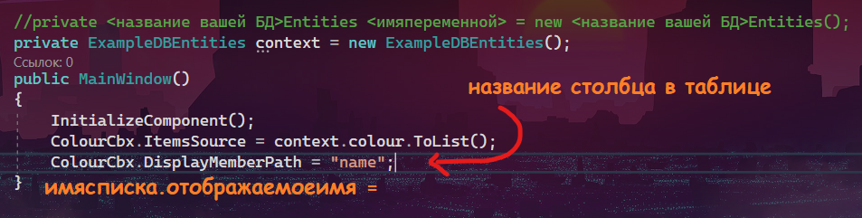

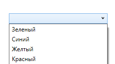

## Выбор данных из таблицы

Чтобы взять данные из таблицы или списка, я также буду использовать `SelectedItem`. `SelectedIndex` здесь работать не будет (либо дико криво и критовать, так как по факту, мы работаем не с листом, а с объектами базы данных). Опять же воспользуемся [четырьмя пунктами](/wpf/datagrid) для взаимодействия с элементами.

Верну `DataGrid` вместо `ComboBox`.

1. Дадим имя списку — уже есть, `ColourDgr`.
2. Найдём нужное свойство — `SelectedItem`.
3. Обработаем событие — мне нужно изменение выбора, значит событие `SelectionChanged`.
4. Объединим 1 и 2 пункт — `ColourDgr.SelectedItem`.

Каждый объект таблицы — это модель. Подобно тому, как было в практических работах — мы выгружали в список/табличку лист с моделями, один объект — одна модель. Значит и взять нужно выбранный элемент как модель. И сохранить в переменную, чтобы не потерять.

```csharp
private void ColourDgr_SelectionChanged(object sender, SelectionChangedEventArgs e)
{
    var selected = ColourDgr.SelectedItem as colour;
}
```

Уже из этой переменной я могу подтянуть значение из любого поля (столбца), будь то `id`, будь то `name`.

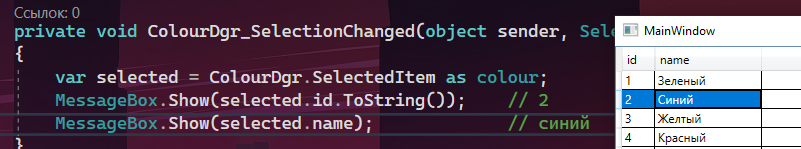

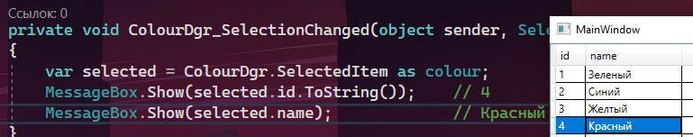

С данными из ячейки я могу работать как захочу — вывести в [MessageBox](/wpf/events-msgbox), записать в текстовое поле, построить с этой переменной [условие](/csharp/if) и прочее.

## Полный код примера

`MainWindow.xaml` — DataGrid (или ComboBox) под содержимое таблицы:

```xml
<Window x:Class="vipief.MainWindow"
        xmlns="http://schemas.microsoft.com/winfx/2006/xaml/presentation"
        xmlns:x="http://schemas.microsoft.com/winfx/2006/xaml"
        Title="MainWindow" Height="450" Width="800">
    <Grid>
        <DataGrid x:Name="ColourDgr" SelectionChanged="ColourDgr_SelectionChanged"/>
    </Grid>
</Window>
```

`MainWindow.xaml.cs` — единый контекст БД, выгрузка в DataGrid и обработка выбора:

```csharp
using System.Linq;
using System.Windows;
using System.Windows.Controls;

namespace vipief
{
    public partial class MainWindow : Window
    {
        private ExampleDBEntities context = new ExampleDBEntities();

        public MainWindow()
        {
            InitializeComponent();
            ColourDgr.ItemsSource = context.colour.ToList();
        }

        private void ColourDgr_SelectionChanged(object sender, SelectionChangedEventArgs e)
        {
            var selected = ColourDgr.SelectedItem as colour;
            if (selected != null)
            {
                MessageBox.Show(selected.id.ToString());
                MessageBox.Show(selected.name);
            }
        }
    }
}
```
