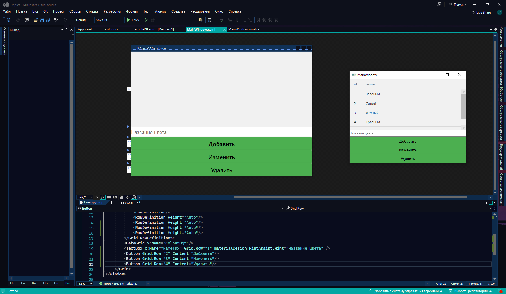
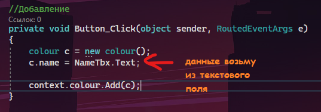
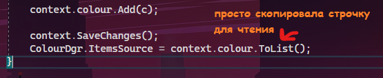
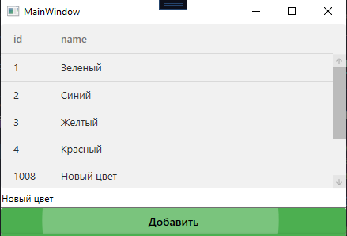
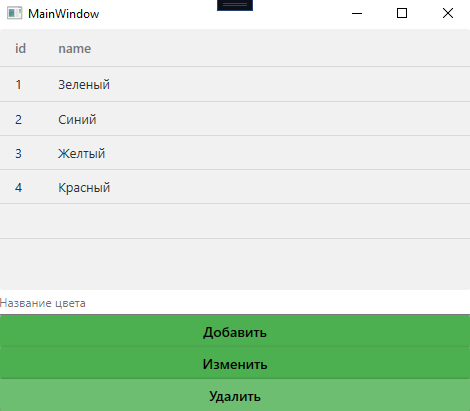
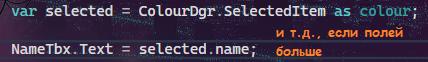
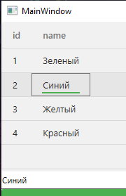
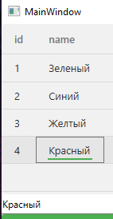
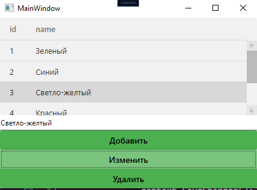

Сейчас наша таблица только отображает данные. Давайте научимся добавлять, изменять и удалять данные в базу данных, чтобы все изменения сразу были в БД.

## Постановка

У нас есть пример — база данных с цветами и людьми с любимыми цветами и таблица, которая отображает цвета из БД.


Мы хотим добавлять новые цвета, так что создадим текстовое поле, куда мы будем вписывать названия цветов. Также создадим кнопку, по которой будет происходить добавление.

Текстовое поле я назову `NameTbx`. Таблицу я назову `ColourDgr`.



Так как все подгружаемые данные из Entity Framework это чисто работа с [листами](/csharp/collections) (тот же `Add`, тот же `Remove`), то я подумала, что разделять CRUD операции на 3 файла не имеет смысла, так что разберём сразу в одном каждую функцию — добавление, изменение и удаление.

Основа приложения будет такая же — подключаем `Entities`, берём из него нужную нам табличку, преобразовываем его в лист и пихаем в датагрид. Плюс обработаем нажатие на все три кнопки.


```csharp
public partial class MainWindow : Window
{
    private ExampleDBEntities context = new ExampleDBEntities();

    public MainWindow()
    {
        InitializeComponent();
        ColourDgr.ItemsSource = context.colour.ToList(); // чтение БД и её отображение в датагриде
    }

    // Добавление
    private void Button_Click(object sender, RoutedEventArgs e) { }

    // Изменение
    private void Button_Click_1(object sender, RoutedEventArgs e) { }

    // Удаление
    private void Button_Click_2(object sender, RoutedEventArgs e) { }
}
```

Напомню, работа та же, как с листами.

## Добавление

Для добавления нам нужно создать новый `colour` и наполнить его данными. После наполнения, его нужно добавить внутрь таблицы. С таблицей мы взаимодействовали через `context.colour`, так что если я хочу что-то добавить туда, нужно написать `context.colour.Add(объект который добавляем)`.

`ID` прописывать не нужно, `id` пропишется самостоятельно, как только пойдёт в базу данных.



```csharp
private void Button_Click(object sender, RoutedEventArgs e)
{
    colour c = new colour();
    c.name = NameTbx.Text; // данные возьму из текстового поля
    context.colour.Add(c);
}
```

После добавления, внесённые изменения нужно сохранить. Для этого у нашей переменной `context`, коей является вся БД, есть метод `SaveChanges`, по факту, «сохранить все внесённые изменения». После сохранения, нужно ещё обновить само содержимое датагрида, так что мы снова пропишем `ItemsSource` для нашей таблички.



```csharp
context.colour.Add(c);

context.SaveChanges();
ColourDgr.ItemsSource = context.colour.ToList(); // просто скопировала строчку для чтения
```

И добавление уже будет работать.



## Удаление

Если мы говорим про удаление, значит нам нужно выбрать какой-то объект в табличке, который мы будем удалять. Выбранный объект — свойство `SelectedItem` из нашего датагрида.

Для начала проверим, точно ли у нас выбран какой-то объект. Если ничего не выбрано, значит `SelectedItem` равен `null`, а нам как раз это НЕ нужно.

```csharp
// Удаление
private void Button_Click_2(object sender, RoutedEventArgs e)
{
    if (ColourDgr.SelectedItem != null)
    {

    }
}
```

Если всё хорошо, тогда возьмём наш выбранный элемент как `colour` (у вас — как `<вставьте название вашей таблицы>`), и при помощи `Remove` уберём его из таблицы.

Напомню, если я хочу убрать объект из листа, я пишу `мойлист.Remove(элементкоторыйубираю)`. Так как наши таблицы — это тоже по факту листы, то тут так же, возьмём табличку из переменной `context` и оттуда уберём выбранный элемент.

```csharp
if (ColourDgr.SelectedItem != null)
{
    context.colour.Remove(ColourDgr.SelectedItem as colour);
}
```

Как всегда, не забываем в конце про сохранение изменений и обновление таблицы, без этого ничего не получится.

```csharp
context.colour.Remove(ColourDgr.SelectedItem as colour);

context.SaveChanges();
ColourDgr.ItemsSource = context.colour.ToList();
```

И удаление также будет работать.



## Изменение

Для изменения нужно сделать один предварительный шаг — выгрузить данные из выбранного элемента в текстовые поля. Чтобы я нажала, а цвет в текстбоксе появился. Так мы сможем быстрее менять данные и опечатки, нежели вручную переписывать все данные из поля.

Для этого обработаем [событие](/wpf/events-msgbox) «Выбор изменён» у датагрида. Просто дважды в XAML нажмите по нему, и у вас появится событие `SelectionChanged`. Внутри также нужно сделать проверку, точно ли что-то выбрано, как это было в удалении, а потом взять этот выбранный элемент и записать его в переменную.

```csharp
private void ColourDgr_SelectionChanged(object sender, SelectionChangedEventArgs e)
{
    if (ColourDgr.SelectedItem != null)
    {
        var selected = ColourDgr.SelectedItem as colour;
    }
}
```

Если мы взяли выбранный элемент как нашу модель, значит у нас есть доступ к каждому пункту в нашей модели, таким как имя, id и прочее. Все эти поля можно выгрузить в текстовые поля.



```csharp
var selected = ColourDgr.SelectedItem as colour;
NameTbx.Text = selected.name; // и т.д., если полей больше
```

Это даст нам вот такой результат.





И в изменении нужно сделать всё то же самое, но последнюю строчку выполнить наоборот: также проверить на пустоту, также взять выбранный элемент, но вместо запихивания информации ИЗ элемента В текстбокс, сделать наоборот — ИЗ текстбокса В элемент.

```csharp
// Изменение
private void Button_Click_1(object sender, RoutedEventArgs e)
{
    if (ColourDgr.SelectedItem != null)
    {
        var selected = ColourDgr.SelectedItem as colour;
        selected.name = NameTbx.Text;
    }
}
```

Не забываем сохранять данные.

```csharp
selected.name = NameTbx.Text;

context.SaveChanges();
ColourDgr.ItemsSource = context.colour.ToList();
```

И изменения также будут работать.



## Изменение без выгрузки в текстбокс

Либо вообще не парьтесь над выгрузкой, если это простые таблички без множественных связей, и меняйте всё в табличке. Для этого вам **НЕ** понадобится метод `SelectionChanged`, **НЕ** понадобится текстовое поле, а сам код при кнопке изменения будет выглядеть так:

```csharp
// Изменение
private void Button_Click_1(object sender, RoutedEventArgs e)
{
    context.SaveChanges();
}
```

Всё потому, что датагрид и так связан с таблицей, и сам вносит все изменения внутрь каждого объекта. Все изменения потом нужно просто сохранить.

## Полный код примера

`MainWindow.xaml` — DataGrid, поле ввода и три кнопки:

```xml
<Window x:Class="vipief.MainWindow"
        xmlns="http://schemas.microsoft.com/winfx/2006/xaml/presentation"
        xmlns:x="http://schemas.microsoft.com/winfx/2006/xaml"
        Title="MainWindow" Height="450" Width="400">
    <Grid>
        <Grid.RowDefinitions>
            <RowDefinition/>
            <RowDefinition Height="Auto"/>
            <RowDefinition Height="Auto"/>
            <RowDefinition Height="Auto"/>
            <RowDefinition Height="Auto"/>
        </Grid.RowDefinitions>

        <DataGrid x:Name="ColourDgr" SelectionChanged="ColourDgr_SelectionChanged"/>
        <TextBox Grid.Row="1" x:Name="NameTbx"/>
        <Button Grid.Row="2" Content="Добавить" Click="Button_Click"/>
        <Button Grid.Row="3" Content="Изменить" Click="Button_Click_1"/>
        <Button Grid.Row="4" Content="Удалить"  Click="Button_Click_2"/>
    </Grid>
</Window>
```

`MainWindow.xaml.cs` — полный CRUD:

```csharp
using System.Linq;
using System.Windows;
using System.Windows.Controls;

namespace vipief
{
    public partial class MainWindow : Window
    {
        private ExampleDBEntities context = new ExampleDBEntities();

        public MainWindow()
        {
            InitializeComponent();
            ColourDgr.ItemsSource = context.colour.ToList();
        }

        // Добавление
        private void Button_Click(object sender, RoutedEventArgs e)
        {
            colour c = new colour();
            c.name = NameTbx.Text;
            context.colour.Add(c);

            context.SaveChanges();
            ColourDgr.ItemsSource = context.colour.ToList();
        }

        // Изменение
        private void Button_Click_1(object sender, RoutedEventArgs e)
        {
            if (ColourDgr.SelectedItem != null)
            {
                var selected = ColourDgr.SelectedItem as colour;
                selected.name = NameTbx.Text;

                context.SaveChanges();
                ColourDgr.ItemsSource = context.colour.ToList();
            }
        }

        // Удаление
        private void Button_Click_2(object sender, RoutedEventArgs e)
        {
            if (ColourDgr.SelectedItem != null)
            {
                context.colour.Remove(ColourDgr.SelectedItem as colour);

                context.SaveChanges();
                ColourDgr.ItemsSource = context.colour.ToList();
            }
        }

        private void ColourDgr_SelectionChanged(object sender, SelectionChangedEventArgs e)
        {
            if (ColourDgr.SelectedItem != null)
            {
                var selected = ColourDgr.SelectedItem as colour;
                NameTbx.Text = selected.name;
            }
        }
    }
}
```
