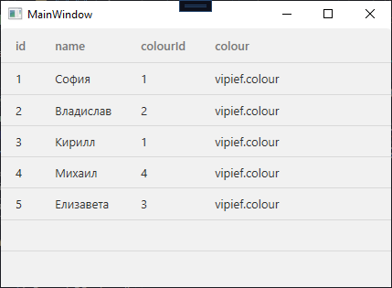
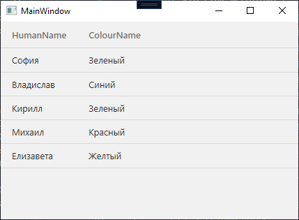
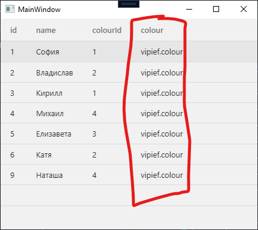
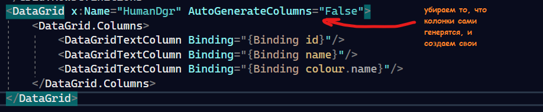
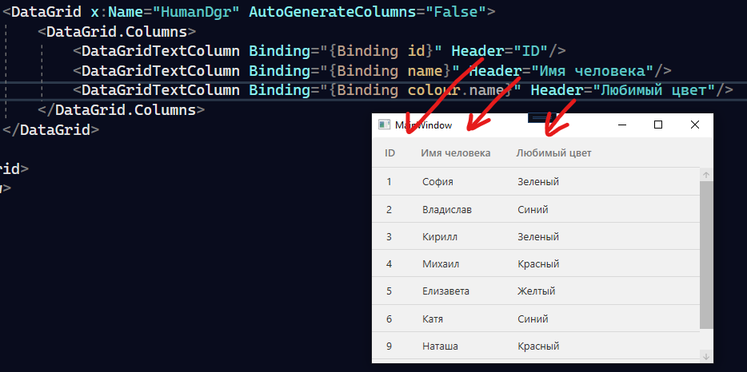

Когда мы отображаем данные из таблиц, у которых есть внешний ключ, они показывают ID записи, на которую они ссылаются. Согласитесь, что понять, что за цвет «1» достаточно сложно, а постоянно переключаться на другую таблицу — муторно. Поэтому давайте научимся отображать данные из нескольких таблиц внутри программы.

У нас есть пример — база данных с цветами и людьми с любимыми цветами и таблица, которая отображает цвета из БД.


В Entity Framework таблица будет выглядеть также, только вот ещё дополнительно внутри будет объект, на который ссылается табличка.



Как раз-таки из неё мы можем вытаскивать данные и с ними работать. Как именно — три варианта.

## Вариант 1 — отдельный DTO-класс

Мы можем сделать отдельный класс, как-нибудь его назвать и передать внутрь `human`. На основе столбцов `human` заполнить этот отдельный класс, и его уже возвращать.

Вот пример: сделаю класс `Krasivo`. Он у меня будет состоять из имени человека и цвета (на всякий, id ещё передам, если вдруг понадобятся в будущем на коде).

```csharp
internal class Krasivo
{
    public int HumanId;
    public int ColourId;
    public string HumanName { get; private set; }
    public string ColourName { get; private set; }
}
```

В конструктор передам только `human` и на его основе заполню все столбцы.

```csharp
public Krasivo(human hum)
{
    HumanId = hum.id;
    HumanName = hum.name;

    if (hum.colour != null)
    {
        ColourId = hum.colour.id;
        ColourName = hum.colour.name;
    }
}
```

Перед тем, как пихать данные в табличку, переберём каждого `human` [циклом](/csharp/cycles) и переделаем его под класс `Krasivo`. Только потом получившиеся значения поместим в [датагрид](/wpf/datagrid), который я назвала `HumanDgr`.


```csharp
public partial class MainWindow : Window
{
    private ExampleDBEntities context = new ExampleDBEntities();
    List<Krasivo> krasivos = new List<Krasivo>(); // лист, который будет в датагриде

    public MainWindow()
    {
        InitializeComponent();
        foreach (var item in context.human.ToList())
        {
            krasivos.Add(new Krasivo(item)); // перебираем Human и делаем его красивым
        }
        HumanDgr.ItemsSource = krasivos;     // пихаем получившийся лист в датагрид
    }
}
```

Такой выйдет итог.



Проблема такого формата в том, что изменять данные по объекту не получится, только если вы в классе `Krasivo` изначально не сделаете переменную, в которой будет храниться `human`. Только тогда его можно будет изменить. Иначе — искать объект по id, и менять найденный.

## Вариант 2 — LINQ-запросы

Можно воспользоваться LINQ запросами, которые работают ЧИСТО для DataSet. Они работают примерно как запросы в БД, однако в них меняется порядок (самый явный пример — в БД `SELECT ___ FROM ___`, в C# `from ____ select _____`). С ними подробнее вы можете ознакомиться [тут](https://metanit.com/sharp/tutorial/15.6.php), так как я не очень хочу, чтобы у вас в голове путались примеры с БД.

## Вариант 3 — привязки в DataGrid

Можно воспользоваться привязками. Как по мне, самый безобидный и приятный способ, потому что настраивается только интерфейс, и в коде ничего писать не нужно. Как он будет работать?

В самом начале данные идут как обычно — просто выгрузка.

```csharp
private ExampleDBEntities context = new ExampleDBEntities();

public MainWindow()
{
    InitializeComponent();
    HumanDgr.ItemsSource = context.human.ToList();
}
```

И теперь, главным виновником события будет столбец с объектом данных из БД, который сейчас отображается очень странно.



Именно с его помощью, так как это одна запись из таблицы, мы можем подтянуть все столбцы и все данные прямо из него, при помощи `colour.id`, `colour.name`, `colour.прочиестолбцы` и т.п. Говоря про отображение интерфейса, мы можем создать свои столбцы, и сказать, что в определённый столбец данные будут выгружаться из определённого поля.

Например, я хочу выгрузить ID человека, Name человека и Name цвета. За это будут отвечать столбцы `id`, `name` и `colour.name` (берём наш непонятный столбец и тащим из него поля) соответственно. Столбцы я буду создавать вручную, а потом говорить, что содержимое привязано к этим полям.

Вместо такого грида:

```xml
<DataGrid x:Name="HumanDgr"/>
```

Станет такой:



```xml
<DataGrid x:Name="HumanDgr" AutoGenerateColumns="False">
    <DataGrid.Columns>
        <DataGridTextColumn Binding="{Binding id}"/>
        <DataGridTextColumn Binding="{Binding name}"/>
        <DataGridTextColumn Binding="{Binding colour.name}"/>
    </DataGrid.Columns>
</DataGrid>
```

И при запуске увидим следующее. Чтобы колонки имели имя, поставьте им свойство `Header`.



## Полный код примера

`MainWindow.xaml` — DataGrid с привязками к навигационному свойству:

```xml
<Window x:Class="vipief.MainWindow"
        xmlns="http://schemas.microsoft.com/winfx/2006/xaml/presentation"
        xmlns:x="http://schemas.microsoft.com/winfx/2006/xaml"
        Title="MainWindow" Height="450" Width="800">
    <Grid>
        <DataGrid x:Name="HumanDgr" AutoGenerateColumns="False">
            <DataGrid.Columns>
                <DataGridTextColumn Binding="{Binding id}"          Header="ID"/>
                <DataGridTextColumn Binding="{Binding name}"        Header="Имя человека"/>
                <DataGridTextColumn Binding="{Binding colour.name}" Header="Любимый цвет"/>
            </DataGrid.Columns>
        </DataGrid>
    </Grid>
</Window>
```

`MainWindow.xaml.cs` — обычная выгрузка из контекста:

```csharp
using System.Linq;
using System.Windows;

namespace vipief
{
    public partial class MainWindow : Window
    {
        private ExampleDBEntities context = new ExampleDBEntities();

        public MainWindow()
        {
            InitializeComponent();
            HumanDgr.ItemsSource = context.human.ToList();
        }
    }
}
```
