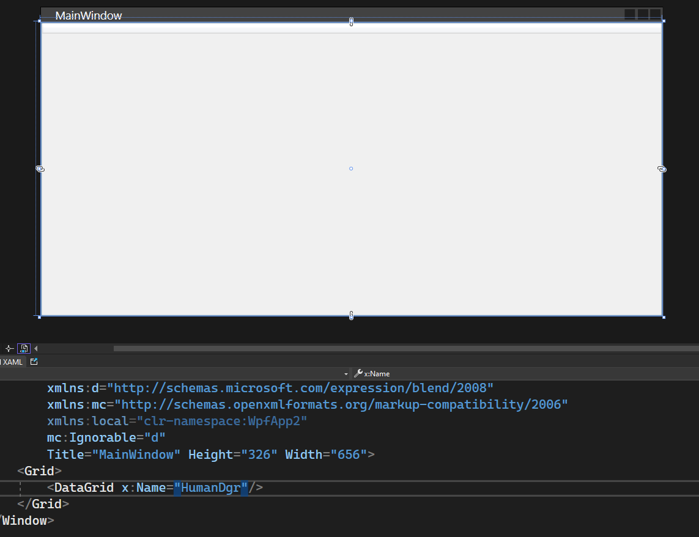
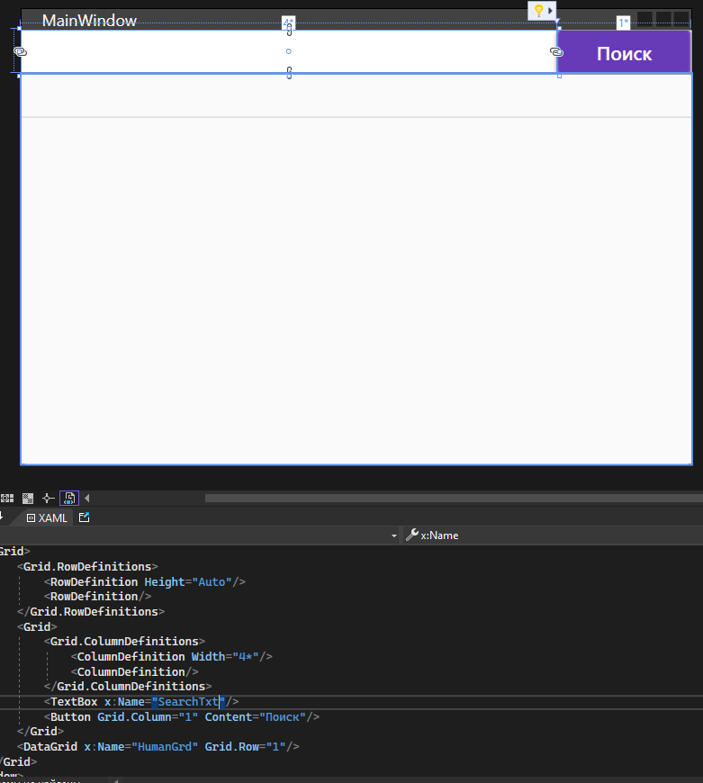
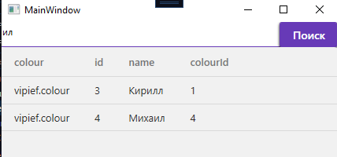
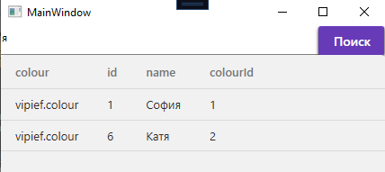
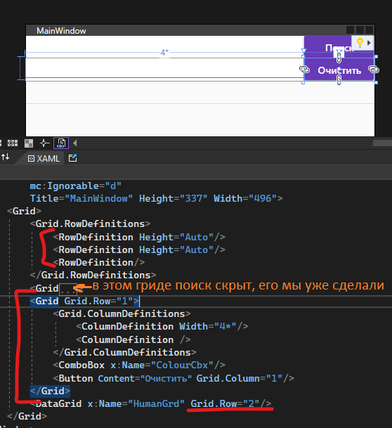
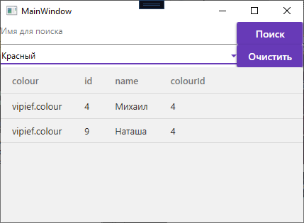

Если данных слишком много, у нас должна быть возможность что-то среди них найти, либо просто отфильтровать пункты по каким-то свойствам. По факту, все выборки делаются просто через различные запросы, коих нужно сделать немало, если мы хотим сделать правильную выборку. Однако давайте разберём пару примеров по тому, как нужно сделать поиск по одному полю и фильтрацию по одному полю.

## Постановка

Сделаем интерфейс с табличкой, куда мы будем выгружать данные о пользователях и их любимых цветах. Табличку я назову `HumanDgr`.



Как всегда, подключу базу данных и создам EntityFramework для работы с БД. БД буду использовать ту же, с людьми и их любимыми цветами. Вот пример данных, чтобы понимать, что внутри.


Также напишу код для того, чтобы у меня данные из таблицы Human отобразились в моем `DataGrid`.

```csharp
public partial class MainWindow : Window
{
    private ExampleDBEntities context = new ExampleDBEntities();

    public MainWindow()
    {
        InitializeComponent();
        HumanDgr.ItemsSource = context.human.ToList();
    }
}
```

## Поиск через LINQ Where + Contains

Если мы хотим сделать поиск, то необходимо ещё добавить текстовое поле и кнопку. Текстовое поле я назову как `SearchTxt`. Сразу обработаем и Click для кнопки.



```csharp
private void Button_Click(object sender, RoutedEventArgs e)
{

}
```

Так как Entity Framework — это всё работа с листами, я советую вам обратиться к [LINQ-запросам](/csharp/linq), либо использовать циклы для того, чтобы сделать выборку по определённому пункту. Я воспользуюсь Linq запросами.

Если я хочу достать все поля, которые удовлетворяют какому-то условию, мне нужно воспользоваться методом `Where` и вставить внутрь условие, по которому я буду искать. Напомню схему запроса:

```
Лист.Where(имяодногоэлемента => условие)
```

Таким образом, условие для поиска будет `табличка.Where(item => item.Name.Contains(текстбокс.Text))`, так как я хочу вытащить все объекты, которые будут содержать в себе то, что я написала в текстовом поле.

Получившийся результат я кидаю внутрь `DataGrid`.


```csharp
private void Button_Click(object sender, RoutedEventArgs e)
{
    HumanDgr.ItemsSource = context.human.ToList().Where(item => item.name.Contains(SearchTxt.Text));
}
```

Результат получится следующим.





## Фильтрация через ComboBox

Фильтрация делается по той же схеме, что и поиск, однако она изначально показывает варианты, по которым можно найти поиск (например, вместо того, чтобы нам вписывать текст «зелёный», мы можем просто выбрать пункт «зелёный», и он автоматом нам отобразит все элементы с зелёным цветом). Поэтому, чтобы сделать фильтрацию по цвету, давайте сделаем [выпадающий список](/wpf/combobox-listbox) с выгруженным туда цветом, и кнопку для очистки фильтрации. Список я назову `ColourCbx`.



В этот список нужно выгрузить все данные из таблички `Colours` + чтобы у нас отображался текст, в качестве `DisplayMemberPath` укажем название вашего столбца с именем. У меня такой столбец называется `name`.

```csharp
public MainWindow()
{
    InitializeComponent();
    HumanDgr.ItemsSource = context.human.ToList();
    ColourCbx.ItemsSource = context.colour.ToList();
}
```

```xml
<ComboBox x:Name="ColourCbx" DisplayMemberPath="name"/>
```

При изменении выбора в `ComboBox` (событие `SelectionChanged`, которое надо создать, дважды нажав по списку), нам нужно взять объект, который мы нашли, и также при помощи LINQ запросов сделать выборку через `Where`. Сравнивать мы будем с тем же полем, что и внутри `human` хранит в себе данные о цвете.

Проверим, точно ли у нас есть выбор через `SelectionItem != null`. Если есть, возьмём объект.

```csharp
private void ColourCbx_SelectionChanged(object sender, SelectionChangedEventArgs e)
{
    if (ColourCbx.SelectedItem != null)
    {
        var selected = ColourCbx.SelectedItem as colour;
    }
}
```

По этому объекту делаем выборку — где `item.colour` (цвет у человека) равен выбранному цвету. Результат поместим в датагрид.

```csharp
var selected = ColourCbx.SelectedItem as colour;
HumanDgr.ItemsSource = context.human.ToList().Where(item => item.colour == selected);
```

На всякий случай, сразу же, давайте пропишем `Click` для кнопки «Очистить». Внутри неё нужно просто снова отправить запрос на получение информации.

```xml
<Button Content="Очистить" Grid.Column="1" Click="Button_Click_1"/>
```

```csharp
private void Button_Click_1(object sender, RoutedEventArgs e)
{
    HumanDgr.ItemsSource = context.human.ToList();
}
```

И тогда при выборе цвета отобразится необходимые поля.




## Полный код примера

`MainWindow.xaml` — TextBox поиска, ComboBox фильтра по цвету и DataGrid:

```xml
<Window x:Class="WpfApp2.MainWindow"
        xmlns="http://schemas.microsoft.com/winfx/2006/xaml/presentation"
        xmlns:x="http://schemas.microsoft.com/winfx/2006/xaml"
        Title="MainWindow" Height="337" Width="496">
    <Grid>
        <Grid.RowDefinitions>
            <RowDefinition Height="Auto"/>
            <RowDefinition Height="Auto"/>
            <RowDefinition/>
        </Grid.RowDefinitions>

        <Grid>
            <Grid.ColumnDefinitions>
                <ColumnDefinition Width="4*"/>
                <ColumnDefinition/>
            </Grid.ColumnDefinitions>
            <TextBox x:Name="SearchTxt"/>
            <Button Grid.Column="1" Content="Поиск" Click="Button_Click"/>
        </Grid>

        <Grid Grid.Row="1">
            <Grid.ColumnDefinitions>
                <ColumnDefinition Width="4*"/>
                <ColumnDefinition/>
            </Grid.ColumnDefinitions>
            <ComboBox x:Name="ColourCbx" DisplayMemberPath="name"
                      SelectionChanged="ColourCbx_SelectionChanged"/>
            <Button Content="Очистить" Grid.Column="1" Click="Button_Click_1"/>
        </Grid>

        <DataGrid x:Name="HumanDgr" Grid.Row="2"/>
    </Grid>
</Window>
```

`MainWindow.xaml.cs` — поиск через Where+Contains, фильтрация через SelectionChanged, очистка:

```csharp
using System.Linq;
using System.Windows;
using System.Windows.Controls;

namespace WpfApp2
{
    public partial class MainWindow : Window
    {
        private ExampleDBEntities context = new ExampleDBEntities();

        public MainWindow()
        {
            InitializeComponent();
            HumanDgr.ItemsSource = context.human.ToList();
            ColourCbx.ItemsSource = context.colour.ToList();
        }

        private void Button_Click(object sender, RoutedEventArgs e)
        {
            HumanDgr.ItemsSource = context.human.ToList()
                                          .Where(item => item.name.Contains(SearchTxt.Text));
        }

        private void ColourCbx_SelectionChanged(object sender, SelectionChangedEventArgs e)
        {
            if (ColourCbx.SelectedItem != null)
            {
                var selected = ColourCbx.SelectedItem as colour;
                HumanDgr.ItemsSource = context.human.ToList()
                                              .Where(item => item.colour == selected);
            }
        }

        private void Button_Click_1(object sender, RoutedEventArgs e)
        {
            HumanDgr.ItemsSource = context.human.ToList();
        }
    }
}
```
