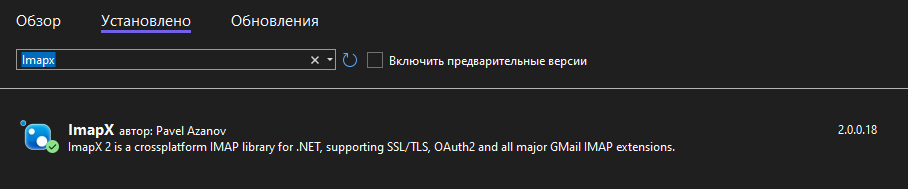
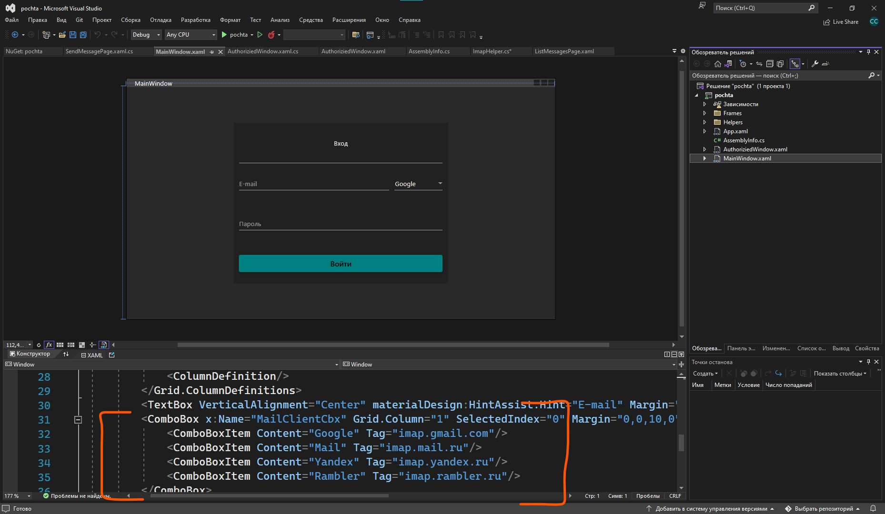
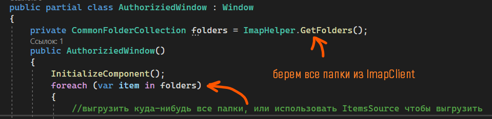
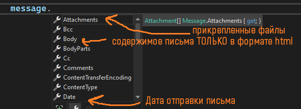
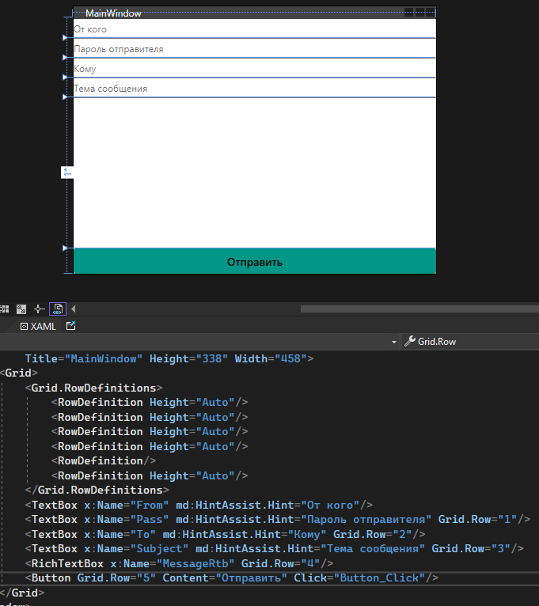

Все почтовые мессенджеры реализованы на двух протоколах передачи данных — `IMAP` для чтения данных и `SMTP` для передачи. Мы в свою очередь, если хотим сделать приложение для работы с почтой, должны также будем понимать протоколы `IMAP` и `SMTP`.

Ну и вдруг в будущем понадобится.

Начнём с первого, так как именно он позволяет нам прочитать всё содержимое из почты.

## IMAP — чтение почты

Начнём с того, что мы немного углубимся в почтовые сервисы. Каждый почтовый сервис, будь то `mail` или `gmail`, использует некий сервер для обработки входящих и исходящих сообщений. Этот сервер находится на своём домене — `imap.mail.ru` для Mail.ru, `imap.gmail.com` для Google и прочее. Все они начинаются с `imap`. Более подробную инфу можно узнать, если загуглить «`imap имя почтового сервиса`».

Для работы с `IMAP` в коде воспользуемся библиотекой `ImapX` — это далеко не лучшая библиотека по работе с почтовым клиентом, их есть много, но чисто для удобства используем эту. Я создам новое приложение и добавлю туда эту библиотеку.



### Класс-обёртка ImapHelper

На просторах интернета я нашла этот класс с статичными методами внутри, который позволяет нам работать с получением писем. Я немного адаптировала его на русский (буквально один месседжбокс поменяла).

```csharp
internal class ImapHelper
{
    private static ImapClient client { get; set; }

    public static void Initialize(string host)
    {
        client = new ImapClient(host, true);
        if (!client.Connect())
        {
            throw new Exception("Не удалось подключиться!");
        }
    }

    public static bool Login(string u, string p)
    {
        return client.Login(u, p);
    }

    public static void Logout()
    {
        // Выйти из аккаунта, если он авторизирован.
        if (client.IsAuthenticated)
        {
            client.Logout();
            client.Dispose();
        }
    }

    public static CommonFolderCollection GetFolders()
    {
        client.Folders.Inbox.StartIdling(); // И продолжить слушать входящие дальше.
        client.Folders.Inbox.OnNewMessagesArrived += Inbox_OnNewMessagesArrived;
        return client.Folders;
    }

    private static void Inbox_OnNewMessagesArrived(object sender, IdleEventArgs e)
    {
        MessageBox.Show($"Пришло новое сообщение в папку {e.Folder.Name}.");
    }

    public static MessageCollection GetMessagesForFolder(string name)
    {
        client.Folders[name].Messages.Download(); // Начать скачивание сообщений
        return client.Folders[name].Messages;
    }
}
```

Что делает каждый из этих методов и свойств:

- Свойство `client` — хранит экземпляр `ImapClient`, чтобы через него мы смогли получить все сообщения с почты, авторизоваться и прочее.
- Метод `Initialize` — подключение к почтовому сервису. Если не получилось — выкидываем ошибку и прерываем программу.
- Метод `Login` — тут мы пытаемся через наш `ImapClient` авторизироваться под введенными данными.
- Метод `Logout` — выходим из аккаунта.
- Метод `GetFolders` — получаем все существующие папки авторизированного пользователя.
- Метод `OnNewMessagesArrived` — что происходит, как только пришло новое сообщение на одну из папок.
- Метод `GetMessagesForFolder` — скачивает все сообщения из почтовой папки в приложение и возвращает их список.

### Окно авторизации

Всё будет начинаться с авторизации. Внутри неё я делаю точно такие же поля по умолчанию — почта и пароль. Однако кроме этого мне ещё необходимо сделать выпадающий список, из которого я буду выбирать — что именно за почта у меня была введена, а также через какой именно `imap`-сервер я буду отправлять свои сообщения.



Обработаю нажатие на кнопку. Внутри неё у меня должна быть проверка на логин и пароль, а реализована она будет следующим образом — мы просто попытаемся залогиниться, и, если не получилось, то программа сломается. Получилось — выведем что всё ок и перейдём в новое окно, где мы и будем взаимодействовать с нашими сообщениями.

```csharp
private async void Button_Click(object sender, RoutedEventArgs e)
{
    ImapHelper.Initialize((MailClientCbx.SelectedItem as ComboBoxItem).Tag.ToString());
    if (ImapHelper.Login(EmailTxt.Text, PasswordTxt.Password))
    {
        // переход на новое окно
    }
}
```

### Получение папок пользователя

Как только мы перешли на новое окно, нам нужно будет взять все папки из почты авторизированного пользователя и выгрузить их куда-либо. Сделать это можно при помощи всё того же класса — `ImapHelper`, вызвав метод `GetFolders()`. Так мы возьмем все папки у пользователя.



### Получение сообщений из папки

Как только мы выберем какую-то папку (т.е. обрабатываем `Click` на нужную кнопку с папкой, или `SelectionChanged` срабатывает), нам нужно начать выгружать все сообщения из этой папки. У меня была новая страница, которая отвечала за контейнер для почты, так что у меня всё начинается после `InitializeComponent()`. Помните, что сообщения грузятся очень долго, так что лучше всего поставить `ProgressBar` (элемент загрузки).


На данном этапе, как только у вас закончится вся выгрузка в листбокс, вам нужно сделать выключение видимости для `ProgressBar`.

Теперь, как только у вас всё загрузится, и вы сможете выбрать одно из писем (также при помощи `SelectedItem` или `sender`, смотря куда вы выгружали), вы можете получить одно выбранное сообщение. Одно будет иметь тип данных `Message`, так что если вы собрались использовать `SelectedItem`, приводите этот элемент к нему.

Примеры:

```csharp
(вашлистбокссписьмами.SelectedItem as Message)
(sender as Message)
```

Внутри самого `Message` есть много интересного, например, вот первые перечисленные свойства.



Из тех, что может вам понадобится, есть следующий список:

- `Body` — содержимое письма в HTML.
- `Subject` — тема сообщения.
- `To.Address` — адрес получателя.
- `From.Address` — адрес отправителя.

И уже при помощи этих свойств вы сможете только выгружать информацию из письма. Отправлять таким образом не получится. Выгрузить её можно, например, в текстовые поля для ввода «Кому» и «От кого», а также для вывода темы и содержимого письма. Отправлять нельзя. Отправка идет через протокол `SMTP`.

Хочу сфокусировать ваше внимание на том, что письма хранятся в `html` формате, а [RichTextBox](/wpf/richtextbox) воспринимает только `rtf` в себя. Файлы придется конвертить через [ту же библиотеку](/wpf/word-excel), при помощи которой мы конвертировали Word в Rtf.

## SMTP — отправка почты

Для отправки сообщений у нас существует протокол `SMTP`. Он также задействует сервера для отправки, только если при чтении мы использовали `imap.gmail.com`, то здесь мы будем использовать `smtp.gmail.com`. Аналогично с другими почтовыми сервисами.

Создам маленькое приложение по отправке значений из `RichTextBox`. Внимание на имена элементов — `From` — текстовое поле от кого идет письмо, `Pass` — пароль отправителя, `To` — куда идет письмо, `Subject` — тема приложения, а `MessageRtb` — `RichTextBox` с сообщением. Отправляться всё будет по нажатию на кнопку.



### Создание MailMessage

Для отправки сообщений нам нужно сообщение — `MailMessage`. Внутрь мы пишем всё, что мы знаем об этом сообщении — от кого, кому, тема сообщения, содержимое сообщения.

Чтобы взять содержимое из ричтекстбокса, воспользуемся `TextRange`.

```csharp
private void Button_Click(object sender, RoutedEventArgs e)
{
    TextRange range = new TextRange(MessageRtb.Document.ContentStart, MessageRtb.Document.ContentEnd);
    MailMessage message = new MailMessage(From.Text, To.Text, Subject.Text, range.Text);
}
```

Если вы ещё предварительно при помощи [Spire.Doc](/wpf/word-excel) конвертанете текст из Rtf в Html (чтобы форматированный текст отправить), то вам нужно будет указать у сообщения, что в содержимом Html.

```csharp
MailMessage message = new MailMessage(/* ... */);
message.IsBodyHtml = true;
```

Также, если вы хотите добавить файл в сообщение, воспользуйтесь свойством `Attachments`.

```csharp
MailMessage message = new MailMessage(From.Text, To.Text, Subject.Text, range.Text);
message.Attachments.Add(new Attachment(@"C:\бла\бла\бла\файл.txt")); // может быть и не txt
```

### Настройка SmtpClient и отправка

Для отправки мне необходимо создать `SmtpClient`. Ему нужен хост, через который он будет отправлять сообщение. Хост тот же, что и почта отправителя, т.е. если я отправляю через `mail`, значит хост будет `«smtp.mail.ru»`. Если `gmail` — `«smtp.gmail.com»` и так далее. Если класс не работает, нажмите `Alt+Enter` по нему и выберите первый `using`.

Скажем, что я отправляю через `mail`. Тогда пишу следующее.

```csharp
SmtpClient client = new SmtpClient("smtp.mail.ru");
```

Если такой способ не получается, попробуйте после хоста добавить через запятую порт `587`. Получится `new SmtpClient("хост", 587)`. Если и он не работает, дай вам бог загуглите правильный порт для вашего хоста. Зачастую это один из них: `993`, `995`, `453`, `587`.

Далее я настраиваю кто именно должен отправить (я, я сюда свой email и пароль ввожу), а также включаю шифрование, так как все распространенные почтовые сервера смогут отправлять сообщения только с включенным шифрованием.

```csharp
SmtpClient client = new SmtpClient("smtp.mail.ru");
client.Credentials = new NetworkCredential(From.Text, Pass.Text);
client.EnableSsl = true;
```

И в конце я отправляю своё сообщение `message`. Если всё пройдет успешно, то тогда сообщение отправится.

```csharp
client.Send(message);
```

Если появится ошибка — проверьте хост, порт, а также попробуйте написать содержимое/текст сообщения, который будет максимально минимально похож на робота, так как все эти почтовые сервера имеют внутри себя проверку на спам, и есть шанс, что почта откажет в отправке сообщения потому что вы робот :)

## Полный код примера

`Helpers/ImapHelper.cs` — статический хелпер на основе `ImapClient`:

```csharp
using System;
using System.Windows;
using ImapX;
using ImapX.Collections;
using ImapX.EncodingHelpers;

namespace WpfApp1.Helpers
{
    internal class ImapHelper
    {
        private static ImapClient client { get; set; }

        public static void Initialize(string host)
        {
            client = new ImapClient(host, true);
            if (!client.Connect())
            {
                throw new Exception("Не удалось подключиться!");
            }
        }

        public static bool Login(string u, string p) => client.Login(u, p);

        public static void Logout()
        {
            if (client.IsAuthenticated)
            {
                client.Logout();
                client.Dispose();
            }
        }

        public static CommonFolderCollection GetFolders()
        {
            client.Folders.Inbox.StartIdling();
            client.Folders.Inbox.OnNewMessagesArrived += Inbox_OnNewMessagesArrived;
            return client.Folders;
        }

        private static void Inbox_OnNewMessagesArrived(object sender, IdleEventArgs e)
        {
            MessageBox.Show($"Пришло новое сообщение в папку {e.Folder.Name}.");
        }

        public static MessageCollection GetMessagesForFolder(string name)
        {
            client.Folders[name].Messages.Download();
            return client.Folders[name].Messages;
        }
    }
}
```

`SendWindow.xaml.cs` — отправка через SmtpClient с SSL:

```csharp
using System.Net;
using System.Net.Mail;
using System.Windows;
using System.Windows.Documents;

namespace WpfApp1
{
    public partial class SendWindow : Window
    {
        public SendWindow()
        {
            InitializeComponent();
        }

        private void Button_Click(object sender, RoutedEventArgs e)
        {
            TextRange range = new TextRange(MessageRtb.Document.ContentStart, MessageRtb.Document.ContentEnd);
            MailMessage message = new MailMessage(From.Text, To.Text, Subject.Text, range.Text);

            SmtpClient client = new SmtpClient("smtp.mail.ru");
            client.Credentials = new NetworkCredential(From.Text, Pass.Text);
            client.EnableSsl = true;
            client.Send(message);
        }
    }
}
```
