## События

Хорошо, мы научились менять сам вид кнопок, но как мне привязать к элементу какое-то действие, например, для кнопки — нажатие, а для текстбокса — изменение текста?

Для этого у нас существуют события. Список всех событий мы можем посмотреть также через свойства, однако нужно немного изменить окошко. Справа сверху, вместо гаечного ключа, где у нас есть настройка самого объекта, есть молния, внутри которой как раз хранятся все события.

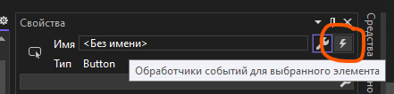

Нажмем на эту молнию и увидим полный список событий для выбранного объекта, в моем случае, для кнопки. Сделать здесь можно все, что угодно — обработать клик, нажатие ПКМ, наведение мышки, фокус на объекте, загрузку объекта (момент, когда кнопка была создана) и прочее.

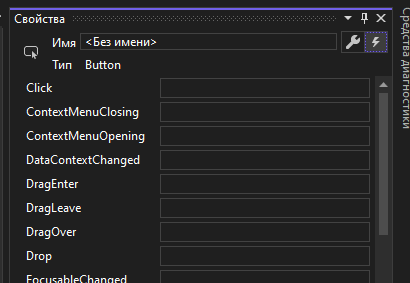

Давайте обработаем нажатие. Для этого дважды нажмем по пустому блоку напротив слова Click. Внутри самого блока появится название метода, обрабатывающее событие, а внутри файла xaml.cs этого окна будет находится метод с логикой, которая должна происходить при нажатии на кнопку.

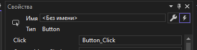

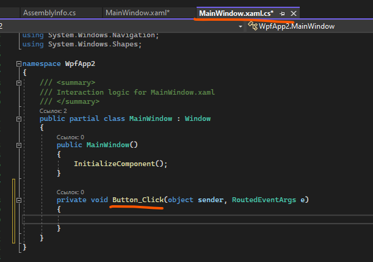

## Структура xaml.cs

Перед тем, как начать делать логику для кнопки, давайте посмотрим из чего в принципе состоит наш xaml.cs.

- Сам класс нашего окна наследует класс `Window`, позволяя нам работать с этим классом, как с окном.
- Внутри класса есть конструктор с методом `InitializeComponent()`. Этот метод создает само окно, т.е. работа окна начинается не с самого окна, а с xaml.cs, уже из которого идет создание окна. **!ВАЖНО!**, если вы будете работать с объектами интерфейса до метода `InitializeComponent()`, тогда у вас код выкинет ошибку, по той причине, что интерфейс еще не был создан.
- Вся остальная область класса отведена для событий и каких-то собственных методов.

## MessageBox

Теперь, рассмотрим сам метод, отвечающий за событие нажатия на кнопку. В качестве параметров этого метода, у нас есть переменная `sender`, где хранится объект, который вызвал событие (в нашем случае кнопка), и `e` — само произошедшее событие. Из sender-а мы можем как-либо взаимодействовать с объектом, например, поменять его текст, а из «e» — взаимодействовать с событием, например, отменить его.

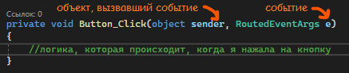

Внутри метода уже будет сама логика приложения. Давайте, например, выведем окошко с сообщением «Hello, world!». В консоли мы выводили текст с помощью `Console.WriteLine()`, а здесь, раз мы хотим сделать окошко, мы сделаем `MessageBox.Show()`, т.е. я хочу использовать диалоговое окно, а именно, показать какой-то текст. Показываемый текст будет внутри метода `Show()`.

```csharp
private void Button_Click(object sender, RoutedEventArgs e)
{
    MessageBox.Show("Hello, world!");
}
```

И теперь, при запуске приложения и нажатия на кнопку, мы увидим сообщение в диалоговом окошке.

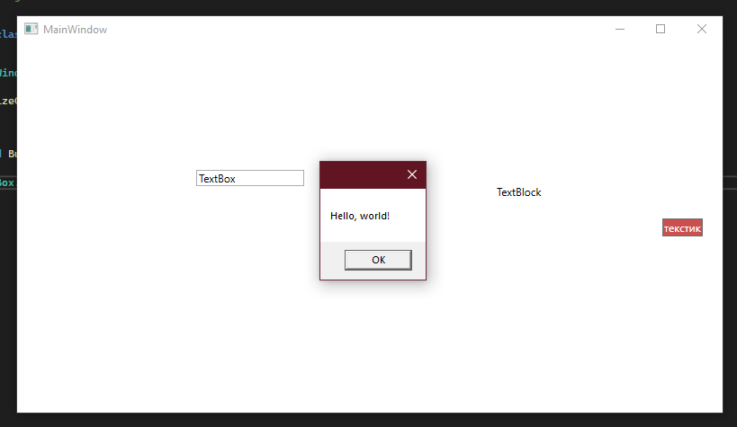

Но достаточно неприятно, если все данные, которые у нас есть, будут показываться через диалоговое окно. Зачем нам тогда интерфейс? Давайте научимся выводить текст на самом интерфейсе.

## Чтение и вывод текста

Условно говоря, все наши объекты интерфейса, это тоже какие-то переменные, только для того, чтобы с ними взаимодействовать, нам нужно дать им имя. Имя этим объектам дается в свойствах. Например, я дам имя текстблоку, чтобы я смогла обратиться к тексту и вывести туда какой-то текст. Имя, как и название переменной, может быть любым, главное, чтобы названия не повторялись.

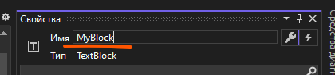

Теперь, мы можем взаимодействовать с этим элементом, с помощью его имени. Но как мне изменить именно текст? Заметим, что свойство текста у текстблока называется как «Text». Так что если я хочу взаимодействовать с текстом из кода, мне необходимо прямо так и написать — я хочу использовать свой объект, а именно, текст.

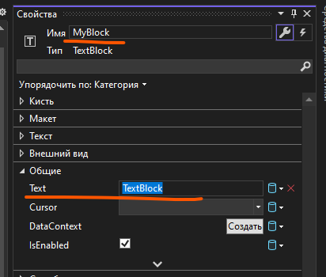

```csharp
private void Button_Click(object sender, RoutedEventArgs e)
{
    MyBlock.Text = "поменяла текст!";
}
```

И теперь, после того, как мы нажмем на кнопку, текст изменится.

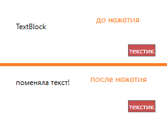

## Ввод текста через TextBox

Точно также я могу взаимодействовать и с введенным текстом. Мне нужно дать имя текстбоксу, в который я ввожу текст, а потом, по нажатию на кнопку, я хочу вывести введеный текст. Алгоритм тот же:

- Даем имя элементу — текстбоксу, я назову его `MyInputBox`.
- Проверяем, какое свойство отвечает за текст — `Text`.
- Через `MyInputBox.Text` берем введенное значение и пихаем его в `MyBlock.Text`.

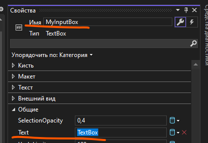

```csharp
private void Button_Click(object sender, RoutedEventArgs e)
{
    MyBlock.Text = MyInputBox.Text;
}
```

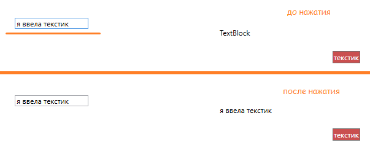

## Полный код примера

`MainWindow.xaml` с тремя элементами и привязанным обработчиком клика:

```xml
<Window x:Class="WpfApp2.MainWindow"
        xmlns="http://schemas.microsoft.com/winfx/2006/xaml/presentation"
        xmlns:x="http://schemas.microsoft.com/winfx/2006/xaml"
        xmlns:d="http://schemas.microsoft.com/expression/blend/2008"
        xmlns:mc="http://schemas.openxmlformats.org/markup-compatibility/2006"
        xmlns:local="clr-namespace:WpfApp2"
        mc:Ignorable="d"
        Title="MainWindow" Height="450" Width="800">
    <Grid>
        <TextBox x:Name="MyInputBox"
                 HorizontalAlignment="Left" VerticalAlignment="Top"
                 Margin="100,100,0,0" Width="120"/>
        <TextBlock x:Name="MyBlock" Text="TextBlock"
                   HorizontalAlignment="Center" VerticalAlignment="Center"/>
        <Button Content="текстик"
                Background="#FFCA4F4F" Foreground="White"
                Click="Button_Click"/>
    </Grid>
</Window>
```

`MainWindow.xaml.cs` с обработчиком кнопки:

```csharp
using System.Windows;

namespace WpfApp2
{
    public partial class MainWindow : Window
    {
        public MainWindow()
        {
            InitializeComponent();
        }

        private void Button_Click(object sender, RoutedEventArgs e)
        {
            MyBlock.Text = MyInputBox.Text;
        }
    }
}
```
