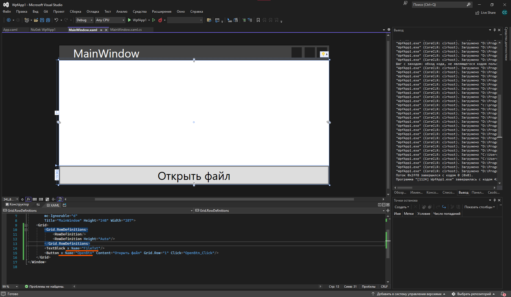
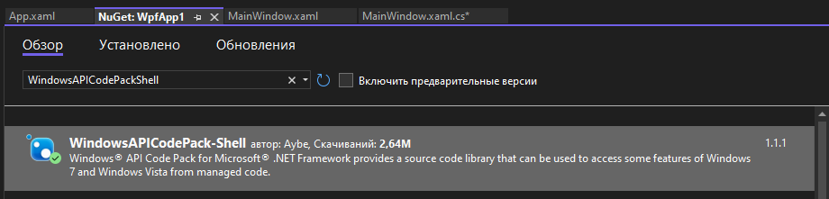
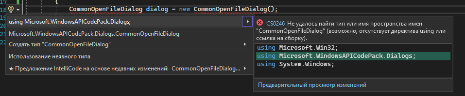
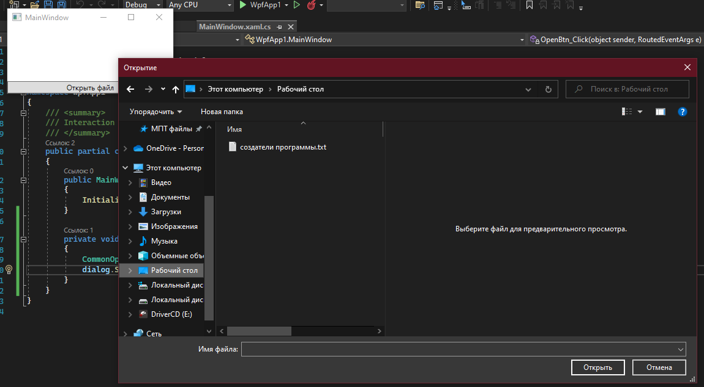
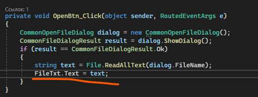
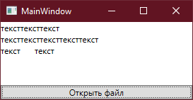
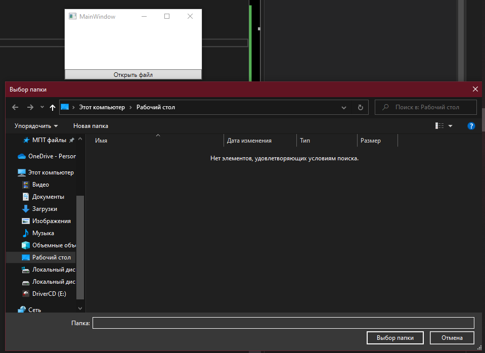
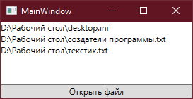

## Открытие файлов и папок

С [предыдущего полугодия](/csharp/files) мы уже с вами знаем, что с файлами мы работаем с помощью [класса File](/csharp/files), а с [папками](/csharp/directory) — с помощью `Directory`. Однако если в предыдущих практических мы делали выбор через `Console.ReadLine()`, вводя путь до нужного файла или папки, то в оконных приложениях у нас есть окно с выбором файла или папки — `CommonOpenFileDialog`. Его можно настроить как для файлов, так и для папок. Давайте научимся с ним работать.

Для начала, я создам какой-то базовый интерфейс с текстовым полем, где мы будем смотреть содержимое файла, и кнопку, нажимая на которую, мы будем выбирать файл. Кнопке я дам имя `OpenBtn`, тексту — `FileTxt`.



Обработаем нажатие на кнопку `OpenBtn`. Я хочу, чтобы при нажатии на эту кнопку появлялось диалоговое окно выбора файла. Раз мы уже знаем, что нам нужен класс `CommonOpenFileDialog`, давайте создадим переменную с типом данных этого класса. Этот тип данных заставляет нас думать дольше двух секунд, значит это у нас сложный тип данных.

```csharp
private void OpenBtn_Click(object sender, RoutedEventArgs e)
{
    CommonOpenFileDialog dialog = new CommonOpenFileDialog();
}
```

Однако создавая эту переменную, мы видим, что у нас появляется ошибка, и `Alt+Enter` не помогает.


Почему так? Проблема в том, что нам нужно докачать пакет, чтобы работать с этим классом. Откроем управление пакетами NuGet через ПКМ по проекту → Управление пакетами NuGet.

Перейдем в обзор пакетов и в поиске напишем «WindowsAPICodePack-Shell». Нам нужен пакет, который был установлен более двух миллионов раз. Версия пакета не важна.



После ее установки мы можем спокойно вернуться к нашему коду, и, нажав `Alt+Enter` или на лампочку, подключить нужную библиотеку — `Microsoft.WindowsAPICodePack.Dialogs`.



После этого мы сможем работать с нашей переменной `dialog`, где у нас будет хранится вся информация об окошке выбора файла и о выбранном файле соответственно.

Мы хотим открыть это окно и знать, когда оно закроется. Значит, мы понимаем, что это окно [диалоговое](/csharp/files), и открыть мы его хотим с помощью `ShowDialog()`.

```csharp
private void OpenBtn_Click(object sender, RoutedEventArgs e)
{
    CommonOpenFileDialog dialog = new CommonOpenFileDialog();
    dialog.ShowDialog();
}
```

Теперь, при нажатии на кнопку, у нас откроется диалоговое окно с выбором файла. По умолчанию, мы можем выбрать любой файл любого формата.



После выбора файла и нажатия на кнопку «Открыть», мое диалоговое окно закрывается, а на интерфейсе ничего не появится. Логично, потому что код мы еще для этого не прописали. Однако, как его прописать, как мне получить выбранный файл?

Во-первых, давайте вспомним, что все подтверждающие кнопки в диалоговых окнах («да», «открыть», «установить» и прочее) имеют под собой `DialogResult = true`. Значит, мне нужно сделать условие, что если мы открываем выбранный нами файл, то нам нужно взять его имя, и уже тогда работать с ним через `File`.

Однако так как это немного не простое окно, а окно выбора файла, то и результат у него будет не типа данных `bool?`, а тип данных `CommonFileDialogResult`. Это у нас [enum](/csharp/enum), так что удовлетворяющее нас условие будет выглядеть как `CommonFileDialogResult.Ok`.

```csharp
private void OpenBtn_Click(object sender, RoutedEventArgs e)
{
    CommonOpenFileDialog dialog = new CommonOpenFileDialog();
    CommonFileDialogResult result = dialog.ShowDialog();
    if (result == CommonFileDialogResult.Ok)
    {
        // выбрать файл
    }
}
```

А чтобы взять файл, который я выбрала, мне необходимо взять `FileName` из моей переменной с окошком, т.е. из `dialog`. Внутри него будет хранится полный путь до файла. С помощью него я могу прочитать весь текст из файла — [File.ReadAllText(dialog.FileName)](/csharp/files).

```csharp
private void OpenBtn_Click(object sender, RoutedEventArgs e)
{
    CommonOpenFileDialog dialog = new CommonOpenFileDialog();
    CommonFileDialogResult result = dialog.ShowDialog();
    if (result == CommonFileDialogResult.Ok)
    {
        string text = File.ReadAllText(dialog.FileName);
    }
}
```

Получившийся текст я могу вывести на экран через `FileTxt.Text`. Напомню, что `FileTxt` называется мой `TextBlock` в интерфейсе.



Итого наша программа, после выбора файла, будет выглядеть вот так.



## Выбор папки

Однако, что если я хочу выбрать не файл, а папку? Мы можем настроить `CommonOpenFileDialog` для открытия папки. Для этого при создании переменной вместо круглых скобок мы напишем фигурные. Внутри фигурных скобок есть свойство `IsFolderPicker`. Если мы хотим сделать диалоговое окно по выбору папок, то `IsFolderPicker` должен быть равен `true`.

```csharp
private void OpenBtn_Click(object sender, RoutedEventArgs e)
{
    CommonOpenFileDialog dialog = new CommonOpenFileDialog { IsFolderPicker = true };
}
```

Вся остальная работа с папками будет такая же: отображаем диалоговое окно с помощью `ShowDialog()`, результат окна сохраняем в переменную `result`. Если мы хотим быть уверены, что папка была выбрана, нам нужно условие `if (result == CommonFileDialogResult.Ok)`. Внутри мы уже будем читать полный путь до папки, например, давайте прочитаем все файлы из этой папки и выведем их в текстовое поле. Путь до выбранной папки мы также будем брать через свойство `FileName`.

```csharp
private void OpenBtn_Click(object sender, RoutedEventArgs e)
{
    CommonOpenFileDialog dialog = new CommonOpenFileDialog { IsFolderPicker = true };
    var result = dialog.ShowDialog(); // открываем окошко

    if (result == CommonFileDialogResult.Ok)
    {
        string[] files = Directory.GetFiles(dialog.FileName); // получаем все файлы из папки
        foreach (string file in files)                        // перебираем файлы
        {
            FileTxt.Text += file + "\n";                      // чтобы каждый новый файл был с новой строчки
        }
    }
}
```

По итогу у нас будет открываться выбор папки, а не файла.



И как только мы выберем какую-то папку, то все файлы из этой папки будут выведены в интерфейс.



## Полный код примера

`MainWindow.xaml.cs` с двумя вариантами `CommonOpenFileDialog` — для файла и для папки:

```csharp
using System.IO;
using System.Windows;
using Microsoft.WindowsAPICodePack.Dialogs;

namespace WpfApp1
{
    public partial class MainWindow : Window
    {
        public MainWindow()
        {
            InitializeComponent();
        }

        // Выбор файла
        private void OpenFileBtn_Click(object sender, RoutedEventArgs e)
        {
            CommonOpenFileDialog dialog = new CommonOpenFileDialog();
            CommonFileDialogResult result = dialog.ShowDialog();
            if (result == CommonFileDialogResult.Ok)
            {
                string text = File.ReadAllText(dialog.FileName);
                FileTxt.Text = text;
            }
        }

        // Выбор папки
        private void OpenFolderBtn_Click(object sender, RoutedEventArgs e)
        {
            CommonOpenFileDialog dialog = new CommonOpenFileDialog { IsFolderPicker = true };
            CommonFileDialogResult result = dialog.ShowDialog();
            if (result == CommonFileDialogResult.Ok)
            {
                string[] files = Directory.GetFiles(dialog.FileName);
                foreach (string file in files)
                {
                    FileTxt.Text += file + "\n";
                }
            }
        }
    }
}
```
