## Работа с картинками

В WPF есть элемент `Image`, предназначенный для работы с изображениями. Для более быстрого взаимодействия с картинкой, я могу перенести файл в свой проект, а затем перетащить файл прямо в XAML. Элемент `Image` с картинкой внутри автоматически создастся.

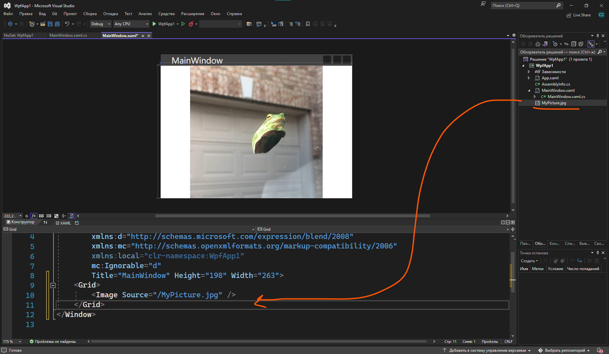

Чтобы картинка была видна в интерфейсе, нужно указать в её свойствах, что это ресурс, который нужно копировать всегда. Свойства картинки мы откроем, нажав ПКМ по файлу. Тогда при запуске приложения она будет отображаться.

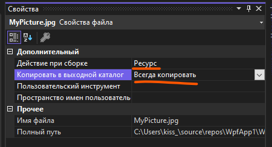

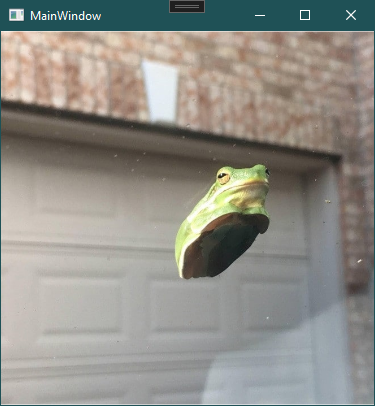

## Установка картинки из кода

Если я хочу выставить картинку для `Image` через код, я опять пойду по своему алгоритму из 4 пунктов:

- Дам имя картинке — `picture`.
- Найду свойство, отвечающее за содержимое — `Source`.
- Обработаю событие (в этом случае я буду писать прямо в `public MainWindow`, потому что хочу, чтобы картинка выставилась при запуске программы).
- Объединю 1 и 2 пункт и получу `picture.Source`.

`Source` просит в себя тип данных `ImageSource`. Все картинки в коде я храню в переменных типа данных `BitmapImage`. Значит, берем за правило — видим `ImageSource`, пишем `BitmapImage`. Сам `BitmapImage` просит от меня внутри расположить `Uri`.

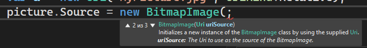

`Uri`, в этом контексте, существует для хранения пути файла. Создам переменную с путем и видом `Uri`. Путь я могу указать двумя способами: полный путь, т.е. абсолютный (об этом говорит `UriKind.Absolute`):

```csharp
Uri absolute = new Uri("C:\\Users\\kiss_\\source\\repos\\WpfApp1\\WpfApp1\\MyPicture.jpg", UriKind.Absolute);
```

И относительный. Относительный работает, начиная с текущей папки. Например, я запустила программу на рабочем столе, относительный `Uri` будет искать указанный путь начиная от рабочего стола.

```csharp
Uri relative = new Uri("MyPicture.jpg", UriKind.Relative);
```

Получившийся `Uri` помещаем в `BitmapImage`:

```csharp
public MainWindow()
{
    InitializeComponent();
    Uri relative = new Uri("MyPicture.jpg", UriKind.Relative);
    picture.Source = new BitmapImage(relative);
}
```

## Картинка как фон элемента

Картинки можно использовать не только как источник элемента `Image`, но и как фон любого объекта — `Background` вместо `Source`. Задать фон картинкой мы можем либо через свойства внутри XAML, либо в коде — также через `BitmapImage` и `Uri`.

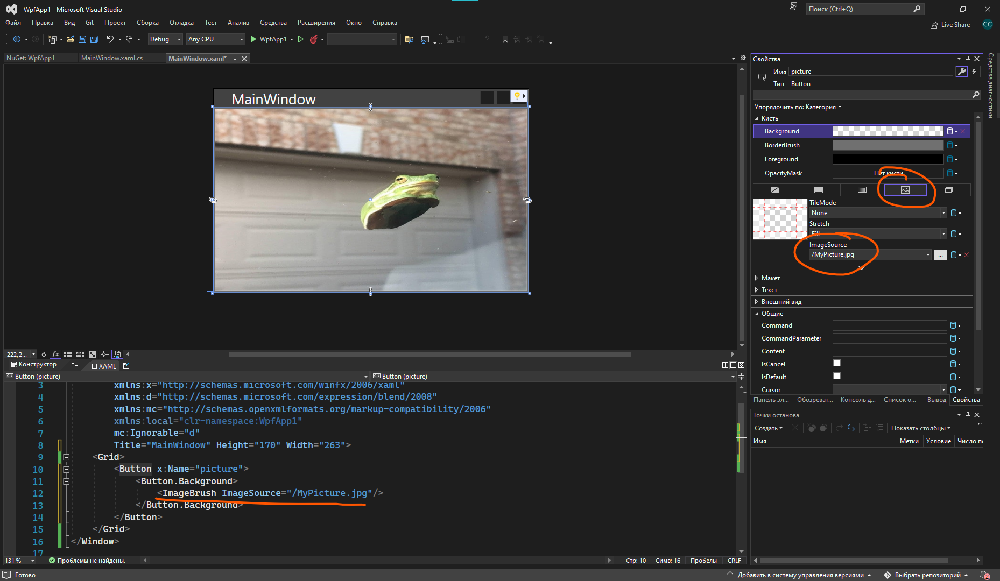

Если мы хотим менять картинку из кода, тогда нам нужно будет сделать следующее. Возьму ту же кнопку, и сделаю так, что если я нажимаю на кнопку — ставится фон. Если фон уже есть, фон очищается. Первоначальная структура будет выглядеть вот так:

```csharp
private void picture_Click(object sender, RoutedEventArgs e)
{
    if (picture.Background == null) // если бекграунда нет
    {
        // тогда поставить его
    }
    else // иначе
    {
        picture.Background = null; // убрать его
    }
}
```

Вместо «тогда поставить его» нам нужно задать значение для бекграунда, чтобы он был равен картинке. Как и внизу, напишем `picture.Background = чему-то`.

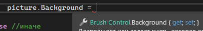

Он должен быть равен какой-то кисточке, вероятно, кисточке с картинкой. Создадим её.

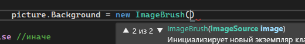

Сама кисточка просит внутрь себя `ImageSource`. Тут уже алгоритм тот же, что и был выше — видим `ImageSource`, пишем `BitmapImage`. А он уже в свою очередь просит картинку в виде `Uri`. Сделаю через относительный путь.

```csharp
if (picture.Background == null)
{
    picture.Background = new ImageBrush(new BitmapImage(new Uri("MyPicture.jpg", UriKind.Relative)));
}
else
{
    picture.Background = null;
}
```

## Относительные пути и `../`

Запущу и проверю, работает ли. Нажимаю 1 раз — все чистится. Нажимаю 2 — вылезает [ошибка](/csharp/trycatch).

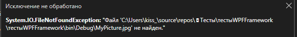

Он не может найти файл в `bin\debug`. А он и не должен, потому что картинка у меня хранится в самом проекте, а не в `bin\debug`.

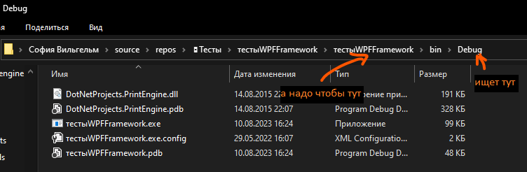

Соответственно нам и нужно подняться на 2 папки выше, в мой проект, чтобы он искал картинку там. Но так как я хочу использовать относительный, а не абсолютный путь (чтобы приложение смогло запуститься и на других компьютерах), то мне нужно как-то сказать, что он должен из текущего местоположения подняться на 2 папки выше. Сделать это я могу при помощи `../`.

- Нужно подняться 2 раза и найти файл `MyPicture.jpg` — напишу `../../MyPicture.jpg`.
- Нужно подняться 3 раза и найти файл `MyPicture.jpg` — напишу `../../../MyPicture.jpg`.
- Нужно подняться 1 раз и оттуда найти в папке `Release` файл `MyPicture.jpg` — напишу `../Release/MyPicture.jpg`.


В нашем случае — мне нужно подняться 2 раза и найти файл `MyPicture.jpg`.

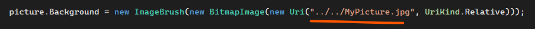

Попробую снова запустить и все у меня прекрасно работает!

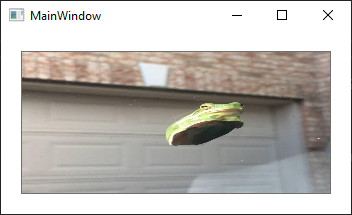

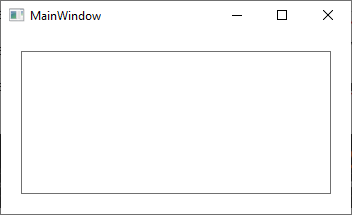

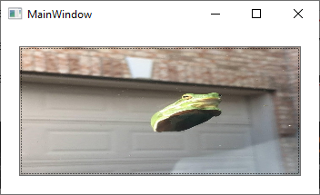

## Полный код примера

`MainWindow.xaml` с элементом `Image` и кнопкой-фоном:

```xml
<Window x:Class="WpfApp1.MainWindow"
        xmlns="http://schemas.microsoft.com/winfx/2006/xaml/presentation"
        xmlns:x="http://schemas.microsoft.com/winfx/2006/xaml"
        Title="MainWindow" Height="200" Width="300">
    <Grid>
        <Button x:Name="picture" Click="picture_Click"/>
    </Grid>
</Window>
```

`MainWindow.xaml.cs` — фон ставится и убирается по клику:

```csharp
using System;
using System.Windows;
using System.Windows.Controls;
using System.Windows.Media;
using System.Windows.Media.Imaging;

namespace WpfApp1
{
    public partial class MainWindow : Window
    {
        public MainWindow()
        {
            InitializeComponent();
        }

        private void picture_Click(object sender, RoutedEventArgs e)
        {
            if (picture.Background == null)
            {
                picture.Background = new ImageBrush(
                    new BitmapImage(
                        new Uri("../../MyPicture.jpg", UriKind.Relative)));
            }
            else
            {
                picture.Background = null;
            }
        }
    }
}
```
