Проекты — это конечно хорошо, но чтобы добраться до exe-файла не каждый хочет лезть в `bin/debug`, к тому же страшно иметь sln, xaml и cs файлы на компьютере, если человек далек от программирования. Поэтому мы можем создавать exe-файлы для установки наших приложений. Но что устанавливать — опять sln проект? Нет, нужно создать окончательную релизную сборку.

Сегодня мы займёмся и релизной сборкой, и созданием установщика.

## Релизная сборка через «Опубликовать»

У меня остался проект от [API](/wpf/api-testing). Давайте его и будем закидывать в установщик.

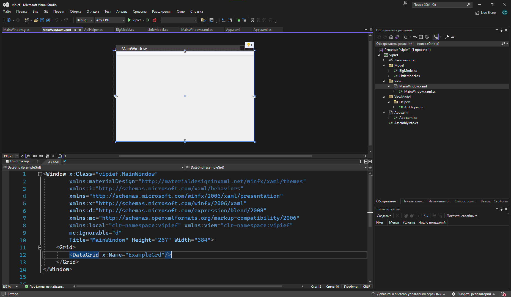

Для этого нужно ПКМ нажать по проекту и выбрать «Опубликовать». Таким образом мы будем создавать итоговый проект с экзешником и всеми dll файлами, необходимыми для работы приложения.

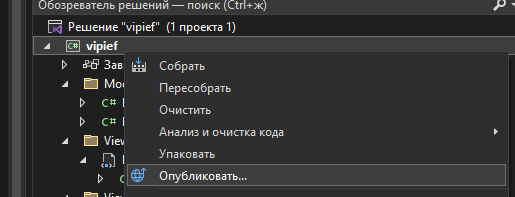

В качестве места публикации выберем папку.

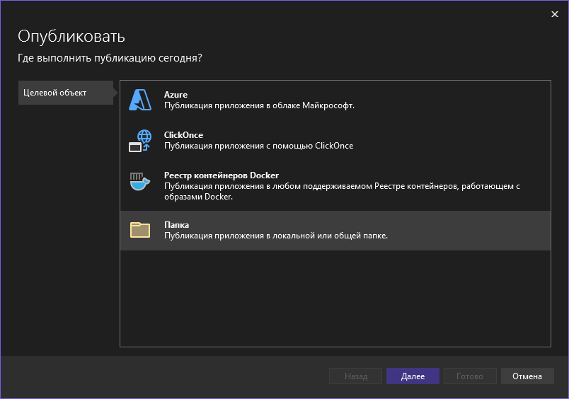

И ещё раз папку.

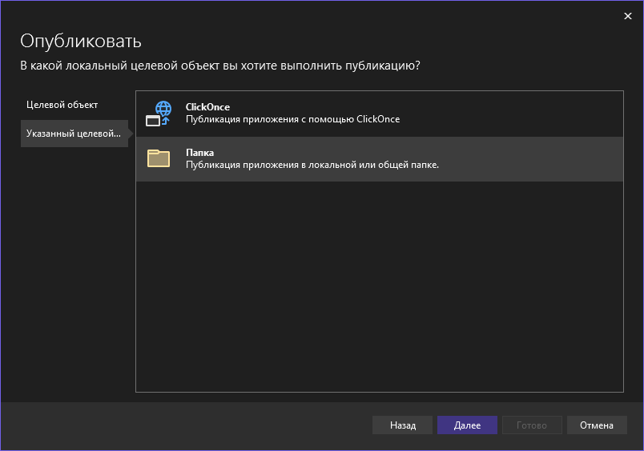

В качестве расположения можем выбрать что угодно, даже сервер. Я опубликую на рабочем столе, для быстрого доступа.

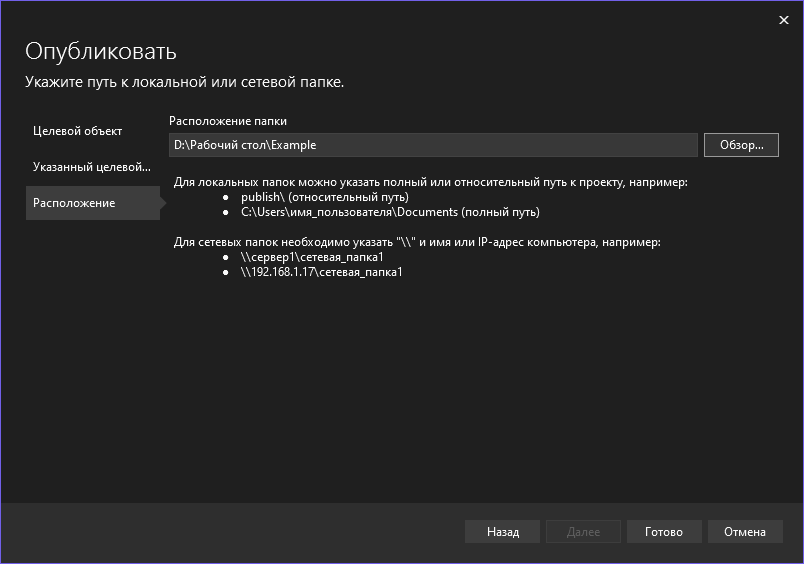

После этого мы нажимаем готово и у нас создается профиль публикации.

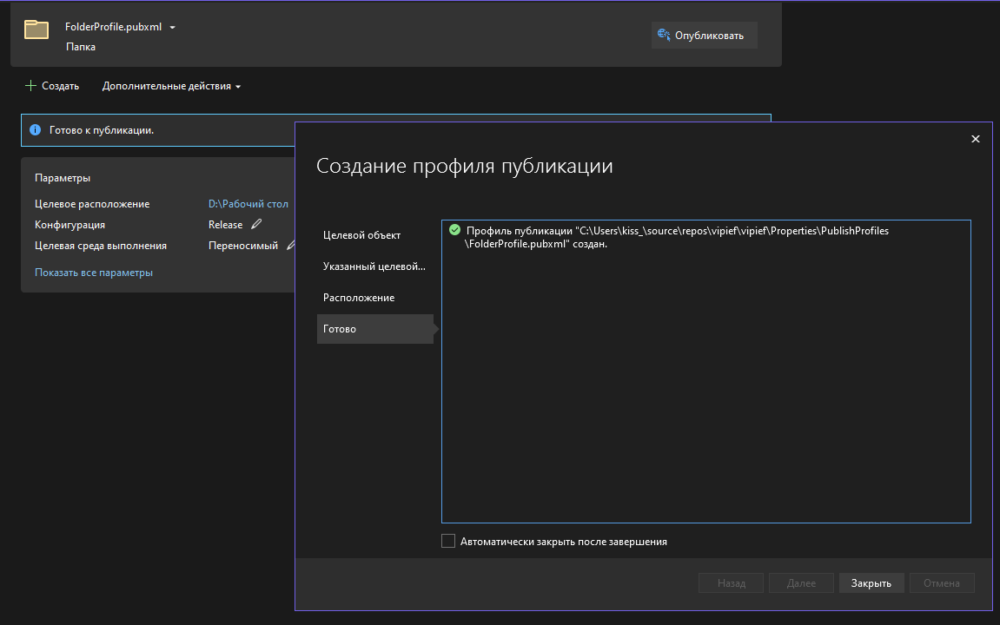

Профиль публикации — вариант того, как можно опубликовать приложение. Их может быть несколько, для разных нужд — опубликовать на рабочий стол, на сервер, в Azure и прочее. Между ними можно переключаться по выпадающему списку в правом верхнем углу.

Тут мы видим куда всё выгрузится, конфигурацию приложения и целевую среду — ОС и архитектуру. По умолчанию — все переносимое, т.е. будет работать на Linux, Windows и MacOS.

Для публикации нашего проекта нужно нажать на кнопку «Опубликовать». После этого начнется сборка проекта, и если она выполнится без ошибок, то и публикация тоже.

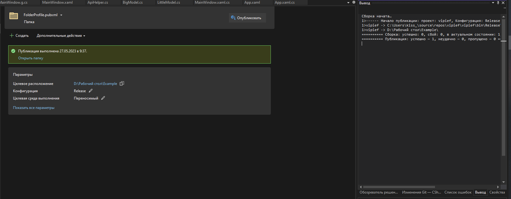

И на рабочем столе у меня появляется папка `Example`, куда я сохранила все мои файлы. Отсюда я уже могу их запустить, а также уже могу создать установщик, который будет ставить на компьютер все эти файлы.

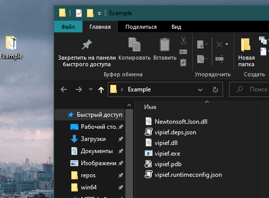

## Создание установщика через Install Creator

Для установщика нам потребуется бесплатная программа без ограничений в создании установщиков — [clickteam.com/install-creator-2](https://www.clickteam.com/install-creator-2). Она бесплатна как для коммерческого, так и для некоммерческого использования. Скачаем бесплатную версию и установим её. Из интересных настроек, максимум, нужно выбрать `Unregistered version`.

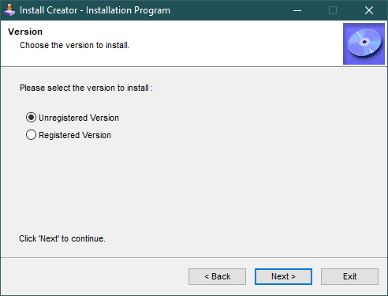

После установки у нас появится приложение `Install Creator`.

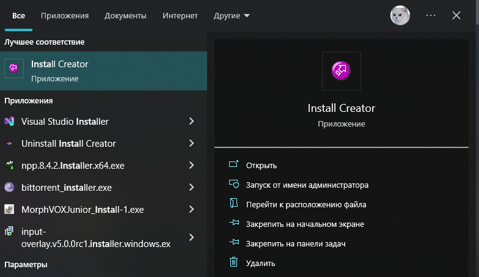

Запустим его и начнем работу. Нас встречает помощник по созданию установщика.

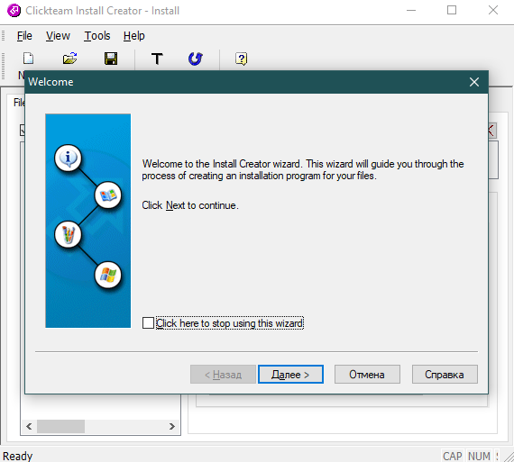

### Source-папка

В самом первом окне нажмем далее. Следующее окно нас спрашивает, какие файлы мы хотим запихнуть в установщик. Здесь мы указываем путь до нашей опубликованной папки.

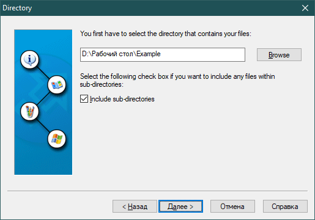

### Язык и название

В следующем окне мы должны выбрать язык установщика (русского нет) и назвать нашу программу, чтобы её имя отображалось в установщике. Также можно посмотреть превью установщика.

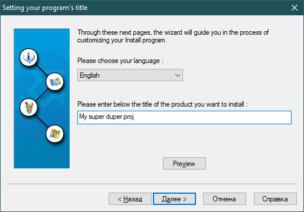

### Формат окна

Следующий пункт оставьте на `Small`, иначе у вас будет полноэкранный установщик как в нулевые года, что выглядит ужасно. Но уж если хотите `full`, тогда хотя бы красивый градиент сделайте.

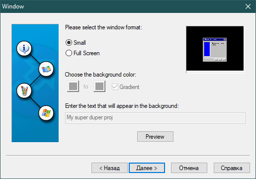

### Картинки и шаблон wizard

В следующем окне можно настроить отображение картинок в установщике — картинка сбоку и картинка в правом верхнем углу в течении всего установщика. Можно либо убрать эти картинки вовсе, либо оставить только главную слева, либо и ту и ту. Плюс их можно настроить, вставив картинки формата bmp.

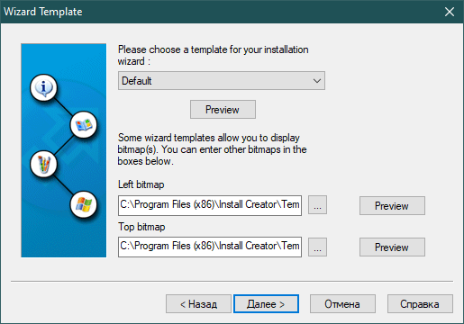

### Дополнительная информация и лицензия

Также вы можете вписать дополнительную информацию, которая также будет отображаться в установщике, например, описание, состав разработчиков, на следующем окне будет ещё и лицензионное соглашение, и т.п.

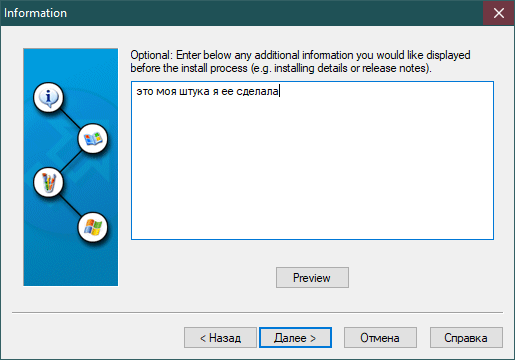

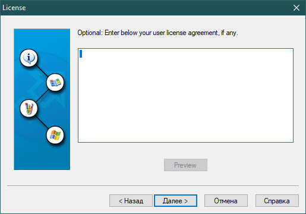

### Папка установки

Далее нам нужно выбрать папку по умолчанию, где будет устанавливаться приложение. Можно по умолчанию и оставить.

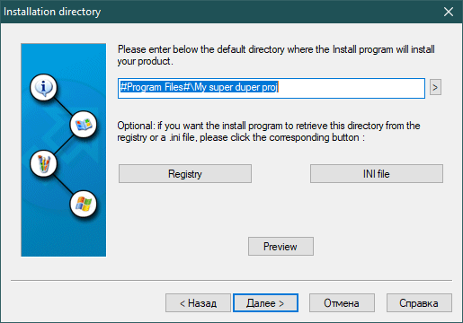

### Иконка и ярлык

Далее мы можем выбрать, хотим ли мы поставить иконку на приложение, если таковой ещё нет. Для этого нужно выбрать файл, на который мы будем накатывать иконку, в нашем случае — экзешник.

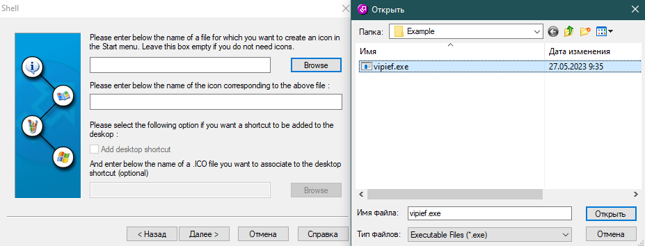

А затем ставим галочку на `Add desktop shortcut` и из `Browse` выбираем нужный файл с иконкой.

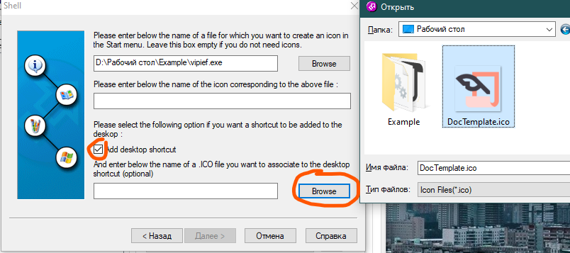

Если у вас появится такая ошибка, просто переместите файл с иконкой внутрь папки, из которой вы собрались делать установщик, и выберите её снова.

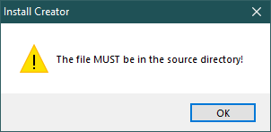

Во второе поле мы должны написать название нашего ярлыка.

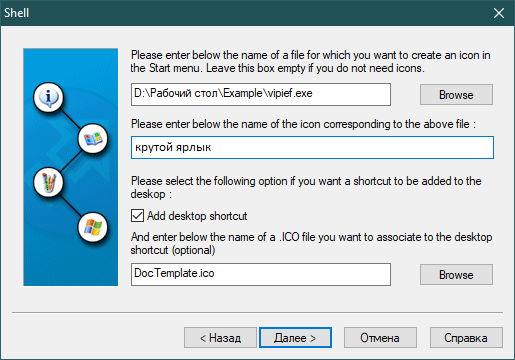

### README и автозапуск

Следующее окно спрашивает нас, хотим ли мы отобразить какой-то README файл для последней информации после инсталляции, а также хотим ли мы запустить программу сразу после установки. И для первого, и для второго пункта в самом конце будут галочки. Если хотим, необходимо указать путь до этих файлов — в первом пункте — файл до README файла, во втором — запускаемое приложение.

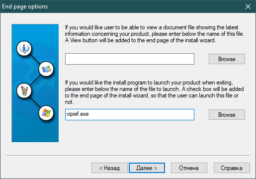

### Деинсталлятор

И последнее окно спрашивает нас, хотим ли мы создавать деинсталлятор.

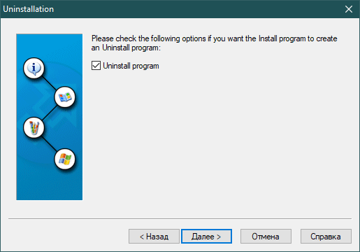

### Сборка установщика

Если всё хорошо, то программа сейчас начнет собирать наш проект после нажатия «Готово». Если мы хотим посмотреть больше настроек в самой программе, тогда нам нужно поставить галочку «Do not build the install program» и продолжить настройку приложения.

Я не ставила галочку и нажала готово. У нас появилось окно, куда нужно сохранить наш файл установки и его название. Ввожу название, нажимаю сохранить, и всё.

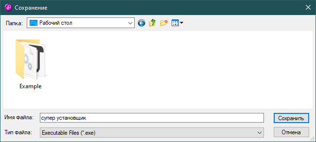

По итогу программа покажет какие файлы она внесла установщик и итоговый маленький отчёт по выполненной работе. В остальном приложении вы можете погулять сами.

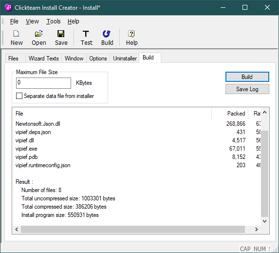

## Результат

Наш установщик будет выглядеть следующим образом и устанавливать все файлы верно.

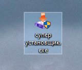

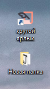

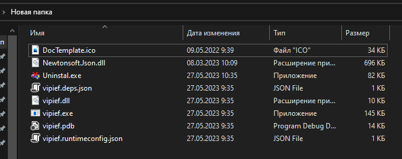

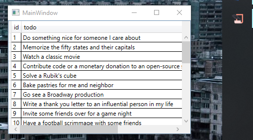
