Все это время, когда мы перетаскивали объекты на экран, они были статичные. Если бы мы поменяли размер окна, объекты бы остались на своем месте.

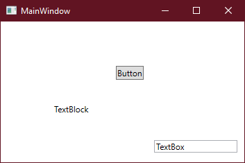

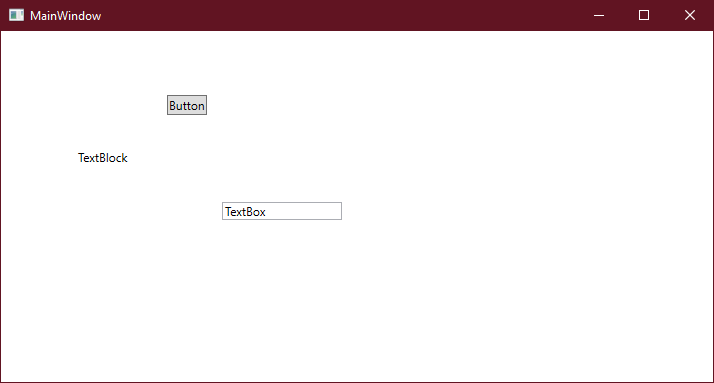

Для того, чтобы объекты визуально оставались на своем месте и передвигались вместе с изменением окна, существует такое понятие, как адаптивная вёрстка. Вёрстка — наш интерфейс, адаптивная — интерфейс будет адаптироваться под изменяемый размер окна. Давайте научимся писать адаптивную вёрстку.

Адаптивную вёрстку мы делаем с помощью сеток. Пока что единственная сетка, которую мы знаем, это `Grid`. Его можно разделять на столбцы и строки. Единственная проблема адаптивной вёрстки в том, что её удобнее всего писать в XAML, то есть через панель элементов комфортно уже не получится поработать, в любом случае придется менять XAML.

Например, давайте сделаем вот такой интерфейс для анкеты, но чтобы она не съезжала при изменении окна.

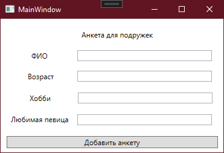

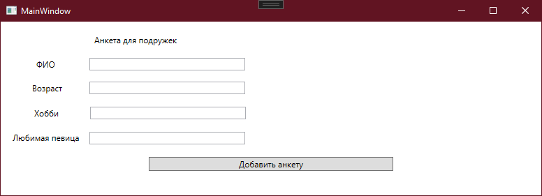

## Разметка Grid

Сначала, условно разметим на сколько столбцов и строк нам нужно будет разделить наш интерфейс.

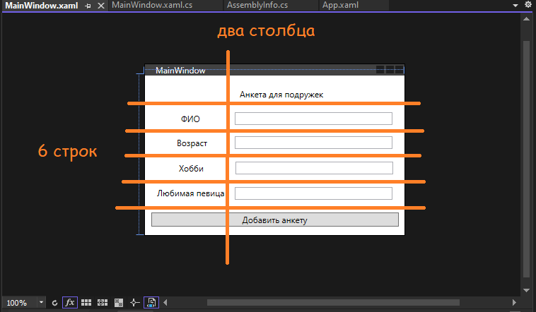

Заметим, что кнопка и верхний текст немного не вписываются в наши столбцы. Но это ничего страшного, элементы можно размещать и на нескольких столбцах или строках одновременно. Главное — наметить основную сетку.

Теперь, давайте начнем разделять её. Все старые элементы я удалю, начнем писать вёрстку с чистого листа. У меня осталась только пустая сетка (и окно наверху, соответственно).

```xml
<Grid>

</Grid>
```

Чтобы разделить наш Grid на несколько столбцов и строк, у нас есть такие теги, как `Grid.RowDefinitions` — определение строк и `Grid.ColumnDefinitions` — определение «колонн» — столбцов соответственно. Чтобы создать столбцы и строки, мне сначала нужно создать контейнер для этих столбцов и строк.

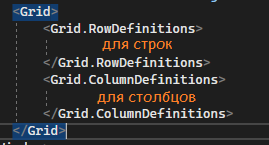

Внутри этих тегов мы и будем располагать наши столбцы — `ColumnDefinition`, и строки — `RowDefinition`. Мы хотели сделать шесть строк и два столбца. Если мы все сделали правильно, на экране у нас уже начнут появляться разделения.

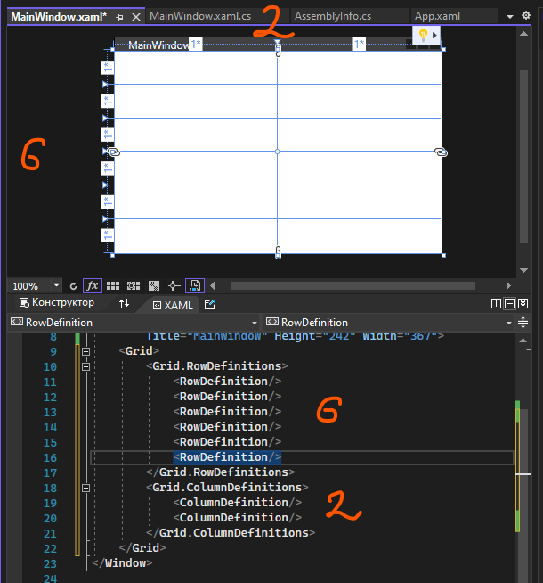

## Размеры строк и столбцов

Также, столбцы и строки можно настроить по ширине. Всего есть три основных настройки ширины/длины:

- **Фиксированная ширина** (например, 50 пикселей).

```xml
<RowDefinition Height="50"/>
```

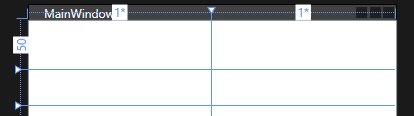

- **Автоматическая ширина по содержимому** (`Auto`).

```xml
<RowDefinition Height="Auto"/>
```

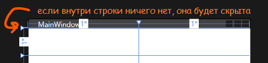

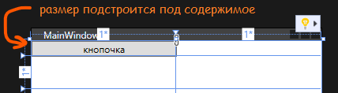

- **Автоматическое заполнение по долям** (если ширина не указана, то ширина колонки ставится по долям. Отмечается как `*`). В самом начале все колонки имеют соотношение 1 к 1.

```xml
<Grid.ColumnDefinitions>
    <ColumnDefinition/>
    <ColumnDefinition/>
</Grid.ColumnDefinitions>
```

```xml
<Grid.ColumnDefinitions>
    <ColumnDefinition Width="*"/>
    <ColumnDefinition Width="*"/>
</Grid.ColumnDefinitions>
```

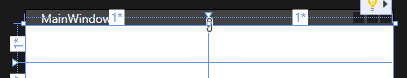

Если мы хотим изменить соотношение, тогда мы должны поставить число перед звездочкой. Если мы хотим, чтобы правая колонка была больше в 2 раза, тогда перед звездочкой поставим цифру 2. Первая также станет меньше из-за соотношения сторон.

```xml
<Grid.ColumnDefinitions>
    <ColumnDefinition Width="*"/>
    <ColumnDefinition Width="2*"/>
</Grid.ColumnDefinitions>
```

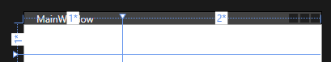

```xml
<Grid.ColumnDefinitions>
    <ColumnDefinition Width="0.5*"/>
    <ColumnDefinition Width="2*"/>
</Grid.ColumnDefinitions>
```

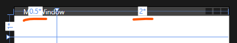

Хорошо, разобрались с тремя размерами столбцов и строк. Теперь, вспоминая нашу разлиновку, вспомним, что второй столбец должен быть в два раза больше, чем первый. Дадим второму столбцу ширину в `2*`, и получим то, что нам нужно.

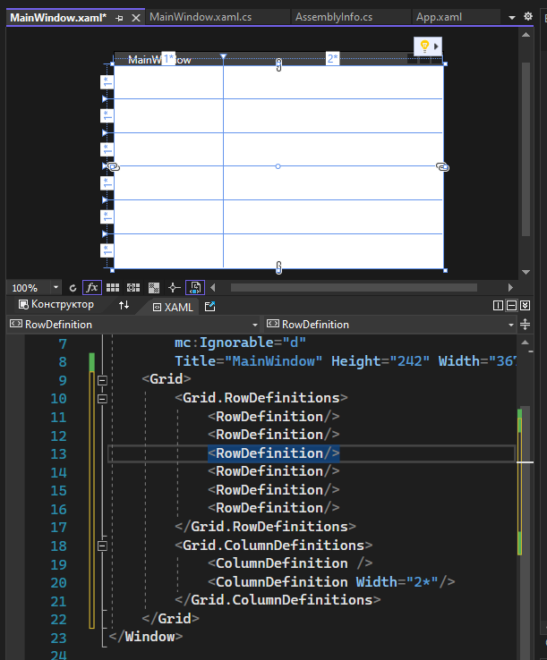

## Размещение элементов

Теперь, давайте расположим элементы интерфейса внутри сетки. Мы хотели, чтобы на самом верху у нас располагался текст — «Анкета для подружек». Я создам `TextBlock` с этим текстом прямо в XAML. Когда мы создаем объект внутри сетки, он создается в самой левой верхней ячейке — строка 0 и столбец 0.

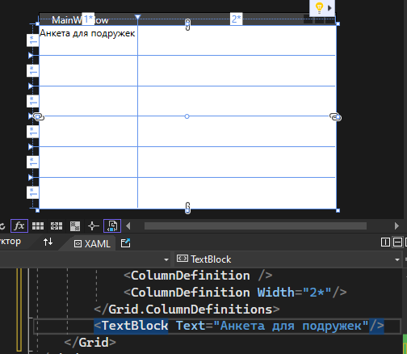

Если я захочу переместить этот текст в другую ячейку, мне необходимо указать строку и столбец с помощью свойств `Grid.Row` и `Grid.Column` соответственно. Вспомним, что в программировании все начинается с нуля, так что если я хочу переместить объект во 2 столбец и 3 ряд, мне необходимо поставить `Grid.Column="1"` и `Grid.Row="2"`.

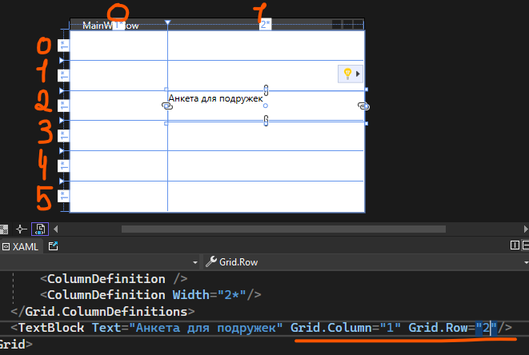

Тоже самое мы можем сделать с любыми объектами. Если столбец или строка не будет указаны, они по умолчанию будут иметь значение 0.

## ColumnSpan и выравнивание

Вернем наш текст обратно на позицию 0 0, мы же хотели, чтобы текст был наверху. Однако если он просто останется наверху, он будет выглядеть не так, как мы хотели. Нам нужно расположить ее на двух колонках одновременно. Для этого, у нас есть `ColumnSpan` или `RowSpan` — охват столбцов или охват строк соответственно. Например, я хочу, чтобы мой текст охватил 2 колонки. Тогда мне необходимо написать `Grid.ColumnSpan="2"`.

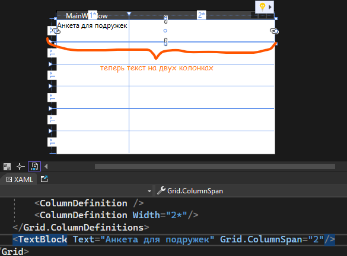

А для того, чтобы выровнять текст посередине, есть `VerticalAlignment` и `HorizontalAlignment` — вертикальное и горизонтальное выравнивание. Выровняем текст по центру.

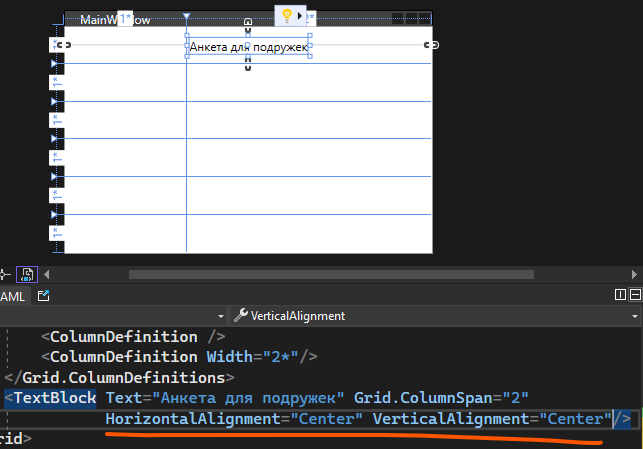

Тоже самое реализуем для всех остальных объектов — текста, кнопки, и текстовых полей.

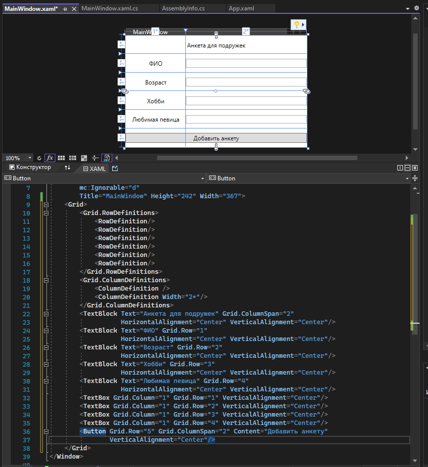

И после долгой работы, мы увидим, что вся наша вёрстка адаптивная, при изменении окна, все объекты перемещаются и не ломаются.

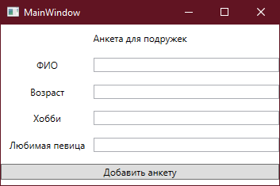

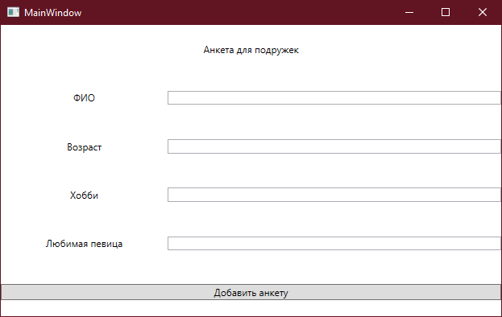

## Дополнительно: виды сеток

Также, есть некоторые виды сеток, которые работают отлично от `Grid`, но так сильно и подробно мы их разбирать не будем. Возьмем два вида.

### StackPanel

`StackPanel` отличается от `Grid` тем, что он сам размещает объекты под друг другом — они не наслаиваются друг на друга, а идут последовательно, друг под дружкой. Это можно сравнить с тем, если бы в `Grid` был один столбец и много-много строк.

Все сетки пишутся либо вместо `Grid`, либо внутри него. Например, обычный `StackPanel` будет размещать элементы по вертикали, и даже если они выходят за пределы окна, он продолжит их ставить друг под дружку.

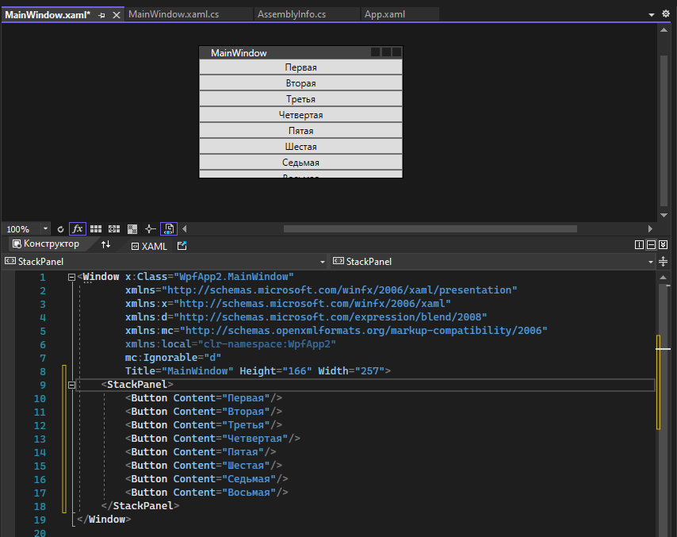

Чтобы изменить размещение элементов и сделать их не по вертикали, а по горизонтали, необходимо изменить ориентацию сетки. Для этого существует свойство `Orientation`. Если я хочу, чтобы элементы располагались справа налево, мне нужно поменять ориентацию на горизонтальную. По умолчанию стоит вертикальная ориентация.

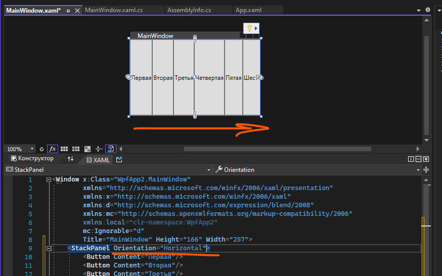

### WrapPanel

`WrapPanel` похож на `StackPanel`, даже имеет ориентацию, но его единственная разница в том, что если он встречает конец окна, он перемещает объект на следующую строчку или столбец. По умолчанию, стоит горизонтальная ориентация. С ней, объекты будут выглядеть вот так.

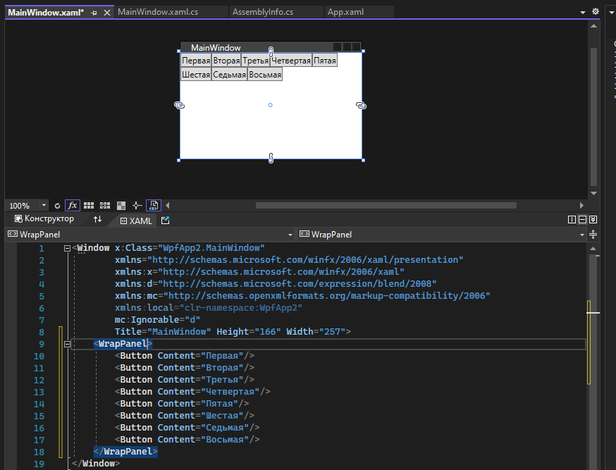

Если выставить вертикальную ориентацию, объекты будут выглядеть вот так.

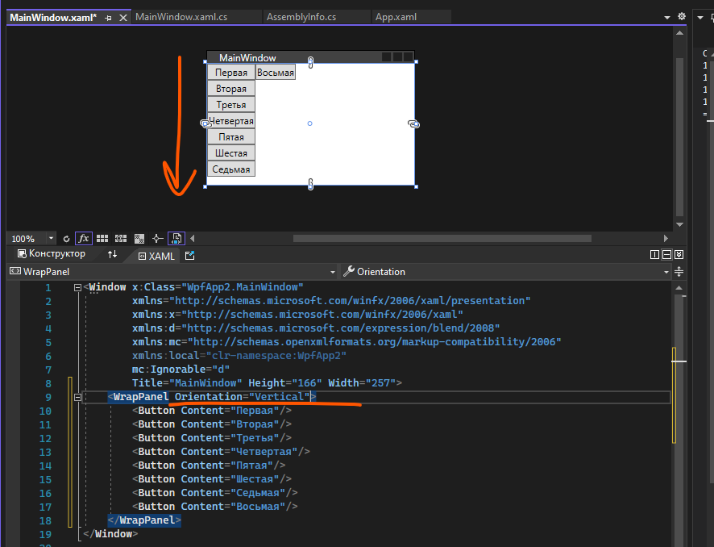

## Полный код примера

`MainWindow.xaml` с адаптивной вёрсткой анкеты:

```xml
<Window x:Class="WpfApp2.MainWindow"
        xmlns="http://schemas.microsoft.com/winfx/2006/xaml/presentation"
        xmlns:x="http://schemas.microsoft.com/winfx/2006/xaml"
        Title="MainWindow" Height="242" Width="367">
    <Grid>
        <Grid.RowDefinitions>
            <RowDefinition/>
            <RowDefinition/>
            <RowDefinition/>
            <RowDefinition/>
            <RowDefinition/>
            <RowDefinition/>
        </Grid.RowDefinitions>
        <Grid.ColumnDefinitions>
            <ColumnDefinition/>
            <ColumnDefinition Width="2*"/>
        </Grid.ColumnDefinitions>

        <TextBlock Text="Анкета для подружек" Grid.ColumnSpan="2"
                   HorizontalAlignment="Center" VerticalAlignment="Center"/>

        <TextBlock Text="ФИО" Grid.Row="1"
                   HorizontalAlignment="Center" VerticalAlignment="Center"/>
        <TextBox Grid.Row="1" Grid.Column="1" Margin="5"
                 VerticalContentAlignment="Center"/>

        <TextBlock Text="Возраст" Grid.Row="2"
                   HorizontalAlignment="Center" VerticalAlignment="Center"/>
        <TextBox Grid.Row="2" Grid.Column="1" Margin="5"
                 VerticalContentAlignment="Center"/>

        <TextBlock Text="Хобби" Grid.Row="3"
                   HorizontalAlignment="Center" VerticalAlignment="Center"/>
        <TextBox Grid.Row="3" Grid.Column="1" Margin="5"
                 VerticalContentAlignment="Center"/>

        <TextBlock Text="Любимая певица" Grid.Row="4"
                   HorizontalAlignment="Center" VerticalAlignment="Center"/>
        <TextBox Grid.Row="4" Grid.Column="1" Margin="5"
                 VerticalContentAlignment="Center"/>

        <Button Content="Добавить анкету" Grid.Row="5" Grid.ColumnSpan="2" Margin="5"/>
    </Grid>
</Window>
```

`MainWindow.xaml` со `StackPanel` (вариант из «Дополнительно»):

```xml
<Window x:Class="WpfApp2.MainWindow"
        xmlns="http://schemas.microsoft.com/winfx/2006/xaml/presentation"
        xmlns:x="http://schemas.microsoft.com/winfx/2006/xaml"
        Title="MainWindow" Height="166" Width="257">
    <StackPanel>
        <Button Content="Первая"/>
        <Button Content="Вторая"/>
        <Button Content="Третья"/>
        <Button Content="Четвертая"/>
        <Button Content="Пятая"/>
        <Button Content="Шестая"/>
        <Button Content="Седьмая"/>
        <Button Content="Восьмая"/>
    </StackPanel>
</Window>
```

`MainWindow.xaml` с `WrapPanel` (другой вариант из «Дополнительно»):

```xml
<Window x:Class="WpfApp2.MainWindow"
        xmlns="http://schemas.microsoft.com/winfx/2006/xaml/presentation"
        xmlns:x="http://schemas.microsoft.com/winfx/2006/xaml"
        Title="MainWindow" Height="166" Width="257">
    <WrapPanel>
        <Button Content="Первая"/>
        <Button Content="Вторая"/>
        <Button Content="Третья"/>
        <Button Content="Четвертая"/>
        <Button Content="Пятая"/>
        <Button Content="Шестая"/>
        <Button Content="Седьмая"/>
        <Button Content="Восьмая"/>
    </WrapPanel>
</Window>
```
