Некоторые блоки кода если они довольно обширные и могут использоваться и в других проектах, выносятся в отдельные библиотеки. Явный пример — `Newtonsoft.Json` — отдельная библиотека с функционалом для сериализации и десериализации. Мы можем создавать такие же библиотеки в трех направлениях: функциональная библиотека, библиотека стилей и библиотека пользовательских элементов управления.

Для примера, я создам маленькое приложение, над которым буду издеваться.

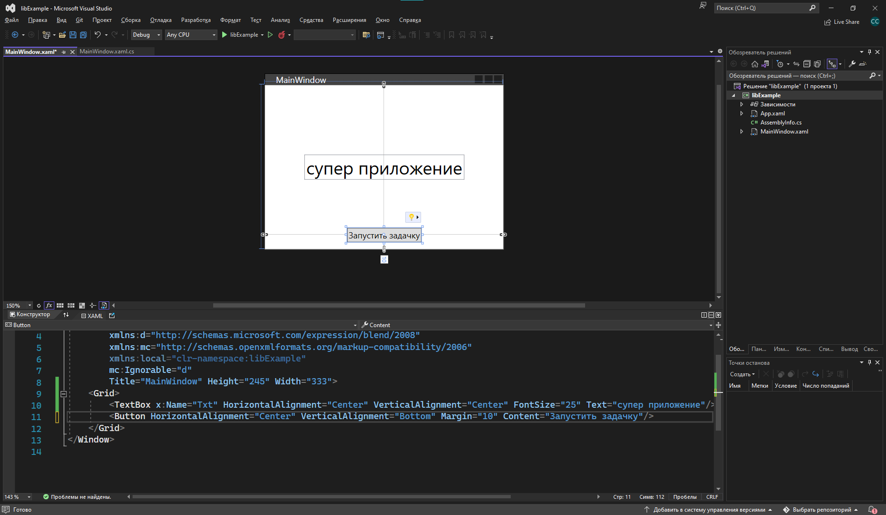

## Функциональная библиотека

Для создания функциональной библиотеки и в принципе любых библиотек нам необходимо добавить новый проект внутрь нашего решения. Решение может хранить несколько проектов и библиотек, чтобы мы сразу видели, что несколько библиотек/приложения относятся к одному и тому же.

ПКМ нажмем по решению и выберем «Добавить», «Создать проект».

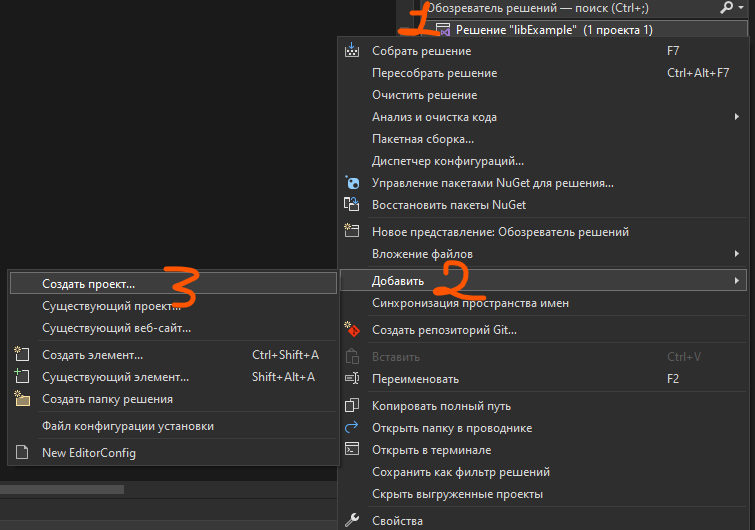

В появившемся окне, как при старте программы, нам нужно найти самую простую библиотеку классов, которая будет поддерживаться на C#.

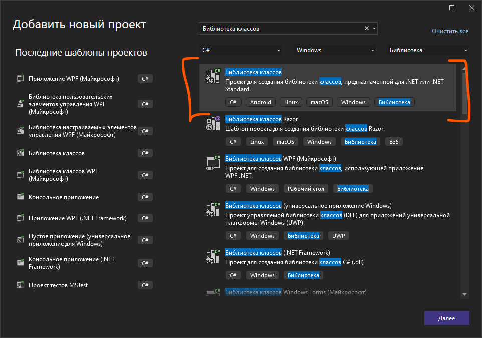

Назовем как-нибудь наш проект и продолжим.

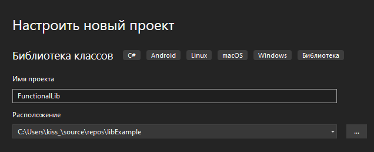

Теперь внутри нашего решения у нас появился ещё один проект — библиотека с одним классом. По умолчанию, сразу после создания, у нас откроется этот класс.

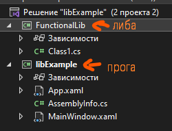

Теперь, прямо внутри этого класса мы можем начать писать какой-то функционал, также как мы это делали и в других приложениях — отдельный класс — отдельный функционал.

Я создам функционал по имитации какого-то долгого действия (примерно, как была генерация точек в [лекции про Task](/wpf/async-await)). Изменю имя класса на `ImmitationWork` и внутрь впишу следующий код.

> Следующий код представлен только для примера и не понадобится вам ни в какой практической, ничего. Вы сюда хоть месседжбокс можете пихнуть.


```csharp
using System.Net;

namespace FunctionalLib
{
    public class ImmitationWork
    {
        public static void ImmitateLongFileBlock(string file, int milisecond)
        {
            using (FileStream fs = new FileStream(file, FileMode.Open))
            {
                Thread.Sleep(milisecond);
            }
        }

        public static HttpStatusCode ImmitateServerResponce(int milisecond = 0)
        {
            Thread.Sleep(milisecond);
            var statuses = Enum.GetValues(typeof(HttpStatusCode)).Cast<HttpStatusCode>().ToArray();
            Random rand = new Random();
            return statuses[rand.Next(0, statuses.Length)];
        }
    }
}
```

### Подключение библиотеки к проекту

Окей, код мы написали, теперь давайте им воспользуемся внутри приложения. Чтобы это сделать, нам сначала необходимо подключить эту библиотеку. И если мы раньше делали это через `NuGet`, то для самосозданных библиотек мы делаем иначе.

Подключим библиотеку, нажав ПКМ по «Зависимости» и выберем «Добавить ссылку на проект».

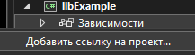

Поставим галочку на нашей библиотеке и нажмем ОК.

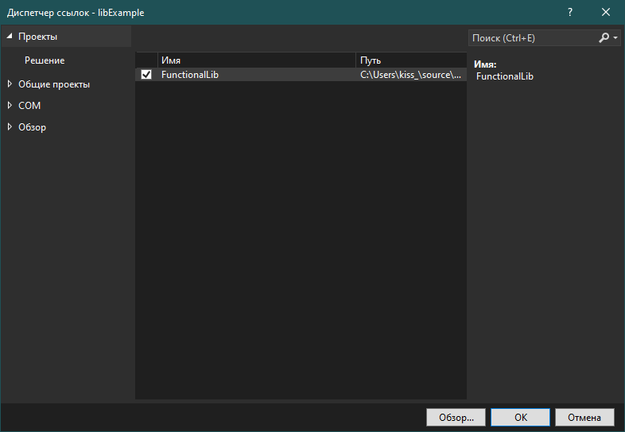

И теперь мы можем использовать классы, которые были внутри этой библиотеки. Например, обработаю нажатие на кнопку и результат метода `ImmitateServerResponce` выведу в текстовое поле. Само текстовое поле названо `Txt`.

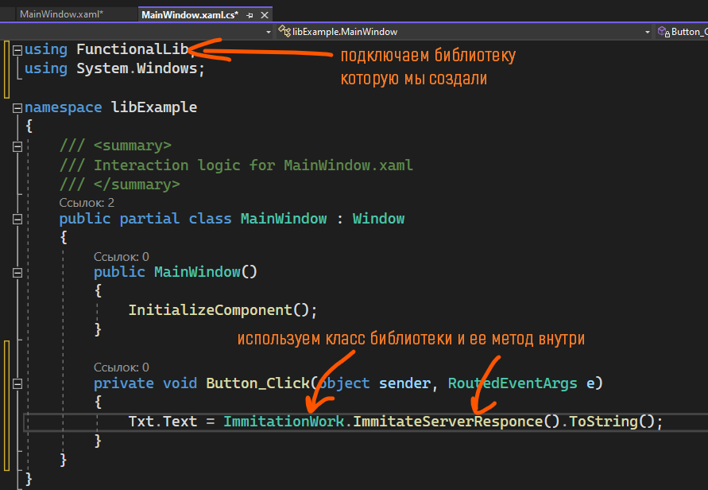

Запущу, и по нажатию на кнопку у меня меняется текст.

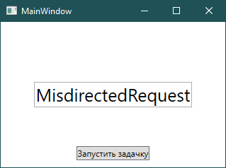

## Библиотека стилей

Для создания библиотеки стилей нам нужно сделать тоже самое — ПКМ по решению → Создать проект → Библиотека настраиваемых элементов управления (либо Microsoft, либо .NET Framework). Назову этот проект `CustomLib`.

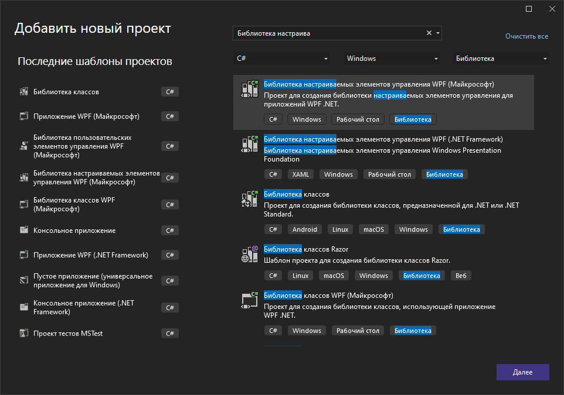

Проект будет выглядеть следующим образом.

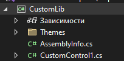

В базовом открываемом файле вы увидите `CustomControl` — это файл, при помощи которого вы можете переписывать стиль для всего приложения через код. Внутри него также есть инструкция как надо подключать этот проект.

Но честно, нам этот файл не интересен, так что я его удалю.

Внутри папки `Themes` разместим стили для кнопок/текстовых полей и других элементов интерфейса, которые мы хотим менять. Старый файл из `Themes` я удалю.

Добавлю внутрь папки `Theme` два заготовленных стиля — кнопку и текстовое поле.

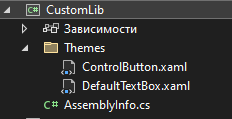

Чтобы я смогла их всецелостно импортировать в свой проект, мне необходимо создать файл, подобный `App.xaml` внутри приложения, где я буду просто хранить все объединенные библиотеки. Назову её `FullDictionary` и помещу его в корень проекта.

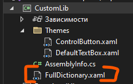

Содержимое будет следующим — просто сразу скажем что этот словарь состоит из нескольких словарей.

```xml
<ResourceDictionary xmlns="http://schemas.microsoft.com/winfx/2006/xaml/presentation"
                    xmlns:x="http://schemas.microsoft.com/winfx/2006/xaml">
    <ResourceDictionary.MergedDictionaries>
        <ResourceDictionary Source="Themes/ControlButton.xaml"/>
        <ResourceDictionary Source="Themes/DefaultTextBox.xaml"/>
    </ResourceDictionary.MergedDictionaries>
</ResourceDictionary>
```

Чтобы подключить такую библиотеку, опять же в основном проекте нажмем на зависимости → Добавить существующий проект и галочку по новой библиотеке → ОК.

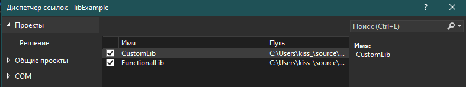

Внутрь `App.xaml` основного приложения нужно прописать ссылку на файл со всеми словарями. Этот ресурс пропишется как:

```xml
<ResourceDictionary Source="pack://application:,,,/библиотека;component/папка/названиесловаря.xaml"/>
```

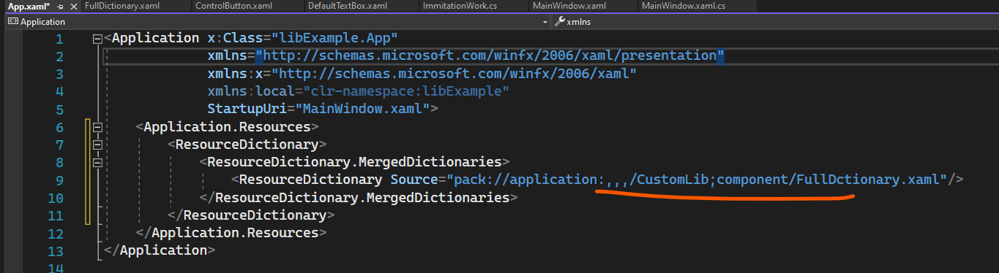

Не забываем собрать проект заново, как только мы подключили новую библиотеку!

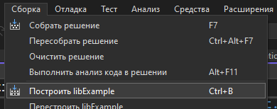

И теперь мы можем использовать стили из этой библиотеки.

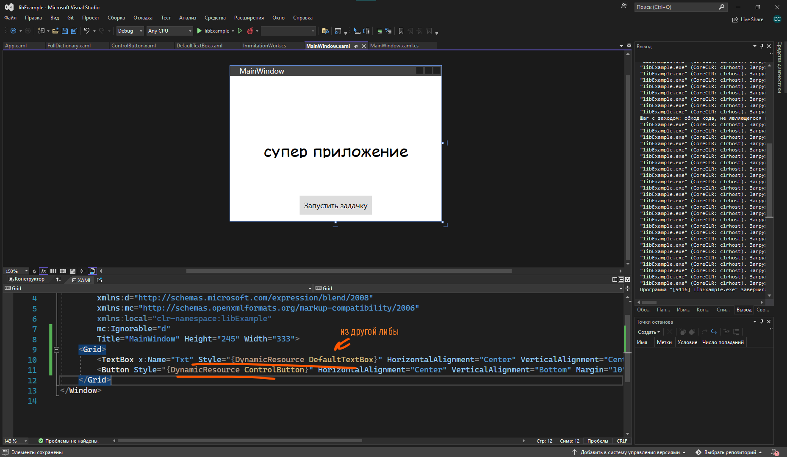

## Библиотека пользовательских элементов управления

Создадим внутри решения ещё одну библиотеку — Библиотека пользовательских элементов WPF. Назову её `ControlsLib`.

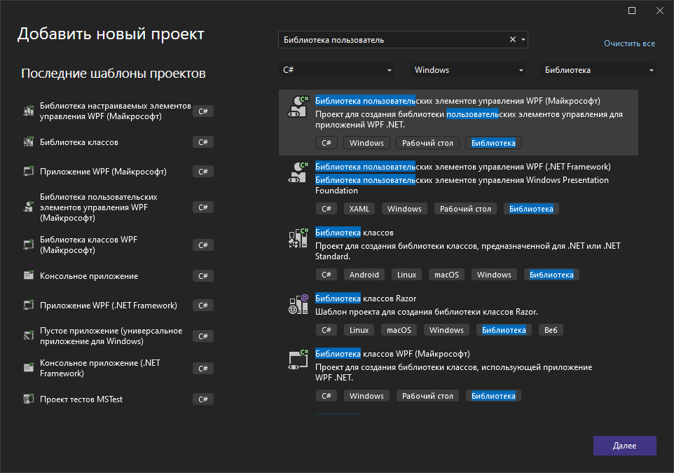

Выглядеть она будет следующим образом. Здесь я смогу располагать все пользовательские элементы интерфейса, которые хочу вынести из проекта.

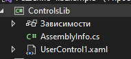

Возьму, например, [карточку из календаря](/wpf/custom-controls) и перенесу её сюда. Она подразумевала картинку, так что добавлю ещё и картинку.

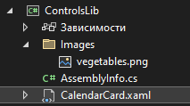

Чтобы картинка работала, поставлю ей в свойствах Ресурс и Копировать всегда. Однако у меня появится проблема — картинка не будет видна в карточке.

Для того, чтобы это исправить, внутрь `Image`, в свойство `Source`, необходимо вставить такой же источник, каким мы делали `ResourceDictionary` для `App.xaml`. Алгоритм следующий:

```
pack://application:,,,/библиотека;component/папка/названиекартинки.расширение
```

Я ссылаюсь сама на себя, так что ссылка будет следующая.

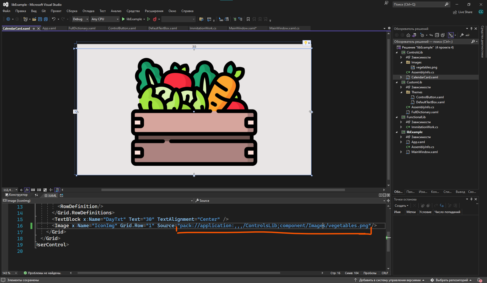

### Подключение и использование

И теперь библиотеку со своими элементами управления мы можем добавить в наш проект. Также нажмем ПКМ по зависимостям → Добавить проект и галочку по проекту → ОК.

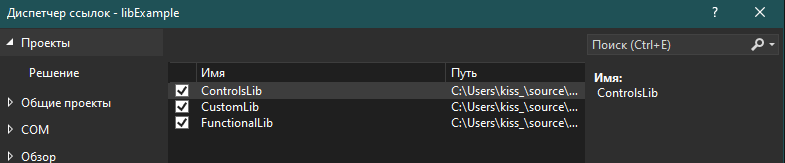

Не забудем собрать проект при помощи `Ctrl + B`.

Чтобы вызывать эти элементы интерфейса из другой библиотеки, нам надо добавить новый `xmlns` внутрь `MainWindow`. Добавим и назовем например `cards`. Внутрь впишем название библиотеки. Как только мы начнем его вписывать, он автоматом нам предложит подключить эту ссылку.

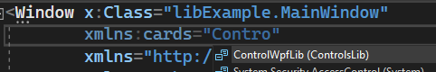

Полностью выглядеть она будет так.

```xml
<Window x:Class="libExample.MainWindow"
        xmlns:cards="clr-namespace:ControlWpfLib;assembly=ControlsLib">
```

Чтобы обратиться к этим элементам, воспользуемся библиотекой `cards` при помощи `cards:названиеэлемента`.

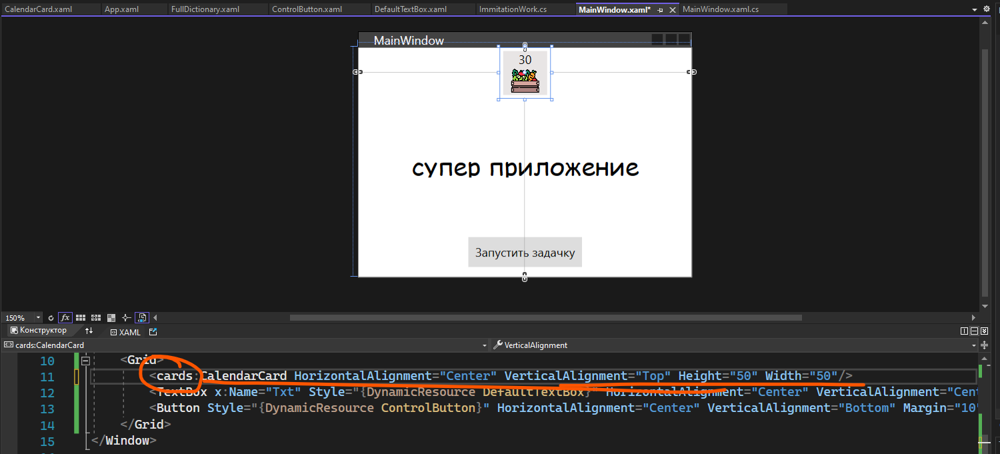

И в целом, с тремя подключенными библиотеками, наша программа будет выглядеть вот так.

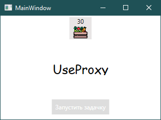

## Подключение сторонних библиотек через .dll

Также, если мы вдруг нашли dll файл, мы можем подключить его как библиотеку. Каждая собранная нами библиотека также имеет формат dll файла, а не exe или прочего. Например так выглядит папка debug у библиотеки с классом.

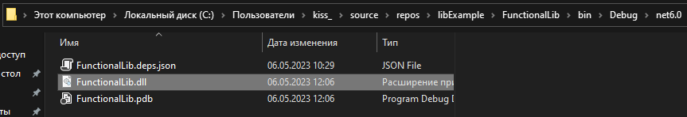

А так выглядит папка debug у приложения.

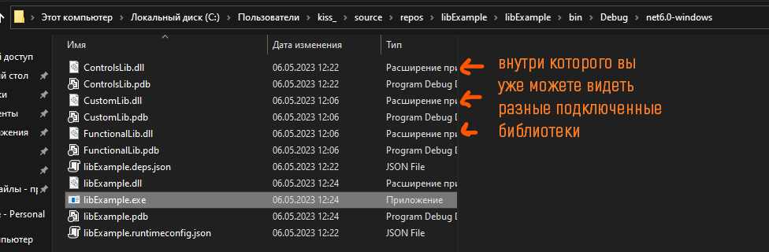

Если вдруг где-то на просторах интернета или просто на рабочем столе вы нашли dll файлик (что дико маловероятно), то вы можете добавить его внутрь проекта следующим образом.

Выгружу библиотеку `FunctionalLib` чтобы решение не видело его (ПКМ → Выгрузить проект).

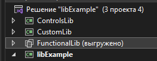

В проводнике у меня всё ещё остался этот проект и его dll файл (картинки выше). Чтобы подключить отдельный файл, мне нужно ПКМ нажать по зависимостям, тыкнуть на любую из первых трех пунктов и в появившемся окне перейти в «Обзор».

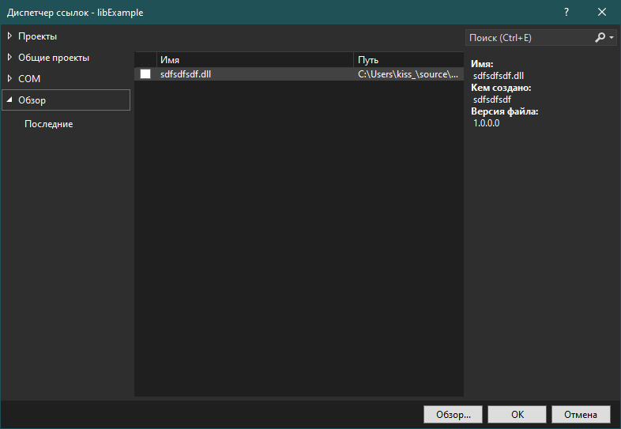

Нажмем на кнопку «Обзор» внизу и найду папку, где у меня хранилась dll.

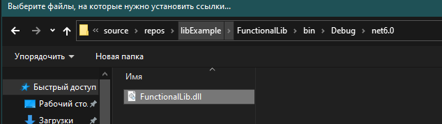

Поставлю галочку напротив него, нажму ОК и я опять же могу её использовать.

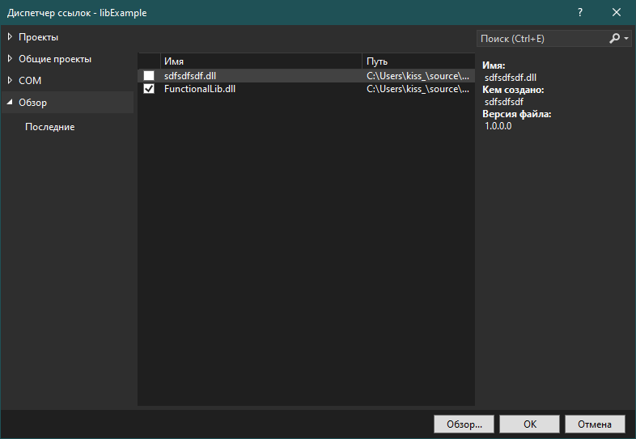

## Полный код примера

`FunctionalLib/ImmitationWork.cs` — функциональная библиотека:

```csharp
using System;
using System.IO;
using System.Linq;
using System.Net;
using System.Threading;

namespace FunctionalLib
{
    public class ImmitationWork
    {
        public static void ImmitateLongFileBlock(string file, int milisecond)
        {
            using (FileStream fs = new FileStream(file, FileMode.Open))
            {
                Thread.Sleep(milisecond);
            }
        }

        public static HttpStatusCode ImmitateServerResponce(int milisecond = 0)
        {
            Thread.Sleep(milisecond);
            var statuses = Enum.GetValues(typeof(HttpStatusCode)).Cast<HttpStatusCode>().ToArray();
            Random rand = new Random();
            return statuses[rand.Next(0, statuses.Length)];
        }
    }
}
```

`CustomLib/FullDictionary.xaml` — объединённый словарь стилей:

```xml
<ResourceDictionary xmlns="http://schemas.microsoft.com/winfx/2006/xaml/presentation"
                    xmlns:x="http://schemas.microsoft.com/winfx/2006/xaml">
    <ResourceDictionary.MergedDictionaries>
        <ResourceDictionary Source="Themes/ControlButton.xaml"/>
        <ResourceDictionary Source="Themes/DefaultTextBox.xaml"/>
    </ResourceDictionary.MergedDictionaries>
</ResourceDictionary>
```

`libExample/App.xaml` — pack URI до словаря из CustomLib:

```xml
<Application x:Class="libExample.App"
             xmlns="http://schemas.microsoft.com/winfx/2006/xaml/presentation"
             xmlns:x="http://schemas.microsoft.com/winfx/2006/xaml"
             StartupUri="MainWindow.xaml">
    <Application.Resources>
        <ResourceDictionary>
            <ResourceDictionary.MergedDictionaries>
                <ResourceDictionary Source="pack://application:,,,/CustomLib;component/FullDictionary.xaml"/>
            </ResourceDictionary.MergedDictionaries>
        </ResourceDictionary>
    </Application.Resources>
</Application>
```

`libExample/MainWindow.xaml` — xmlns на свою сборку и использование `<cards:CalendarCard/>`:

```xml
<Window x:Class="libExample.MainWindow"
        xmlns="http://schemas.microsoft.com/winfx/2006/xaml/presentation"
        xmlns:x="http://schemas.microsoft.com/winfx/2006/xaml"
        xmlns:cards="clr-namespace:ControlWpfLib;assembly=ControlsLib"
        Title="MainWindow" Height="345" Width="450">
    <Grid>
        <cards:CalendarCard HorizontalAlignment="Center" VerticalAlignment="Top" Height="50" Width="50"/>
        <TextBox x:Name="Txt" Style="{DynamicResource DefaultTextBox}"
                 HorizontalAlignment="Center" VerticalAlignment="Center"/>
        <Button Style="{DynamicResource ControlButton}"
                HorizontalAlignment="Center" VerticalAlignment="Bottom" Margin="10"
                Content="Запустить задачку" Click="Button_Click"/>
    </Grid>
</Window>
```

`libExample/MainWindow.xaml.cs` — использование статического метода из библиотеки:

```csharp
using System.Windows;
using FunctionalLib;

namespace libExample
{
    public partial class MainWindow : Window
    {
        public MainWindow()
        {
            InitializeComponent();
        }

        private void Button_Click(object sender, RoutedEventArgs e)
        {
            Txt.Text = ImmitationWork.ImmitateServerResponce().ToString();
        }
    }
}
```
