## Material Design

Большинство используют сейчас обычные системные элементы интерфейса, не придавая значения их виду. Однако у нас есть много специальных библиотек, позволяющих настроить вид наших кнопок. Разберем одну из них — Material Design.

Material Design используется для создания интерфейса на мобильных приложениях, а также на сайтах, используя Bootstrap. Если мы хотим создать приложение с похожим интерфейсом на всех платформах, Material Design будет одним из хороших выборов шаблонных элементов интерфейса.

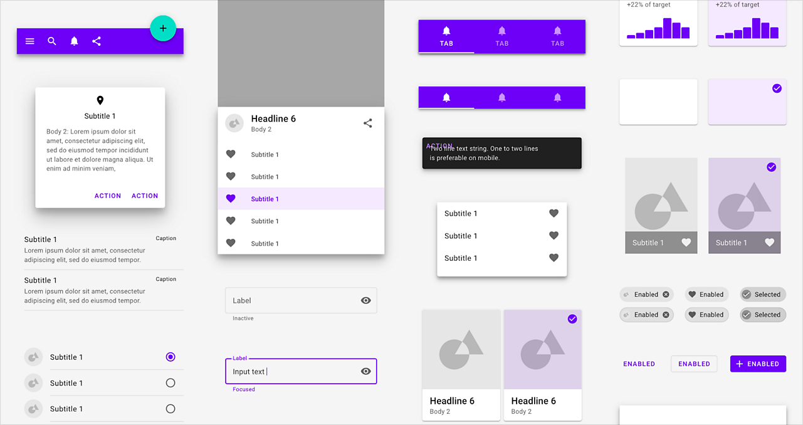

Для того, чтобы начать с ним работать, вам необходимо скачать проект, который я скинула на диск:

[drive.google.com/drive/folders/1KanftRQWGCHxZ6A6coNcip0KGkikD61O](https://drive.google.com/drive/folders/1KanftRQWGCHxZ6A6coNcip0KGkikD61O?usp=share_link)

Это архив с WPF-проектом, где вы сможете быстро ознакомиться со всеми элементами интерфейса и скопировать XAML понравившейся кнопки или текстового поля к себе в проект. Давайте разберемся как работать с этим проектом.

Прежде всего, его нужно скачать и разархивировать куда угодно. После разархивации нам необходимо открыть следующий путь: разархивированная папка → Release → любая версия, которая у вас есть в Visual Studio → `MaterialDesignDemo.exe`.

Для того, чтобы запустить эту программу, у вас должен быть установлен .NET 6.0, 7.0, 8.0 или .NET Framework 4.7.2, любая версия на выбор. Версию вы можете проверить, когда создаете WPF-приложение, если при выборе версии проекта есть хотя бы один из этих, супер.

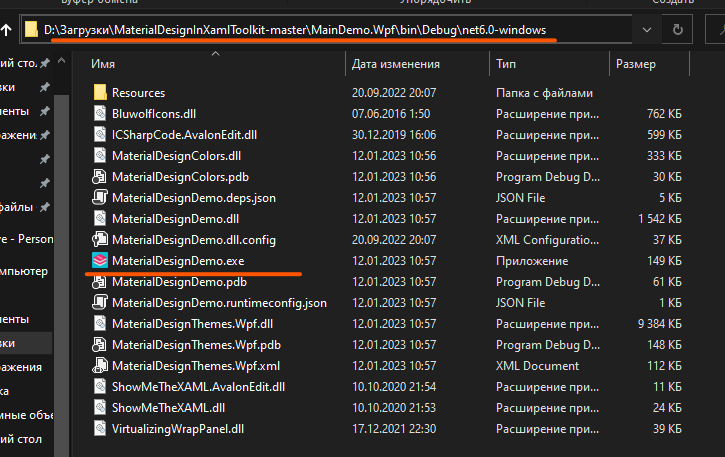

Либо вы можете пойти другим путем и запустить приложение прямо через Visual Studio. Для этого вернитесь в самое начало, в папку, которую вы разархивировали, и найдите там файл `MaterialDesignTooklit.slnf`. Через него вы запустите проект.

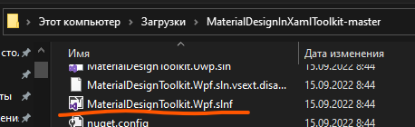

В самой Visual Studio вам необходимо из списка запускаемых приложений (выпадающий список чуть левее кнопки запуска) выбрать приложение `MaterialDesignDemo` и запустить его.

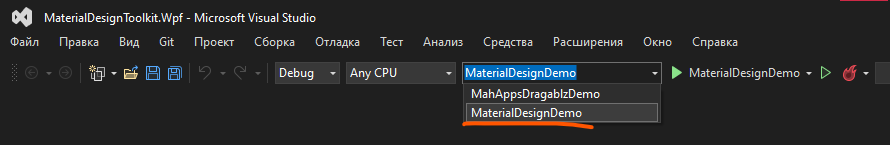

По итогу, после того как мы запустим приложение, нас встретит вот такой интерфейс. Отсюда мы можем посмотреть источник этого приложения — ссылка на GitHub — и контакты создателя Material Design.

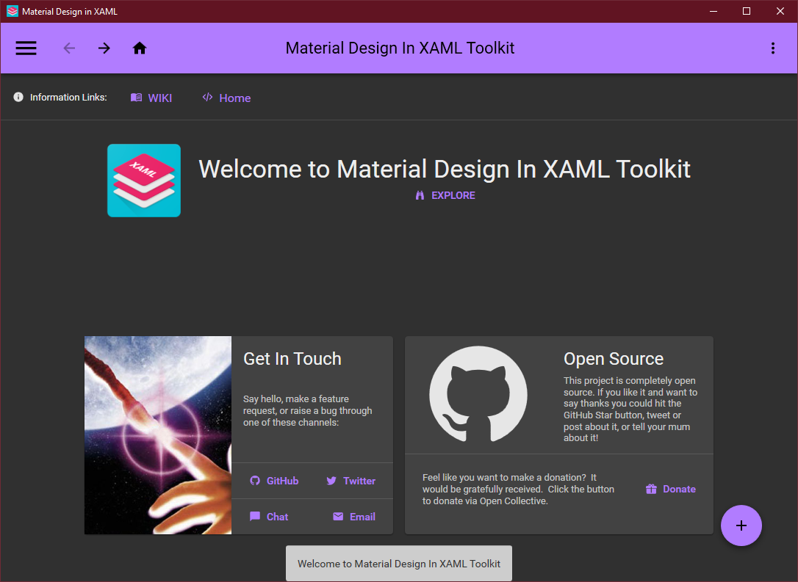

Но нам это все глубоко неинтересно, нам интересно боковое меню в левом верхнем углу. Уже оттуда мы можем найти все элементы интерфейса, которые нам нужны.

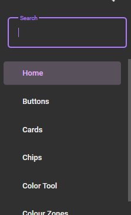

Например, я хочу выбрать себе красивую кнопку. Для этого выберем пункт «Buttons» и найдем здесь кнопки на любой вкус и цвет.

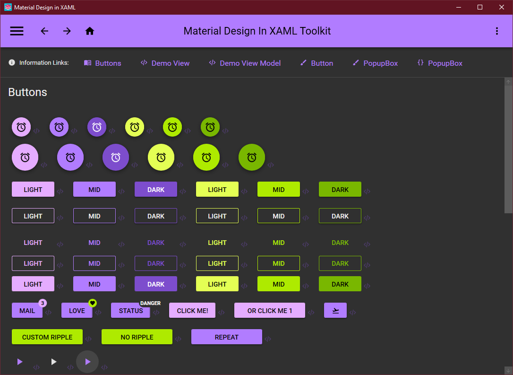

Цвет и содержимое каждого из этого мы сможем менять, за это не переживайте.

Чтобы расположить эти элементы интерфейса у себя в приложении, у нас справа каждого элемента есть кнопка `</>`. Если мы на нее нажмем, мы увидим представление этой кнопки в XAML. Скопировав и вставив эту кнопку в свой проект, мы уже (почти) сможем с ней работать как с самой обычной кнопкой.

Например, я создам совсем пустой проект в WPF и попробую перетащить туда выбранную мной кнопку — Dark. Однако что-то не так. Она совершенно не выглядит так, как было в Material Design, а сам XAML выдает ошибки. В чем проблема?

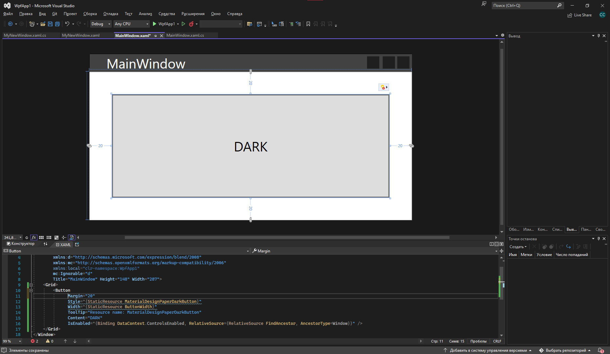

Проблема в том, что для работы с Material Design мы также должны докачать пакет NuGet, чтобы наш проект распознавал все виды кнопок. Давайте откроем управление пакетами NuGet с помощью ПКМ по проекту → Управление пакетами NuGet.

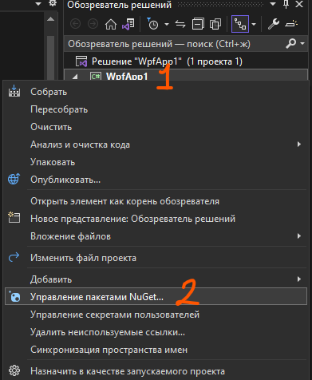

В пакетах нам необходимо найти и докачать `MaterialDesignThemes` — версия не важна.

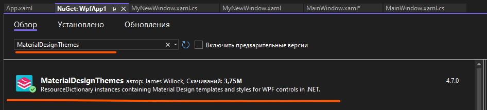

После докачки нам необходимо вставить следующий код в `App.xaml`. ЗАМЕТЬТЕ, что вместо точек после `<Application` у вас должно идти содержимое вашего тэга `Application`. Т.е., если кратко, как только вы заходите в `App.xaml`, вы видите пустой тэг `Application.Resources`. Его вы заменяете на тот `Application.Resources`, что я скинула ниже, а в тэг `Application`, после `StartupUri`, вам необходимо добавить ссылку `xmlns:materialDesign`.

```xml
<Application . . .
             xmlns:materialDesign="http://materialdesigninxaml.net/winfx/xaml/themes">
    <Application.Resources>
        <ResourceDictionary>
            <ResourceDictionary.MergedDictionaries>
                <materialDesign:BundledTheme BaseTheme="Light" PrimaryColor="DeepPurple" SecondaryColor="Lime" />
                <ResourceDictionary Source="pack://application:,,,/MaterialDesignThemes.Wpf;component/Themes/MaterialDesign3.Defaults.xaml" />
            </ResourceDictionary.MergedDictionaries>
        </ResourceDictionary>
    </Application.Resources>
</Application>
```

По итогу, у меня это выглядит так.

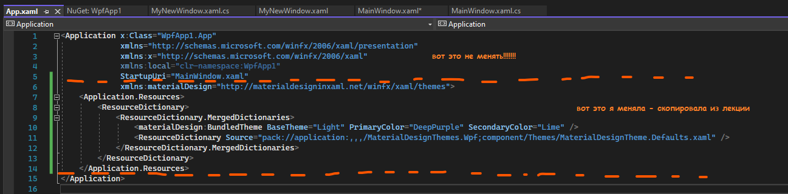

С `App.xaml` закончили, осталось только добавить эту библиотеку непосредственно в окно. Если в коде все библиотеки мы добавляли через `using`, то в XAML мы добавляем их через `xmlns:имя` в самом верхнем тэге — в данном случае `Window`.

Добавить необходимо следующую библиотеку:

```xml
xmlns:materialDesign="http://materialdesigninxaml.net/winfx/xaml/themes"
```

Я добавлю эту библиотеку сразу после первой строчки, чтобы все библиотеки были визуально в одной группке.

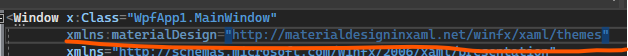

В XAML пока все также тихо — кнопки не отображаются. Чтобы все заработало, нам нужно либо собрать проект без сборки — `Ctrl + B` — либо запустить проект, и мы увидим, какая красивая кнопка у нас появилась!

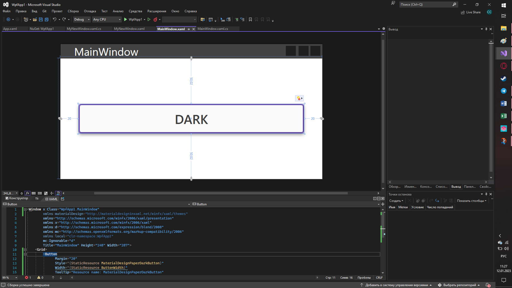

Внутри самой кнопки, в XAML, я могу удалить все ненужные свойства, которые я вижу. Например, мне вообще не нужно какое-то странное значение в `Width`, `ToolTip` и `IsEnabled` — я человек простой, я хочу красивую кнопочку со стилем и текстом внутри.

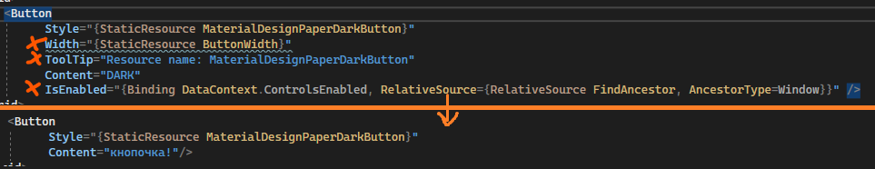

И по итогу у нас будет красивая кнопочка с нашим текстом.

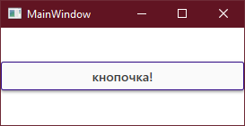

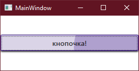

Таким же образом мы можем создавать любой элемент интерфейса, который найдем в программе Material Design. Если мы не хотим использовать стиль этой кнопки, нам нужно убрать свойство `Style`. События для этих кнопок делаются также, как и для обычных элементов управления. Это на самом деле и есть обычный элемент управления, мы просто добавляем ему стиль.

## Новые окна

Все приложения, которые мы используем, используют далеко не одно окно. Однако практические, которые мы писали, все имели одно окно. Тогда встает вопрос — как создать новое окно и отобразить его? Давайте разбираться.

Я создам новый пустой проект, где будет только одна кнопка — открыть новое окно. Интерфейс может быть любым, но сейчас, мне нужна какая-то кнопка, при нажатии на которую, будет открываться новое окно.

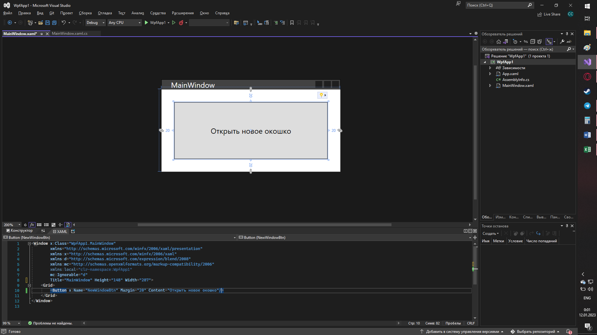

Чтобы у меня открывалось новое окно, мне необходимо его создать. Создать новое окно мы можем также, как раньше создавали новые классы — просто через добавление файла. Нажмем ПКМ по проекту, выберем «Добавить» и выберем «Окно (WPF)».

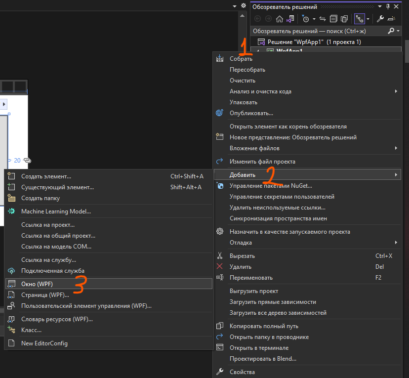

В появившемся окне снова подтвердим, что мы хотим создать окно и дадим ему название. В WPF новые окна принято называть как `____Window`.

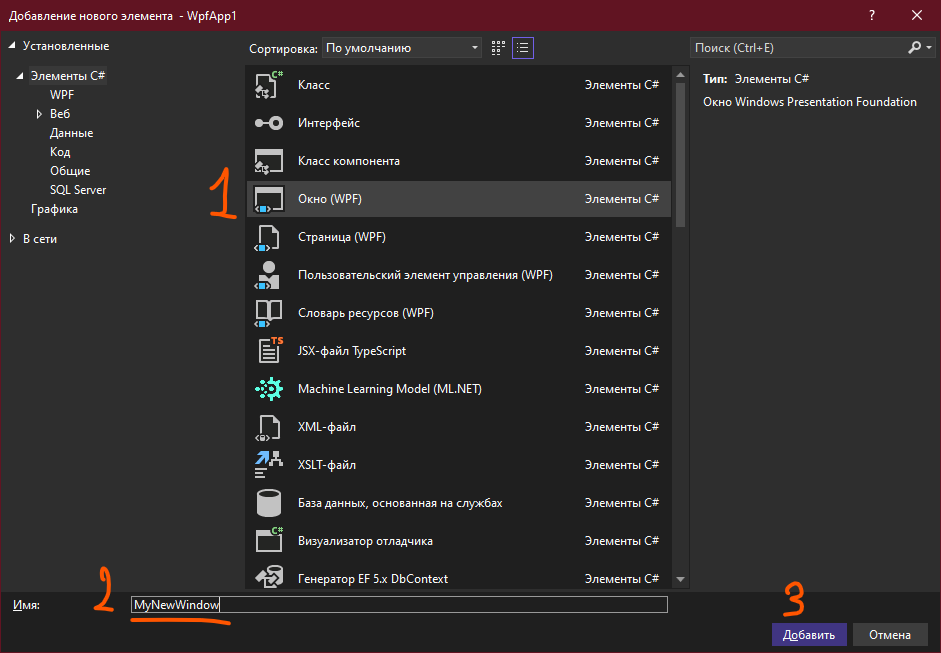

Новое окно имеет всю ту же структуру, что и `MainWindow` (логично, и то и то — окно) — тот же XAML, тот же xaml.cs и прочее. Здесь мы также можем реализовывать любой интерфейс и любые события, только хранится они уже будут в файле определенного окна (событие окна `MyNewWindow.xaml` будут хранится в `MyNewWindow.xaml.cs`, а не в `MainWindow.xaml.cs`).

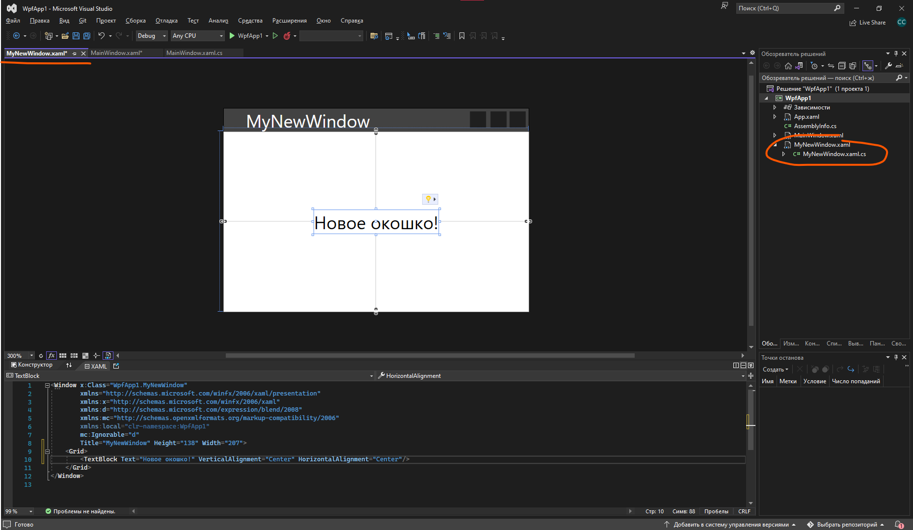

Чтобы открыть это новое окно, его необходимо создать как сложную переменную внутри окна, из которого мы хотим вызвать новое окно. Скажем, я из окна `MainWindow` по нажатию на кнопку хочу открыть `MyNewWindow`. Тогда, обработаем событие нажатия на кнопку, и создадим там переменную типа данных `MyNewWindow`.

```csharp
private void NewWindowBtn_Click(object sender, RoutedEventArgs e)
{
    MyNewWindow window = new MyNewWindow();
}
```

Если я хочу его отобразить, я использую эту переменную `window`, а именно, скажу показать мне окно — вызову метод `Show()`.

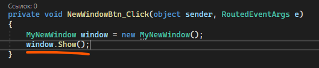

По итогу, у меня отобразится это новое окно.

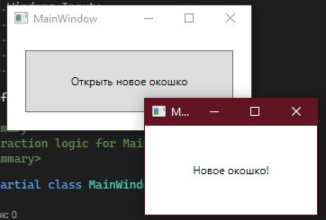

Если я хочу закрыть текущее окно, я напишу `this.Close()` или просто `Close()`. То же самое я могу проделать для всех классов, которые наследуют класс `Window` — этот метод хранится внутри родительского класса.

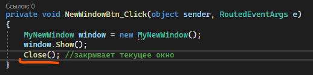

## Передача данных в новое окно

Если я хочу задать значение для какой-то переменной или использовать какой-то элемент интерфейса до того, как открылось окошко (например, изменить текст, или запихнуть в переменную значение), я также буду делать это с помощью переменной `window`. Например, я дам имя текстовому блоку во втором окне.

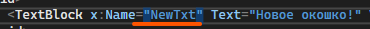

И создам публичную глобальную переменную (использовать я ее не буду, просто создам, чтобы закинуть туда значение).

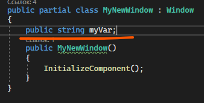

Как я уже сказала, чтобы использовать эти переменные, я обращусь к ним через переменную с моим окном (в моем случае `window`). Обращусь как `window.переменная`.

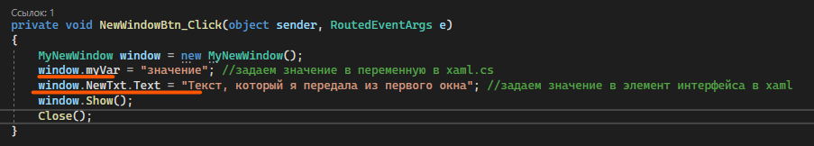

Итого, мы увидим следующее, если откроем наше окошко.

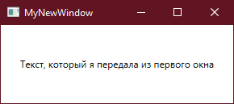

Также мы можем передавать значения с помощью конструктора. Мы помним, что по умолчанию у нас есть вот такой вот пустой конструктор, который просто создает окно интерфейса с помощью метода `InitializeComponent()`.

```csharp
public MyNewWindow()
{
    InitializeComponent();
}
```

Как и в обычном конструкторе, мы можем задать ему параметры, которые будем передавать при создании переменной.

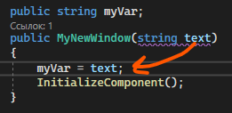

Тогда и объявление переменной `window` изменится, так как теперь нам нужно в наш конструктор что-то передать.

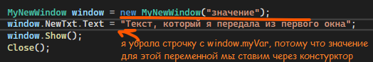

## ShowDialog и DialogResult

Однако, если мы закроем это новое окно, мы не узнаем, закрылось ли оно или нет. А что, если это новое окно было диалоговым, и нам нужно узнать, какая информация была в окошке, когда оно закрылось, или что выбрал пользователь при закрытии? Тогда нам обязательно знать, когда закрылось окно.

Раз уж мы сказали, что окно подразумевается как диалоговое, тогда и откроем мы его с помощью `ShowDialog()`.

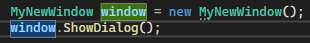

Я видоизменю свое второе окно, чтобы оно было больше похоже на диалоговое с выбором «Да» или «Нет».

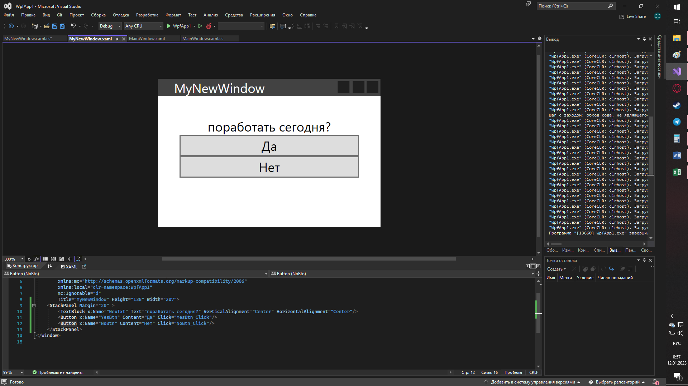

К кнопкам «Да» и «Нет» я привяжу события нажатия — в случае, если я нажала «Да», глобальная переменная `choose` будет равна «Да». В случае если нет — переменная равна «Нет».

```csharp
public partial class MyNewWindow : Window
{
    public string choose;

    public MyNewWindow()
    {
        InitializeComponent();
    }

    private void YesBtn_Click(object sender, RoutedEventArgs e)
    {
        choose = "Да";
        DialogResult = true;  // чтобы закрыть окно, будто все ок
    }

    private void NoBtn_Click(object sender, RoutedEventArgs e)
    {
        choose = "Нет";
        DialogResult = false; // чтобы закрыть окно, будто нажали на кнопку «отмена»
    }
}
```

Заметьте, что я также добавила `DialogResult = true` и `DialogResult = false` в эти события. Что это такое?

`DialogResult` позволяет закрыть окно с каким-либо результатом — `true`, если мы подтвердили действие (например такие вещи как «да», «установить» в установщиках, «удалить» в деинсталляторах, «подтвердить» — все они будут иметь `DialogResult = true`), и `false`, если мы действие отменили («нет», «отмена», «прервать», «остановить» — все это будет иметь `DialogResult = false`). Если мы просто закроем окно через крестик, тогда `DialogResult` будет равен `false`. По умолчанию он равен `null`.

Здесь я хочу иметь подобную логику — сказать предыдущему окну, что я либо подтвердила действие, либо нет. Как только код дойдет до `DialogResult` или `Close()` (в этом случае, `DialogResult` будет равен `null`), окно закроется, и мы вернемся к выполнению кода в первом окне. Т.е. пока второе окно не закрыто, код в первом окне приостанавливается.

Допишу код в первом окне — я хочу вывести в MessageBox результат из своего диалогового окна.

```csharp
private void NewWindowBtn_Click(object sender, RoutedEventArgs e)
{
    MyNewWindow window = new MyNewWindow();
    window.ShowDialog();

    MessageBox.Show(window.choose);
}
```

Пока второе окно не закроется, мы останавливаемся на строчке `window.ShowDialog();`.

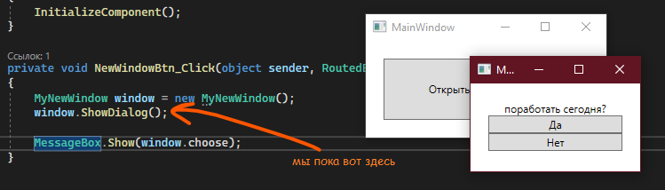

Как только мы что-то выберем (да, нет, закрыть окно), код пойдет дальше, в нашем случае — к MessageBox.

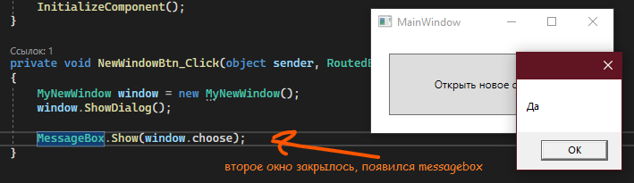

Если я хочу сделать разную логику в зависимости от того, что было в `DialogResult` (`true`, `false` или `null` (если мы просто закрыли через `Close()`)), мне нужно сохранить результат `ShowDialog()` в переменную. Она будет иметь тип данных `bool?` — тот, что принимает `true`, `false` или `null`. И уже от него, можно делать разные условия.

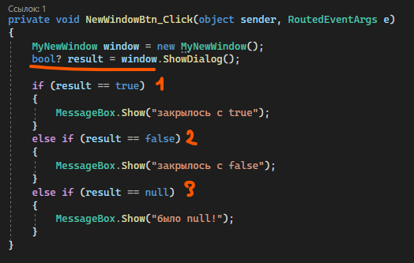

Результат будет отличаться в зависимости от того, с каким значением `DialogResult` закрылось окно.

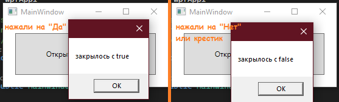

## Полный код примера

`MyNewWindow.xaml` с двумя кнопками для диалогового окна:

```xml
<Window x:Class="WpfApp1.MyNewWindow"
        xmlns="http://schemas.microsoft.com/winfx/2006/xaml/presentation"
        xmlns:x="http://schemas.microsoft.com/winfx/2006/xaml"
        Title="MyNewWindow" Height="200" Width="300">
    <StackPanel Margin="20" VerticalAlignment="Center">
        <TextBlock x:Name="NewTxt" Text="поработать сегодня?"
                   HorizontalAlignment="Center" Margin="0,0,0,15"/>
        <Button x:Name="YesBtn" Content="Да"    Click="YesBtn_Click" Margin="0,0,0,5"/>
        <Button x:Name="NoBtn"  Content="Нет"   Click="NoBtn_Click"/>
    </StackPanel>
</Window>
```

`MyNewWindow.xaml.cs` с обработчиками кнопок и `DialogResult`:

```csharp
using System.Windows;

namespace WpfApp1
{
    public partial class MyNewWindow : Window
    {
        public string choose;

        public MyNewWindow()
        {
            InitializeComponent();
        }

        private void YesBtn_Click(object sender, RoutedEventArgs e)
        {
            choose = "Да";
            DialogResult = true;
        }

        private void NoBtn_Click(object sender, RoutedEventArgs e)
        {
            choose = "Нет";
            DialogResult = false;
        }
    }
}
```

`MainWindow.xaml.cs` с разной логикой на каждый возможный результат:

```csharp
using System.Windows;

namespace WpfApp1
{
    public partial class MainWindow : Window
    {
        public MainWindow()
        {
            InitializeComponent();
        }

        private void NewWindowBtn_Click(object sender, RoutedEventArgs e)
        {
            MyNewWindow window = new MyNewWindow();
            bool? result = window.ShowDialog();

            if (result == true)
            {
                MessageBox.Show("закрылось с true");
            }
            else if (result == false)
            {
                MessageBox.Show("закрылось с false");
            }
            else if (result == null)
            {
                MessageBox.Show("было null!");
            }
        }
    }
}
```
