## Архитектуры приложения, MVVM

По мере выполнения практических, каждый из вас создавал свою архитектуру приложения — использовал окна, создавал новые [классы](/csharp/classasmodel), может размещал их по папкам и прочее. Представьте, что половина второго курса объединится в одну организацию, которая будет писать или тестировать один большой проект. Вы никогда не определитесь в какой именно структуре вы должны будете написать код так, чтобы он был и понятен всем разработчикам, и был достаточно мобилен для расширения вашего функционала. Именно для этого были придуманы различные архитектуры приложений.

**Архитектура приложений** — это структурный принцип, по которому создано приложение таким образом, чтобы оно удовлетворяло всем заявленным к нему требованиям, а также обеспечивало максимальную простоту доработки, развертывания и масштабирования приложения.

Если проект был сделан грамотно, то лишь взглянув на пару-тройку классов, вы сразу же сможете определить его архитектуру. Для WPF самой распространенной архитектурой является MVVM.

---

**MVVM** является аббревиатурой и расшифровывается как **Model-View-ViewModel**. Эти три компонента связаны между собой следующим образом:

- **Model** — модель данных, над которой идет работа. Данные из нее мы будем выгружать в интерфейс.
- **View** — сам интерфейс, к которому будет привязываться данные модели.
- **View model** — принцип того, как данные будут связываться между моделью и интерфейсом. Вся логика работы с данными находится здесь.

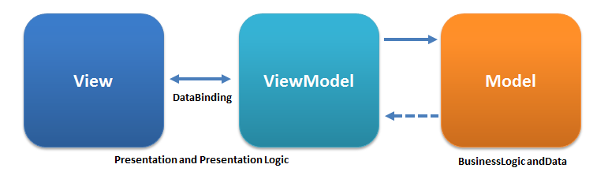

Банальные примеры внедрения MVVM на основе практических:

- **Ежедневник или учет бюджета**:
  - Model — свой класс с заметкой.
  - View — окно с CRUD операциями и датой.
  - ViewModel — логика добавления, изменения и удаления данных.
- **Аудиоплеер**:
  - Model — файл или `MediaElement`, созданный в коде (модели могут быть не только самописными).
  - View — окно аудиоплеера.
  - ViewModel — логика отображения данных из файла в элементы интерфейса: текущая позиция музыки, плей/пауза и прочее.

Можно подумать, что мы и так пишем программы в подобной архитектуре, ведь всю логику мы пишем внутри xaml.cs. Однако есть большая разница. В MVVM работа идет с [привязкой, то есть биндингами](/wpf/bindings). Мы создаем полностью отдельный класс, к которому будем привязывать интерфейс, xaml.cs мы больше не используем.

Такое отделение от xaml.cs позволит нам привязывать ViewModel сразу к нескольким окнам одновременно и удобно расширять функционал сразу во всех окнах.

Когда стоит использовать эту архитектуру? MVVM удобно использовать вместо классического MVC (о которой вы узнаете из других дисциплин, как РПМ) и ему подобных в тех случаях, когда в платформе, на которой ведётся разработка, есть «связывание данных».

---

## Пример программы

Рассмотрим пример программы, написанный на MVVM. Я хочу создать простое приложение — датагрид с цветами. При выборе любого элемента, все значения из таблицы выгрузятся в текстовые поля.

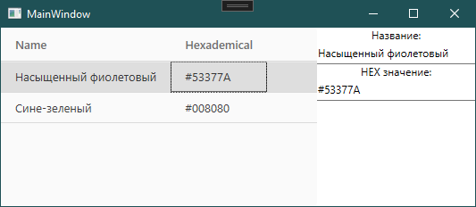

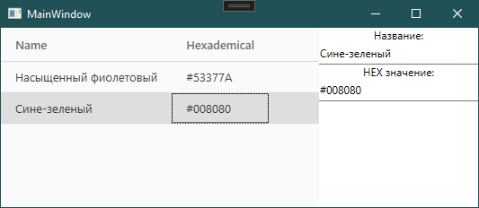

Если бы мы реализовали эту программу основываясь на знаниях из предыдущей лекции, мы бы сделали следующее.

**Перво наперво, подготовимся к привязкам и реализуем интерфейс `INotifyPropertyChanged`**, чтобы интерфейс знал о том, что значения внутри переменных может меняться. Наследуем интерфейс:

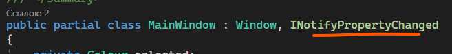

И в самом низу реализуем этот интерфейс:

```csharp
public event PropertyChangedEventHandler PropertyChanged;

protected void OnPropertyChanged([CallerMemberName] string name = null)
{
    PropertyChanged?.Invoke(this, new PropertyChangedEventArgs(name));
}
```

**Создадим модель данных с цветами**, которые мы будем выгружать. Модель состоит из имени и HEX значения этого цвета. Внутри модели также создам конструктор, чтобы было проще в будущем создавать переменные:

```csharp
public class Colour
{
    public Colour(string name, string hexademical)
    {
        Name = name;
        Hexademical = hexademical;
    }

    public string Name { get; set; }
    public string Hexademical { get; set; }
}
```

**Внутри `MainWindow.xaml.cs` я создам два свойства** — одно для выбранного элемента из датагрида, а другое — для списка элементов датагрида. Список у меня будет как [ObservableCollection](/wpf/bindings). Заметьте, что внутри каждого свойства у меня стоит метод `OnPropertyChanged` для отслеживания изменения значения.

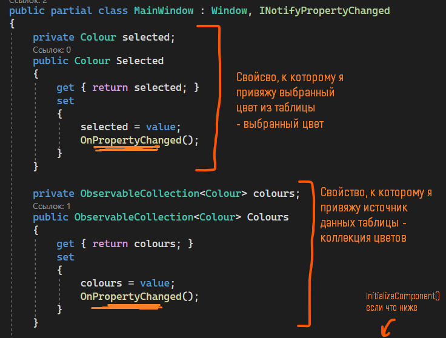

**Реализую сам интерфейс с привязкой данных**:

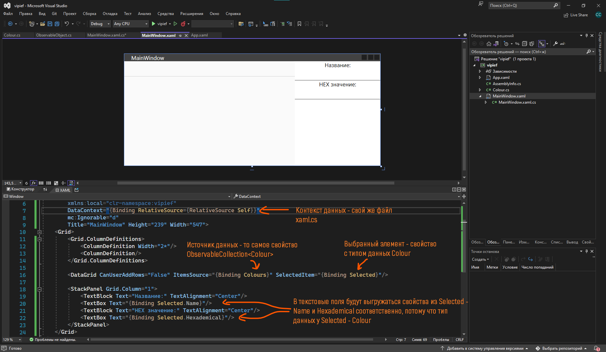

**Заполню свою переменную `Colours`.** Здесь уже не имеет значения где заполнять — перед или после `InitializeComponent`. Заполню при помощи конструктора:

```csharp
public MainWindow()
{
    InitializeComponent();
    Colours = new ObservableCollection<Colour>()
    {
        new Colour("Насыщенный фиолетовый", "#53377A"),
        new Colour("Сине-зелёный", "#008080")
    };
}
```

Запустить запустится, работает работается. Но в данном случае архитектура у нас дико хромает — все раскидано непонятно как, логика данных какого-то черта прямо внутри логики окна и прочее.

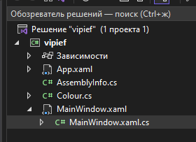

Предлагаю все это дело структурировать.

## Переход от обычной структуры к MVVM

Начну с того, что я создам 4 нужные мне папки — `Model`, `View`, `ViewModel` и `Helpers` (для разных дополнительных классов, которые помогут мне разрабатывать мою модель. Эта папка будет внутри `ViewModel`).

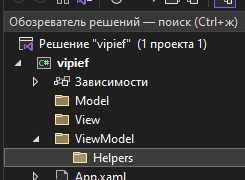

Затем перемещу существующие файлы по папкам — `Colour` в `Model`, `MainWindow` в `View`.

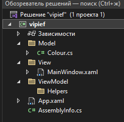

Сейчас программа не запустится, так как файл `App.xaml`, где пишется запускаемое окно, автоматически не изменится. Чтобы его изменить, зайдем в `App.xaml` и в `StartupUri` пропишем новое расположение нашего главного окна, добавив название папки.

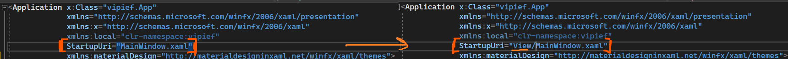

Программа снова будет запускаться.

Осталось только разобраться с `ViewModel`. Туда мы должны перенести весь наш код кроме конструктора с `InitializeComponent`, которое будет создавать наше окно. Создам новый файл внутри папки `ViewModel` с названием `НазваниеокнаViewModel.cs`.

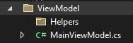

```csharp
namespace vipief.ViewModel
{
    internal class MainViewModel
    {
    }
}
```

Перенесу весь код из xaml.cs внутрь `MainViewModel`:

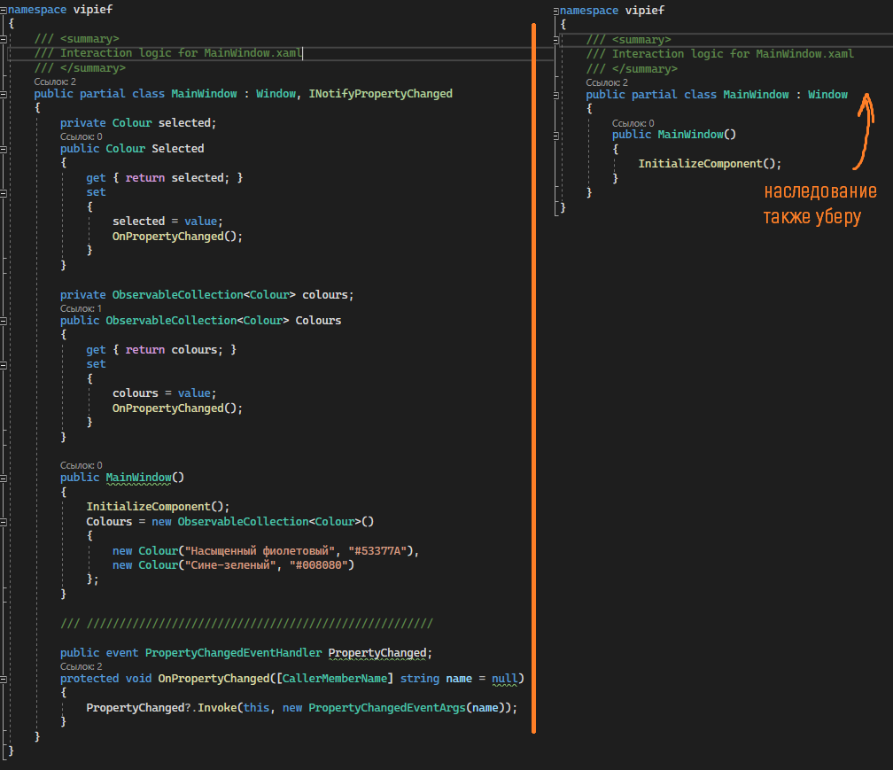

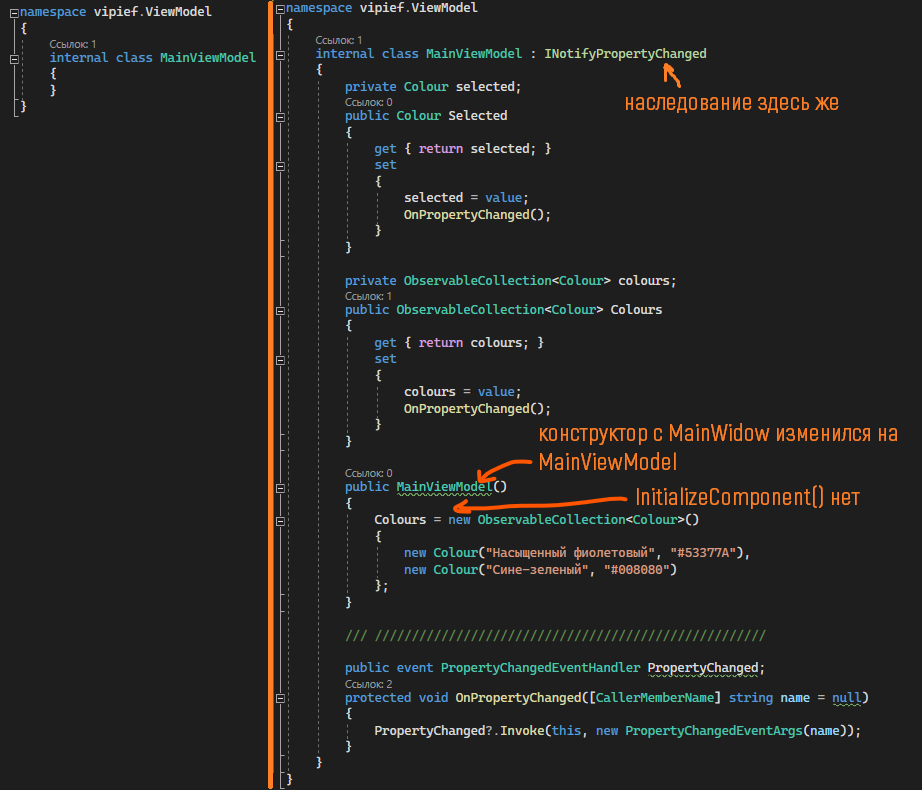

## BindingHelper и наследование

А также вынесу реализацию `INotifyPropertyChanged` в отдельный класс, чтобы:

- не засорять код внутри `ViewModel` этой реализацией.
- создать единый класс, который я буду просто наследовать и использовать его методы внутри `ViewModel`.

Назову его `BindingHelper` и создам его внутри папки `Helpers`.

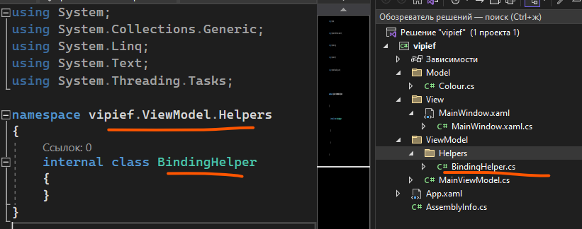

Внутри мне необходимо написать следующий код:

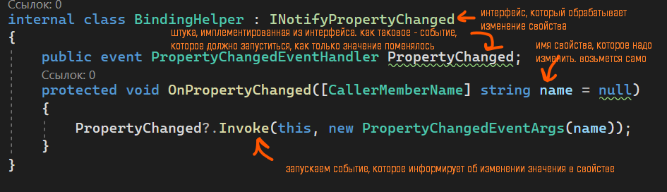

```csharp
using System.ComponentModel;
using System.Runtime.CompilerServices;

namespace vipief.ViewModel.Helpers
{
    internal class BindingHelper : INotifyPropertyChanged
    {
        public event PropertyChangedEventHandler PropertyChanged;

        protected void OnPropertyChanged([CallerMemberName] string name = null)
        {
            PropertyChanged?.Invoke(this, new PropertyChangedEventArgs(name));
        }
    }
}
```

А внутри `ViewModel` я удалю реализацию `INotifyPropertyChanged` и буду наследовать `BindingHelper`:

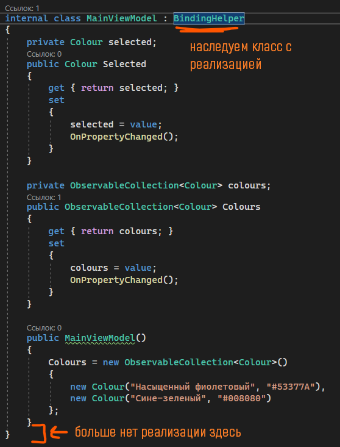

## Регионы и DataContext

Для сокрытия кусочка кода с переменными я могу создать регион при помощи `#region` и `#endregion`. Вещь просто удобная и на код никак не влияет.

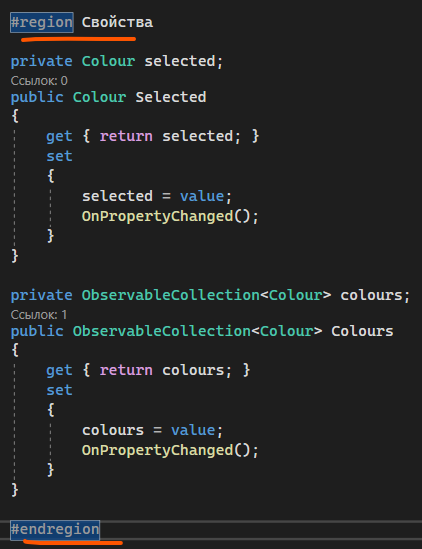

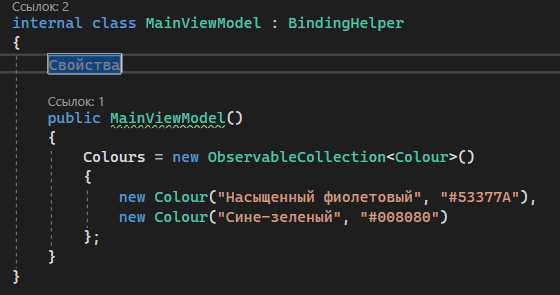

И, так как теперь внутри xaml.cs у нас ничего нет, то и привязки не работают, так как в окне мы указали контекст данных — наш внутренний файл. Теперь, в качестве контекста, нам нужно указать нашу ViewModel. Для этого сделаем следующее:

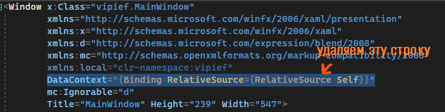

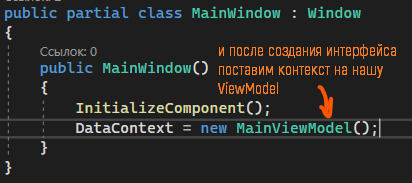

И тогда архитектура MVVM будет реализована, а программа будет работать также.

Опять же, MVVM существует для более лучшей расширяемости функционала нашего приложения, и её будет удобно использовать в больших проектах об этом не стоит забывать!

Для удобства рассмотрения этого примера MVVM проекта, я прикреплю для вас ссылку с проектом, который вы можете загрузить, ознакомиться с ним, и понять, как это работает своими руками:

[drive.google.com/drive/folders/1GKkdE-HTCeNaWKLPTtZ-ELW0pXDrTng2](https://drive.google.com/drive/folders/1GKkdE-HTCeNaWKLPTtZ-ELW0pXDrTng2?usp=share_link)

## Полный код примера

`Model/Colour.cs` — модель данных:

```csharp
namespace vipief.Model
{
    public class Colour
    {
        public Colour(string name, string hexademical)
        {
            Name = name;
            Hexademical = hexademical;
        }

        public string Name { get; set; }
        public string Hexademical { get; set; }
    }
}
```

`ViewModel/Helpers/BindingHelper.cs` — базовый класс с реализацией `INotifyPropertyChanged`:

```csharp
using System.ComponentModel;
using System.Runtime.CompilerServices;

namespace vipief.ViewModel.Helpers
{
    internal class BindingHelper : INotifyPropertyChanged
    {
        public event PropertyChangedEventHandler PropertyChanged;

        protected void OnPropertyChanged([CallerMemberName] string name = null)
        {
            PropertyChanged?.Invoke(this, new PropertyChangedEventArgs(name));
        }
    }
}
```

`ViewModel/MainViewModel.cs` — наследует `BindingHelper`, держит свойства и инициализацию:

```csharp
using System.Collections.ObjectModel;
using vipief.Model;
using vipief.ViewModel.Helpers;

namespace vipief.ViewModel
{
    internal class MainViewModel : BindingHelper
    {
        #region Свойства

        private Colour selected;
        public Colour Selected
        {
            get { return selected; }
            set
            {
                selected = value;
                OnPropertyChanged();
            }
        }

        private ObservableCollection<Colour> colours;
        public ObservableCollection<Colour> Colours
        {
            get { return colours; }
            set
            {
                colours = value;
                OnPropertyChanged();
            }
        }

        #endregion

        public MainViewModel()
        {
            Colours = new ObservableCollection<Colour>()
            {
                new Colour("Насыщенный фиолетовый", "#53377A"),
                new Colour("Сине-зелёный", "#008080")
            };
        }
    }
}
```

`View/MainWindow.xaml.cs` — единственное, что осталось: `InitializeComponent` и установка `DataContext`:

```csharp
using System.Windows;
using vipief.ViewModel;

namespace vipief.View
{
    public partial class MainWindow : Window
    {
        public MainWindow()
        {
            InitializeComponent();
            DataContext = new MainViewModel();
        }
    }
}
```
