Кроме отдельных окон, в WPF есть еще такое понятие, как страницы. Страницы представляют собой контейнеры с интерфейсом и могут меняться прямо внутри окна. С помощью них наш интерфейс не будет наслаиваемым с миллионом окон, а будет иметь одно переключаемое окно.

Создаются страницы также, как и окна — ПКМ по проекту → добавить → Страница (WPF).

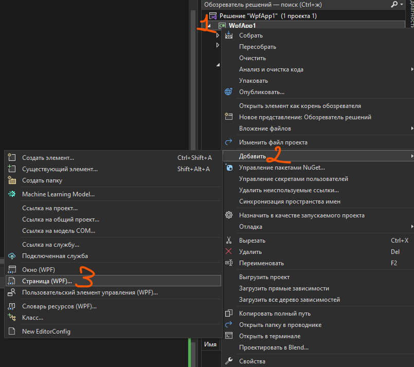

В появившемся окне дадим название нашей странице. Страницы обычно назвают как `___Page.xaml`.

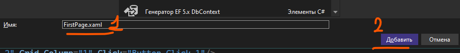

Создавая окно, мы увидим парочку главных отличий:

- Теперь главный тэг называется не `Window`, а `Page`.
- Экран теперь не белый, а прозрачный. Также у него нет шапки вверху интерфейса.

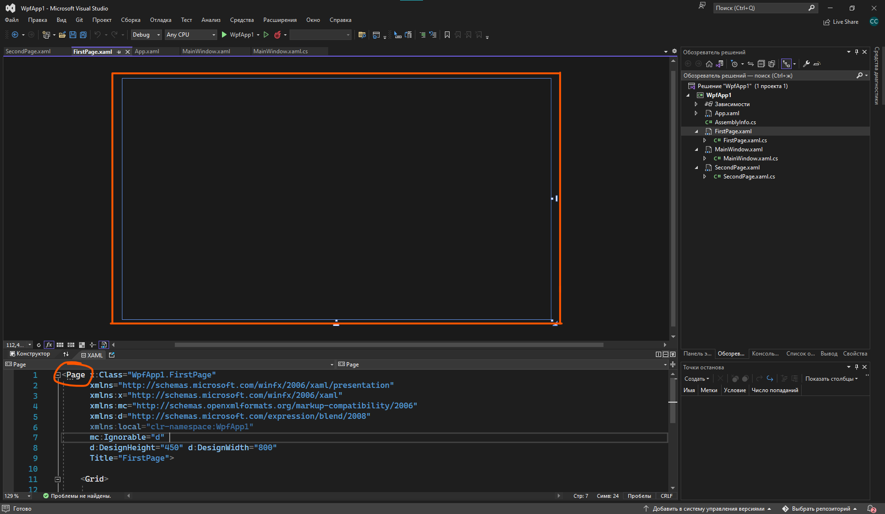

В остальном, все объекты и события мы можем располагать точно также, как и в окне — создавать текстовые поля, кнопки, обрабатывать нажатия на кнопки и прочее.

Создадим 2 страницы — `FirstPage` и `SecondPage`. На одной будет написана «Страница 1», на другой — «Страница 2», чтобы была видна разница при их переключении.

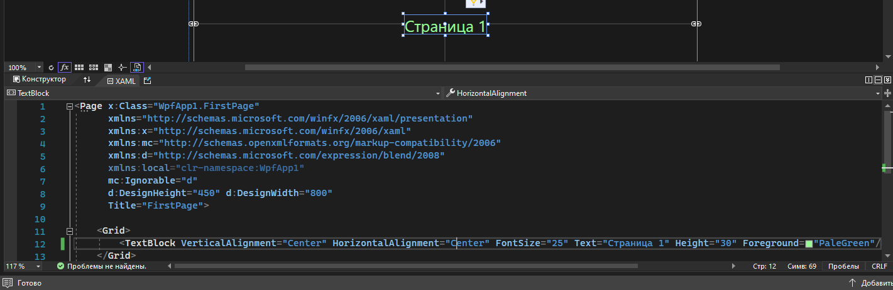

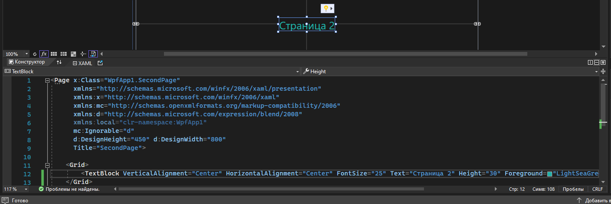

## Frame и переключение страниц

Вернёмся к главному окну и сделаем здесь переключение между страницами.

Начнем с того, что страницы должны хранится в каком-то контейнере — `Frame`. Дам ему имя `PageFrame`. Для изменения страниц я создам две кнопки: по нажатию на первую будет отображаться первая страница, а по нажатию на вторую — вторая.

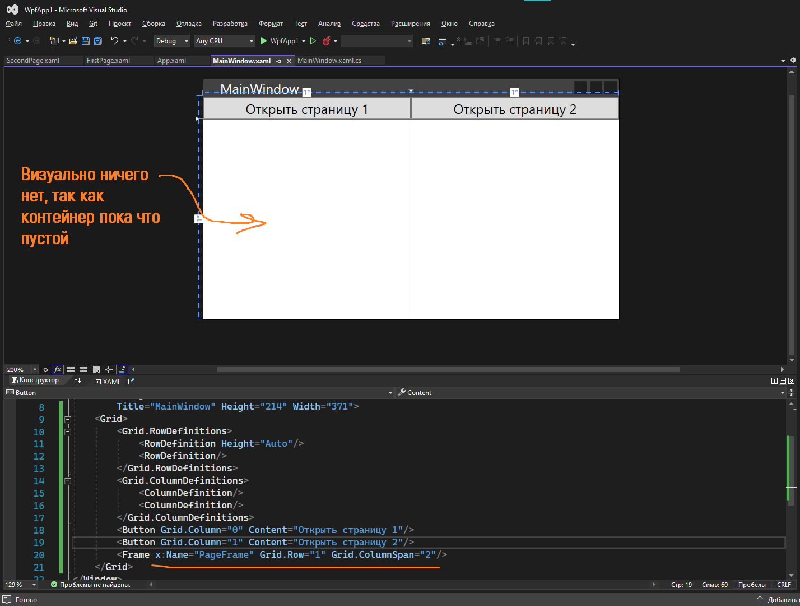

Однако, как задать `Frame` содержимое? Сделать это проще всего через код. Обработаем нажатие на наши кнопки и поменяем нашему `Frame` свойство `Content` — содержимое. В одном случае `Content` будет равен первой странице, в другой — второй странице.

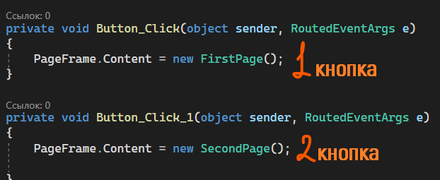

По итогу результат нашей программы будет таким — по нажатию на кнопки у нас меняется наша страница.

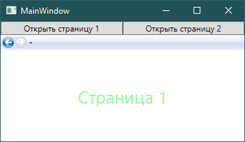

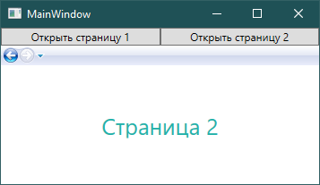

Также слева сверху мы видим маленькое навигационное окно, которое позволит нам перейти обратно на предыдущую или следующую показанную страницу. Названия страниц соответствуют их титульнику.

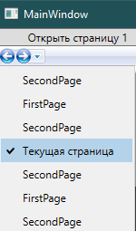

В случае, если вам не нравится это окно, вы можете скрыть его с помощью `NavigationUIVisibility = Hidden`.

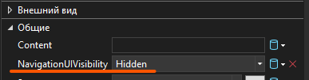

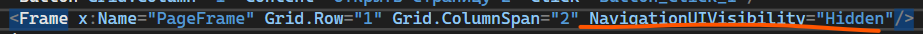

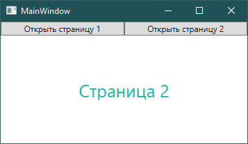

## GoBack и GoForward

Переключение между фреймами кстати можно сделать и вручную — для этого есть методы `GoForward` и `GoBack`. Если вы хотите оставить возможность перемещения даже без этой полоски, этот вариант для вас.

Добавлю кнопки для перемещения назад и вперед. Выкину их на отдельную строку в разметке.

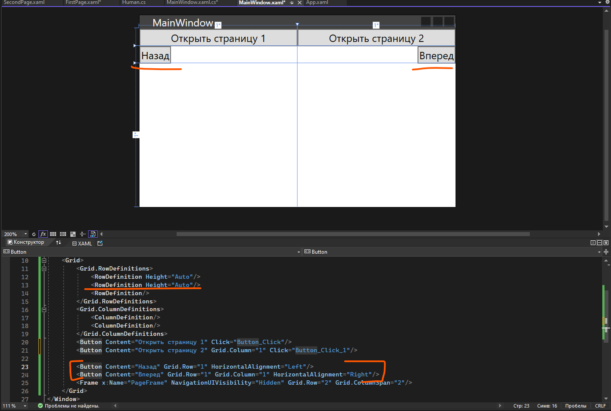

И добавлю к двум кнопкам два метода — вперед и назад. Хочу пойти назад — пишу `GoBack`. Хочу пойти вперед — пишу `GoForward`.

```csharp
private void Button_Click_2(object sender, RoutedEventArgs e) // Вперед
{
    PageFrame.GoForward(); // Говорим фрейму пойти на страницу вперед
}

private void Button_Click_3(object sender, RoutedEventArgs e) // Назад
{
    PageFrame.GoBack(); // Говорим фрейму пойти на страницу назад
}
```

Но если мы слишком много раз нажмем на эти кнопки, в какой-то момент история наших переходов закончится, и мы увидим следующую [ошибку](/csharp/trycatch) — идти больше некуда.

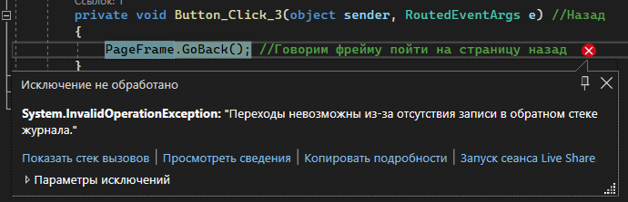

Но и здесь можно просто спросить — можно ли идти вперед или можно ли идти назад при помощи похожего `if` — `CanGoForward` или `CanGoBack`.

```csharp
private void Button_Click_2(object sender, RoutedEventArgs e) // Вперед
{
    if (PageFrame.CanGoForward)
        PageFrame.GoForward(); // Говорим фрейму пойти на страницу вперед
}

private void Button_Click_3(object sender, RoutedEventArgs e) // Назад
{
    if (PageFrame.CanGoBack)
        PageFrame.GoBack(); // Говорим фрейму пойти на страницу назад
}
```

И наши переходы будут готовы, без ошибок :)

## Переход внутри фрейма

Также иногда может быть такое, что вам внутри одного фрейма нужно переключиться на другой, без окна. Если мы находимся в главном окне, то все ок, мы просто обращаемся к фрейму и меняем его содержимое. А вот если мы находимся в фрейме, мы должны из него добраться до окна, взять фрейм, и только так поменять его содержимое. Сделать это можно следующим образом.

Для заготовки, сделаю новую страницу, которую назову `SecretPage`.

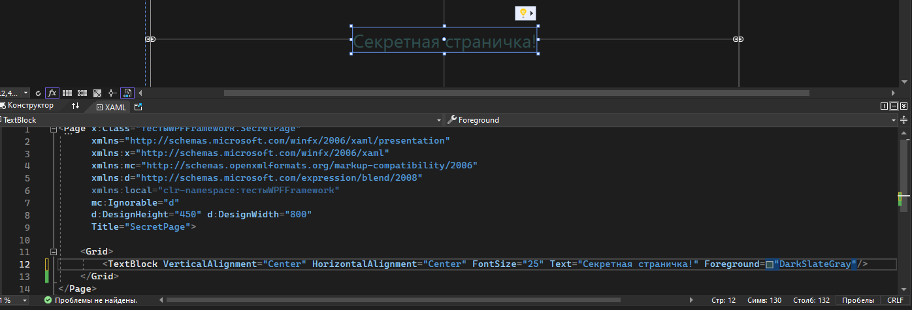

И в первой странице сделаю кнопку с переходом на эту другую страницу. Именно при нажатии на эту кнопку будет идти переход.

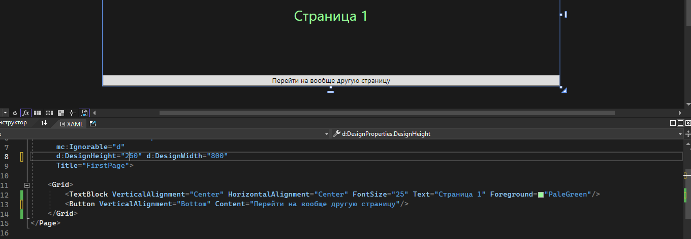

Обработаю нажатие на эту кнопку. Если я попытаюсь воспользоваться тем же кодом, который был в окне, он мне кинет ошибку, потому что `PageFrame` не существует в этой странице, он в окне.

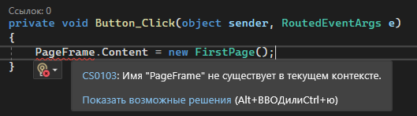

А значит, нам нужно достучаться до текущего активного окна приложения, в котором этот фрейм уже будет. Сделать это можно при помощи `Application.Current.MainWindow`. `MainWindow` здесь не будет являться названием окна, это будет просто текущее главное открытое окно, поэтому нам нужно насильно ему сказать, как какое окно мы будем его использовать. Я хочу взять текущее окно как `MainWindow`, поэтому я так и напишу — `(Application.Current.MainWindow as MainWindow)`, а дальше я уже могу из этого окна взять свой фрейм — `PageFrame`.

`FirstPage` из верхней картинки, я, соответственно, поменяю на `SecretPage`.

Если кратко — если я хочу перемещаться между фреймами внутри самого фрейма, то мне нужно взять старый вариант перехода и добавить к нему в начале `(Application.Current.MainWindow as названиеОкнаСФреймом)`.

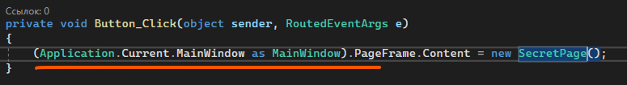

И по итогу мы имеем переходы между фреймами. Между ними также действуют кнопки назад и вперед.

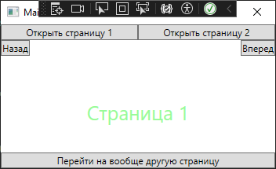

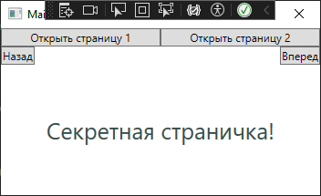

## Полный код примера

`MainWindow.xaml` с двумя кнопками выбора страницы, кнопками назад/вперед и `Frame`:

```xml
<Window x:Class="WpfApp1.MainWindow"
        xmlns="http://schemas.microsoft.com/winfx/2006/xaml/presentation"
        xmlns:x="http://schemas.microsoft.com/winfx/2006/xaml"
        Title="MainWindow" Height="214" Width="371">
    <Grid>
        <Grid.RowDefinitions>
            <RowDefinition Height="Auto"/>
            <RowDefinition Height="Auto"/>
            <RowDefinition/>
        </Grid.RowDefinitions>
        <Grid.ColumnDefinitions>
            <ColumnDefinition/>
            <ColumnDefinition/>
        </Grid.ColumnDefinitions>

        <Button Grid.Column="0" Content="Открыть страницу 1" Click="Button_Click"/>
        <Button Grid.Column="1" Content="Открыть страницу 2" Click="Button_Click_1"/>

        <Button Grid.Row="1" Content="Назад"  HorizontalAlignment="Left"  Click="Button_Click_3"/>
        <Button Grid.Row="1" Grid.Column="1" Content="Вперед" HorizontalAlignment="Right" Click="Button_Click_2"/>

        <Frame x:Name="PageFrame"
               NavigationUIVisibility="Hidden"
               Grid.Row="2" Grid.ColumnSpan="2"/>
    </Grid>
</Window>
```

`MainWindow.xaml.cs` со всеми четырьмя обработчиками:

```csharp
using System.Windows;

namespace WpfApp1
{
    public partial class MainWindow : Window
    {
        public MainWindow()
        {
            InitializeComponent();
        }

        private void Button_Click(object sender, RoutedEventArgs e)
        {
            PageFrame.Content = new FirstPage();
        }

        private void Button_Click_1(object sender, RoutedEventArgs e)
        {
            PageFrame.Content = new SecondPage();
        }

        private void Button_Click_2(object sender, RoutedEventArgs e) // Вперед
        {
            if (PageFrame.CanGoForward)
                PageFrame.GoForward();
        }

        private void Button_Click_3(object sender, RoutedEventArgs e) // Назад
        {
            if (PageFrame.CanGoBack)
                PageFrame.GoBack();
        }
    }
}
```

`FirstPage.xaml.cs` с переходом изнутри страницы на `SecretPage` через `Application.Current.MainWindow`:

```csharp
using System.Windows;
using System.Windows.Controls;

namespace WpfApp1
{
    public partial class FirstPage : Page
    {
        public FirstPage()
        {
            InitializeComponent();
        }

        private void Button_Click(object sender, RoutedEventArgs e)
        {
            (Application.Current.MainWindow as MainWindow).PageFrame.Content = new SecretPage();
        }
    }
}
```
