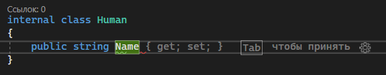
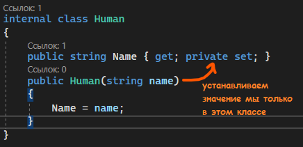
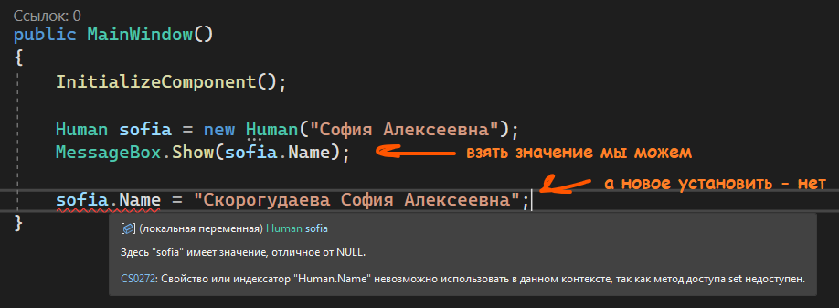
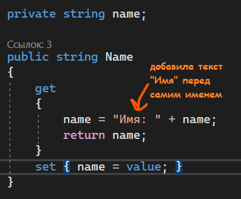
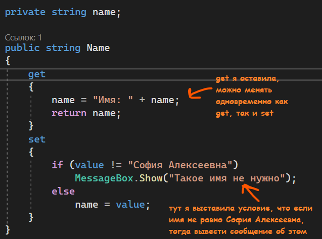

Иногда, когда мы [создавали свои типы данных](/csharp/classasmodel), Visual Studio предлагала нам напротив переменных подставить `get` и `set`. Пришло время узнать, что это такое, и как это использовать.



Если кратко — `get` и `set` — свойства, которые отвечают за чтение данных из переменных (`get` — получить), и установку значения в переменную (`set` — установить). По умолчанию, у переменной и так есть свойства `get` и `set` — мы в любом случае можем получить или установить значение в переменную.

Эти свойства мы можем настраивать. Например, мы можем сказать, что взять значение из переменной мы можем откуда угодно (так как переменная у нас `public`, ее так можно взять откуда угодно), а установить значение можно только в этом классе. Тогда перед свойством `set` нужно поставить модификатор доступа `private`.

```csharp
internal class Human
{
    public string Name { get; private set; }
}
```

Понадобиться нам это может в случае, если мы устанавливаем значение для этой переменной из [конструктора](/csharp/classascontainer) — дать значение этой переменной нужно, но другие классы должны только читать значение, которое мы ей задали.





## value и return

Также мы можем сразу же настроить условия для установки или взятия значения. В блоке `get` выполняются действия по получению значения свойства. В этом блоке с помощью оператора `return` возвращаем некоторое значение. В блоке `set` устанавливается значение свойства. В этом блоке с помощью параметра `value` мы можем получить значение, которое передано свойству.

Однако для того, чтобы выставлять условия, нам нужна еще одна переменная, где мы будем хранить уже отформатированное значение. Для этого сделаю приватную переменную `name`.

```csharp
internal class Human
{
    private string name;

    public string Name
    {
        get { return name; }      // возвращаем значение свойства
        set { name = value; }     // устанавливаем значение свойства
    }
}
```

По умолчанию, наша переменная так и работает. Однако теперь, когда мы имеем `value` и `return`, мы можем сделать либо какие-то условия при установке значения, либо отформатировать текст перед его взятием.

Например, если я хочу, чтобы перед содержимым переменной всегда ставился текст «Имя:», мне необходимо перед `return` добавить этот текст, а уже потом вернуть его с помощью `return`.



И при выводе этого свойства, у нас всегда впереди будет стоять слово «Имя».

```csharp
Human sofia = new Human("София Алексеевна");
MessageBox.Show(sofia.Name);
```


## Проверка в set

Для свойства `set` мы можем ставить всякие условия. Например, если имя не равно «София Алексеевна», тогда нам такое имя не нужно, и об этом пользователя нужно уведомить. Сделаем это также через [MessageBox](/wpf/events-msgbox). Проверять на условие мы будем `value`, так как внутри него будет хранится передаваемое в свойство значение (то, которое мы кинули после равно).



И теперь, чтобы проверить, я создам две переменных — с правильным именем и с неправильным. В правильном случае у нас имя запишется в переменную и все будет хорошо. А в неправильном, выведется сообщение о том, что такое имя не нужно, а также значение в переменную не запишется.

```csharp
Human sofia   = new Human("София Алексеевна");     // все ок
MessageBox.Show(sofia.Name);                       // Имя: София Алексеевна

Human nikolay = new Human("Николай Васильевич");   // выведется сообщение
MessageBox.Show(nikolay.Name);                     // пусто
```

## Полный код примера

`Human.cs` с настроенным свойством `Name` — `get` форматирует текст, `set` проверяет значение:

```csharp
using System.Windows;

namespace WpfApp1
{
    internal class Human
    {
        private string name;

        public string Name
        {
            get
            {
                name = "Имя: " + name;
                return name;
            }
            set
            {
                if (value != "София Алексеевна")
                    MessageBox.Show("Такое имя не нужно");
                else
                    name = value;
            }
        }

        public Human(string name)
        {
            Name = name;
        }
    }
}
```

`MainWindow.xaml.cs` с проверкой работы свойства:

```csharp
using System.Windows;

namespace WpfApp1
{
    public partial class MainWindow : Window
    {
        public MainWindow()
        {
            InitializeComponent();

            Human sofia = new Human("София Алексеевна");
            MessageBox.Show(sofia.Name);

            Human nikolay = new Human("Николай Васильевич");
            MessageBox.Show(nikolay.Name);
        }
    }
}
```
