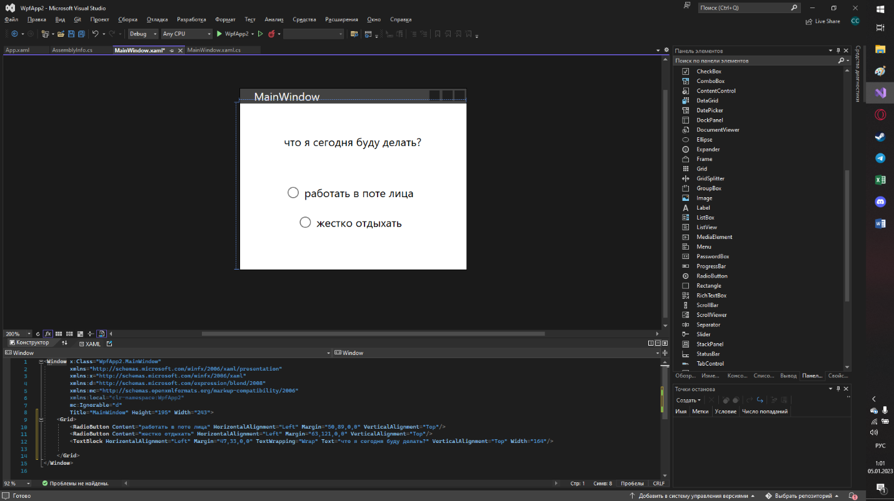
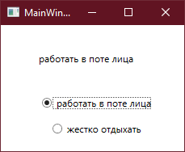
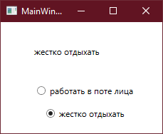
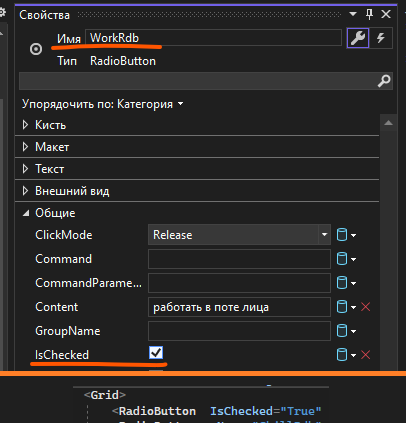
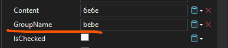
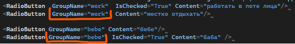
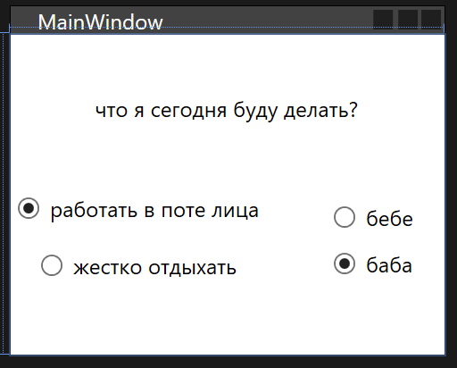
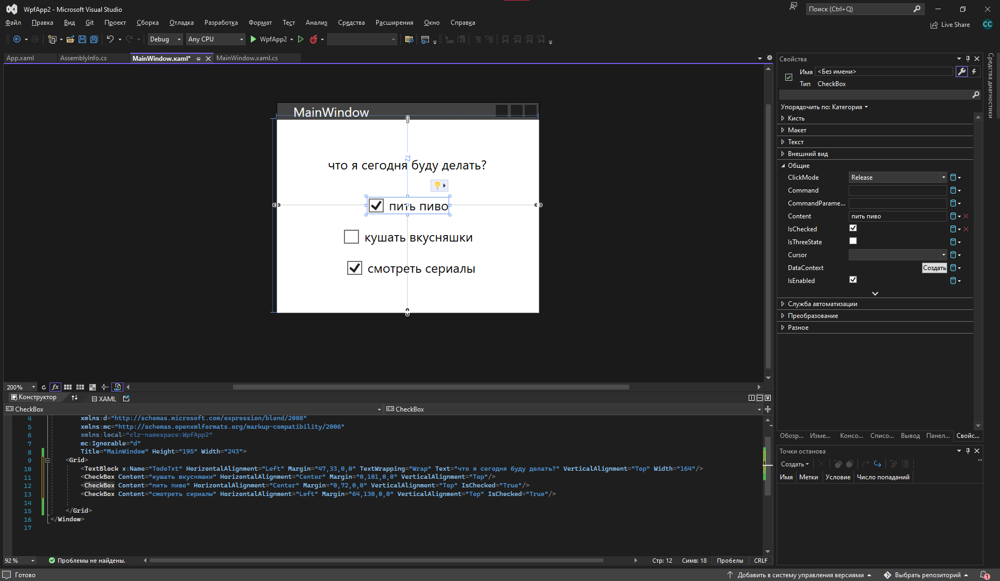
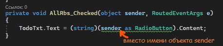
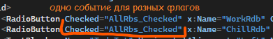

Давайте разберем еще некоторые элементы интерфейса и научимся с ними взаимодействовать.

## RadioButton

RadioButton — флаг с одиночным выбором (круглый такой). Т.е. из всех элементов можно выбрать только один. Создается по такому же принципу, как и остальные объекты — либо через панель элементов, либо через XAML.



Для того, чтобы работать со всеми элементами интерфейса, я дам им имена. Тексту — `TodoTxt`, первому радиобаттону — `WorkRdb`, второму — `RelaxRdb`.

Два главных события для RadioButton — `Checked` и `Click`. Checked срабатывает тогда, когда был выбран именно этот объект (когда в нем точка появилась), а Click — когда на объект просто нажали, вне зависимости от того, поставили ли мы точку, или наоборот — убрали.

```csharp
private void WorkRdb_Checked(object sender, RoutedEventArgs e)
{
    TodoTxt.Text = (string)WorkRdb.Content;
}

private void ChillRdb_Checked(object sender, RoutedEventArgs e)
{
    TodoTxt.Text = (string)ChillRdb.Content;
}
```





Также, можно сразу выставить, выбран ли флаг или нет. Для этого необходимо выставить `IsChecked = true`.



Все радиобаттоны которые мы создаем, по умолчанию, находятся в одной группе. То есть, из всех радиобаттонов, которые мы создадим на окне, можно будет выбрать только одно. Но что, если я хочу, чтобы у меня было две группы флагов?

Для этого мне необходимо выставить им свойство `GroupName`. Все элементы, которые я хочу видеть в одной группе, должны иметь одно имя группы.





И тогда, я смогу выбрать по одному флагу из разных групп.



## CheckBox

CheckBox — флаг с множественным выбором (квадратный). Работает точно также, как и RadioButton, те же события, тот же IsChecked, единственное — нет групп, так как это не нужно, тут и так можно выбрать все элементы.



## Дополнительно — работа с sender

Вернемся к RadioButton-ам. На этом примере мы видим, что логика этих двух методов у нас одна, меняется только сам объект события. Но мы с вами помним, что объект события хранится у нас в переменной `sender`. Как же нам сохранить код так, чтобы вместо нескольких методов, для каждого RadioButton отдельно, у нас был один метод?

```csharp
private void WorkRdb_Checked(object sender, RoutedEventArgs e)
{
    TodoTxt.Text = (string)WorkRdb.Content;
}

private void ChillRdb_Checked(object sender, RoutedEventArgs e)
{
    TodoTxt.Text = (string)ChillRdb.Content;
}
```

Необходимо сделать следующее — давайте приведем `sender` к типу данных RadioButton и возьмем оттуда `Content`.



Сам метод, в котором мы работаем с sender (`AllRbs_Checked`), мы дадим как обработчик события Checked и к первому, и ко второму флагу.



Таким образом, код будет работать по разному в зависимости от объекта, вызвавшего событие, однако метод все еще будет един.


## Полный код примера

`MainWindow.xaml` с одним общим обработчиком для двух радиобаттонов:

```xml
<Window x:Class="WpfApp2.MainWindow"
        xmlns="http://schemas.microsoft.com/winfx/2006/xaml/presentation"
        xmlns:x="http://schemas.microsoft.com/winfx/2006/xaml"
        Title="MainWindow" Height="450" Width="800">
    <Grid>
        <TextBlock x:Name="TodoTxt" Text="что я сегодня буду делать?"
                   HorizontalAlignment="Center" VerticalAlignment="Top" Margin="0,40,0,0"/>
        <RadioButton x:Name="WorkRdb" Content="работать в поте лица"
                     Checked="AllRbs_Checked"
                     HorizontalAlignment="Center" VerticalAlignment="Center" Margin="0,-30,0,0"/>
        <RadioButton x:Name="ChillRdb" Content="жестко отдыхать"
                     Checked="AllRbs_Checked"
                     HorizontalAlignment="Center" VerticalAlignment="Center" Margin="0,30,0,0"/>
    </Grid>
</Window>
```

`MainWindow.xaml.cs` с универсальным обработчиком через sender:

```csharp
using System.Windows;
using System.Windows.Controls;

namespace WpfApp2
{
    public partial class MainWindow : Window
    {
        public MainWindow()
        {
            InitializeComponent();
        }

        private void AllRbs_Checked(object sender, RoutedEventArgs e)
        {
            TodoTxt.Text = (string)(sender as RadioButton).Content;
        }
    }
}
```
