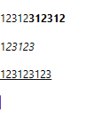
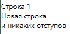
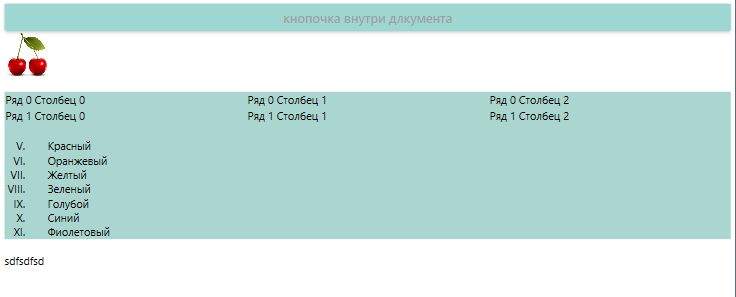
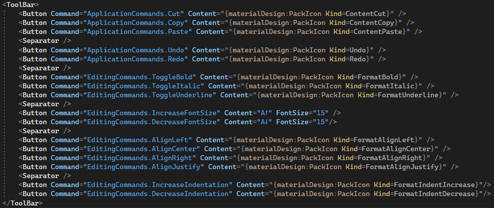
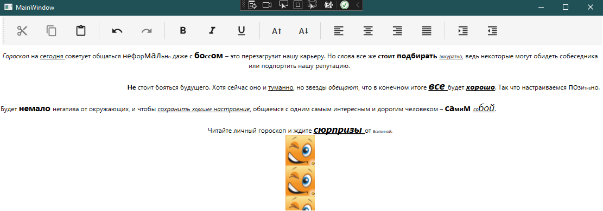
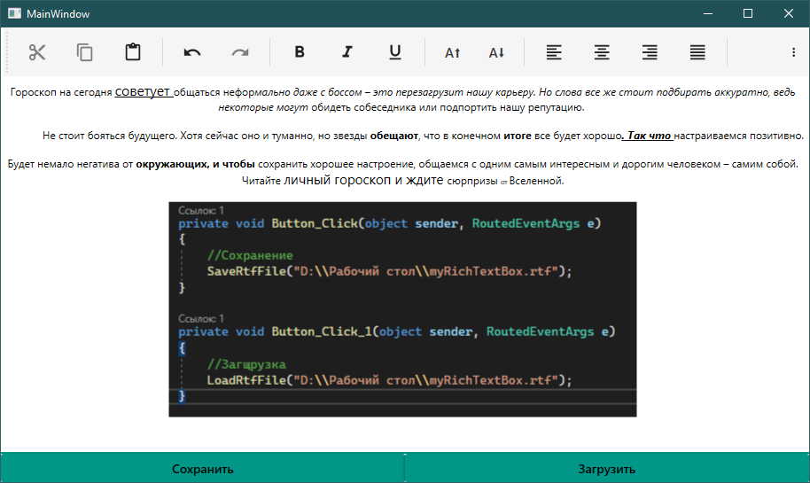
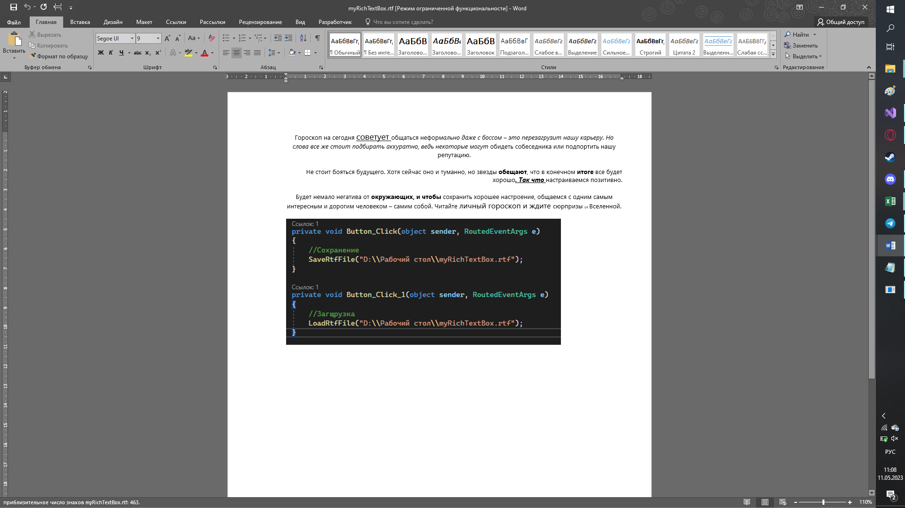
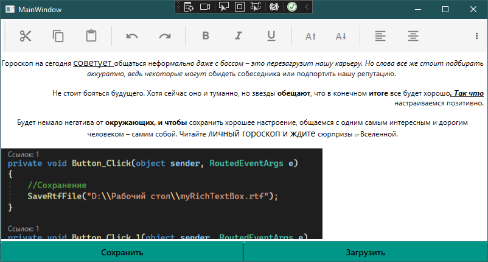

`TextBlock` дает нам возможность просто вводить текст в какое-то поле и использовать его. Если же мы хотим улучшить форматирование нашего текста, тогда нам необходимо использовать `RichTextBox`.

Для быстрого понимания, большой белый прямоугольник в ворде — тоже `RichTextBox`. Внутрь мы можем вписывать текст, форматировать его, вставлять различные элементы и прочее. Научимся с ним работать.

## Базовый функционал RTB

Сам RTB создается очень просто — обычный тэг. Но вот его управление и подводные камни — это отдельная тема.

```xml
<RichTextBox/>
```

Уже сразу же при запуске и использовании `Ctrl+B`, `I` или `U` мы можем начать форматировать текст.



Единственное что — межстрочный интервал слишком большой. Фиксится применением стиля на RTB. Внутри этого стиля мы берем такое понятие как параграф и говорим, что его отступ равен 0. Тогда и текст будет нормально отображаться.

```xml
<RichTextBox Grid.Row="1" VerticalContentAlignment="Top">
    <RichTextBox.Resources>
        <Style TargetType="{x:Type Paragraph}">
            <Setter Property="Margin" Value="0"/>
        </Style>
    </RichTextBox.Resources>
</RichTextBox>
```



Но что такое параграф и почему именно он должен быть равен 0? Для этого нужно разобраться в иерархии объектов внутри RTB.

## Иерархия объектов в RichTextBox

Мы не можем просто взять напрямую текст из `RichTextBox` как делали это с обычным `TextBox`, так как тогда слетит форматирование. Здесь всё намного сложнее.

`RichTextBox` создан по следующей иерархии:

- **`RichTextBox`** — визуальная оболочка для ввода.
- **`Document`** (`FlowDocument`, если в XAML) — содержимое нашего `RichTextBox`. Может содержать в себе 5 разных видов объектов.
  - **`Block`** (только в коде, в XAML его нет) — коллекция со всеми объектами внутри документа.
  - **`BlockUIContainer`** — контейнер, где можно расположить интерфейс (кнопки, радиобаттоны, комбобоксы).
  - **`List`** — маркированный или нумерованный список объектов, как например, этот.
    - **`ListItem`** — элемент списка. Внутри хранится `Paragraph`. Внутри одного `ListItem` может быть ещё один `List`.
  - **`Paragraph`** — абзац, внутри которого может хранится как текст, так и картинки и прочее.
    - **`Run`** — хранилище текста внутри параграфа.
    - **`Image`** — для картинки.
    - **`HyperLink`** — гиперссылка для параграфа.
    - **`Bold`**, **`Italic`**, **`Underline`** — текст с уже готовым форматированием.
    - **`Figure`** — круг, квадрат или прочая фигура внутри документа.
  - **`Section`** — секция в документе. Похоже на `div` в HTML — просто коробочка, которой вы можете задать собственный стиль или разграничить визуально объекты в документе. Внутри может быть ещё один блок со всеми выше и нижеперечисленными объектами.
  - **`Table`** — таблица.
    - **`TableRowGroup`** — один контейнер для всех строк.
    - **`TableRow`** — одна строка.
    - **`TableCell`** — одна ячейка. В себе хранит `Paragraph`.

Один пример вёрстки `RichTextBox` выглядит следующим образом.



```xml
<RichTextBox AcceptsTab="True" Grid.Row="1" VerticalContentAlignment="Top">
    <RichTextBox.Resources>
        <Style TargetType="{x:Type Paragraph}">
            <Setter Property="Margin" Value="0"/>
        </Style>
    </RichTextBox.Resources>
    <FlowDocument>
        <BlockUIContainer>
            <Button Content="кнопочка внутри документа"/>
        </BlockUIContainer>

        <Section Background="#FFADD6CF">
            <Paragraph>
                <Image Height="50" Source="https://onpicon.ru/file/uploads/1303507168_Cherry-256x256.png"/>
            </Paragraph>

            <Table>
                <TableRowGroup>
                    <TableRow>
                        <TableCell><Paragraph>Ряд 0 Столбец 0</Paragraph></TableCell>
                        <TableCell><Paragraph>Ряд 0 Столбец 1</Paragraph></TableCell>
                        <TableCell><Paragraph>Ряд 0 Столбец 2</Paragraph></TableCell>
                    </TableRow>
                    <TableRow>
                        <TableCell><Paragraph>Ряд 1 Столбец 0</Paragraph></TableCell>
                        <TableCell><Paragraph>Ряд 1 Столбец 1</Paragraph></TableCell>
                        <TableCell><Paragraph>Ряд 1 Столбец 2</Paragraph></TableCell>
                    </TableRow>
                </TableRowGroup>
            </Table>

            <!-- Нумерованный римскими цифрами лист -->
            <List MarkerOffset="25" MarkerStyle="UpperRoman" StartIndex="5">
                <ListItem><Paragraph>Красный</Paragraph></ListItem>
                <ListItem><Paragraph>Оранжевый</Paragraph></ListItem>
                <ListItem><Paragraph>Жёлтый</Paragraph></ListItem>
                <ListItem><Paragraph>Зелёный</Paragraph></ListItem>
                <ListItem><Paragraph>Голубой</Paragraph></ListItem>
                <ListItem><Paragraph>Синий</Paragraph></ListItem>
                <ListItem><Paragraph>Фиолетовый</Paragraph></ListItem>
            </List>
        </Section>

        <Paragraph>
            <Run>sdfsdfsd</Run>
        </Paragraph>
    </FlowDocument>
</RichTextBox>
```

## Панель форматирования через EditingCommands

Для управления форматирования вводимого текста можно использовать внутренние команды приложения. Я подключу [MaterialDesign](/wpf/material-design) для использования иконок и создам следующую вёрстку.

Разделю окно на 2 строки — панель управления и поле для `RichTextBox`.

```xml
<Grid>
    <Grid.RowDefinitions>
        <RowDefinition Height="Auto"/>
        <RowDefinition/>
    </Grid.RowDefinitions>
</Grid>
```

Сверху создам `ToolBar` — панель управления, и внутри размещу следующие кнопки. Все они имеют только `Content` — иконку, и `Command` — уже встроенную команду, которую нам нигде прописывать не нужно.



```xml
<ToolBar>
    <Button Command="{x:Static ApplicationCommands.Cut}"  Content="{materialDesign:PackIcon Kind=ContentCut}"/>
    <Button Command="{x:Static ApplicationCommands.Copy}" Content="{materialDesign:PackIcon Kind=ContentCopy}"/>
    <Button Command="{x:Static ApplicationCommands.Paste}" Content="{materialDesign:PackIcon Kind=ContentPaste}"/>
    <Separator/>
    <Button Command="{x:Static ApplicationCommands.Undo}" Content="{materialDesign:PackIcon Kind=Undo}"/>
    <Button Command="{x:Static ApplicationCommands.Redo}" Content="{materialDesign:PackIcon Kind=Redo}"/>
    <Separator/>
    <Button Command="{x:Static EditingCommands.ToggleBold}"      Content="{materialDesign:PackIcon Kind=FormatBold}"/>
    <Button Command="{x:Static EditingCommands.ToggleItalic}"    Content="{materialDesign:PackIcon Kind=FormatItalic}"/>
    <Button Command="{x:Static EditingCommands.ToggleUnderline}" Content="{materialDesign:PackIcon Kind=FormatUnderline}"/>
    <Separator/>
    <Button Command="{x:Static EditingCommands.IncreaseFontSize}" Content="{materialDesign:PackIcon Kind=FormatFontSizeIncrease}"/>
    <Button Command="{x:Static EditingCommands.DecreaseFontSize}" Content="{materialDesign:PackIcon Kind=FormatFontSizeDecrease}"/>
    <Separator/>
    <Button Command="{x:Static EditingCommands.AlignLeft}"    Content="{materialDesign:PackIcon Kind=FormatAlignLeft}"/>
    <Button Command="{x:Static EditingCommands.AlignCenter}"  Content="{materialDesign:PackIcon Kind=FormatAlignCenter}"/>
    <Button Command="{x:Static EditingCommands.AlignRight}"   Content="{materialDesign:PackIcon Kind=FormatAlignRight}"/>
    <Button Command="{x:Static EditingCommands.AlignJustify}" Content="{materialDesign:PackIcon Kind=FormatAlignJustify}"/>
    <Separator/>
    <Button Command="{x:Static EditingCommands.IncreaseIndentation}" Content="{materialDesign:PackIcon Kind=FormatIndentIncrease}"/>
    <Button Command="{x:Static EditingCommands.DecreaseIndentation}" Content="{materialDesign:PackIcon Kind=FormatIndentDecrease}"/>
</ToolBar>
```

Вниз пойдет `RichTextBox` с `Grid.Row="1"`, возможностью ставить табы и начала текста с левого верхнего края.

```xml
<RichTextBox AcceptsTab="True" Grid.Row="1" VerticalContentAlignment="Top">
    <RichTextBox.Resources>
        <Style TargetType="{x:Type Paragraph}">
            <Setter Property="Margin" Value="0"/>
        </Style>
    </RichTextBox.Resources>
</RichTextBox>
```

Уже на этом этапе, не вписав ни единой строчки в код, мы можем форматировать текст и вставлять туда картинки при помощи дефолтных команд. Всё остальное форматирование реализовывается через код.



С базовым функционалом разобрались, осталось разобраться с тем, как же этот текст получить из интерфейса.

## Сохранение и загрузка через TextRange

Рассмотрим использование текста на основе сохранения в [файл](/csharp/files). Создам две кнопки — сохранить и загрузить.

```xml
<Grid>
    <Grid.RowDefinitions>
        <RowDefinition Height="Auto"/>
        <RowDefinition/>
        <RowDefinition Height="Auto"/>
    </Grid.RowDefinitions>

    <!-- ToolBar и RichTextBox выше -->

    <Grid Grid.Row="2">
        <Grid.ColumnDefinitions>
            <ColumnDefinition/>
            <ColumnDefinition/>
        </Grid.ColumnDefinitions>
        <Button Content="Сохранить" Click="Button_Click"/>
        <Button Grid.Column="1" Content="Загрузить" Click="Button_Click_1"/>
    </Grid>
</Grid>
```

Назову как-нибудь свой `RichTextBox` чтобы использовать его содержимое. Если я уже изначально определила какое-то содержимое внутри `FlowDocument`, тогда называть мне нужно будет его.

```xml
<RichTextBox x:Name="MyRtb" ...>
```

Содержимое RTB сохраняется в формате `rtf` — `RichTextFormat`, и не только. Можно сохранять в формате `html`, `text`, `xaml`, `dif` и `bitmap`. Создам 2 метода для сохранения и загрузки файла в формате `rtf`.

```csharp
void SaveRtfFile(string _fileName)
{
    TextRange range = new TextRange(MyRtb.Document.ContentStart, MyRtb.Document.ContentEnd); // Текст мы можем взять только если полностью его выделим
    FileStream fStream = new FileStream(_fileName, FileMode.Create);                         // Создадим файл при помощи потока
    range.Save(fStream, DataFormats.Rtf);                                                    // Сохраним выделенное содержимое в файл
    fStream.Close();                                                                         // Закроем файл
}

void LoadRtfFile(string _fileName)
{
    if (File.Exists(_fileName))
    {
        TextRange range = new TextRange(MyRtb.Document.ContentStart, MyRtb.Document.ContentEnd);  // Полностью выделяем текст
        FileStream fStream = new FileStream(_fileName, FileMode.OpenOrCreate);                    // Откроем файл с данными
        range.Load(fStream, DataFormats.Rtf);                                                     // Внутрь выделения выгрузим содержимое файла в формате rtf
        fStream.Close();                                                                          // Закроем файл
    }
}
```

Сошлюсь на эти методы внутри кнопок.

```csharp
private void Button_Click(object sender, RoutedEventArgs e)
{
    // Сохранение
    SaveRtfFile("D:\\Рабочий стол\\myRichTextBox.rtf");
}

private void Button_Click_1(object sender, RoutedEventArgs e)
{
    // Загрузка
    LoadRtfFile("D:\\Рабочий стол\\myRichTextBox.rtf");
}
```

Запущу программу и посмотрю как моё сохранение будет работать.





Перезапущу программу и нажму на кнопку загрузить. В таком виде файл вернется ко мне в `RichTextBox`.



## Полный код примера

`MainWindow.xaml` — ToolBar с встроенными командами, RichTextBox с фиксом межстрочного интервала и кнопки сохранить/загрузить:

```xml
<Window x:Class="WpfApp1.MainWindow"
        xmlns="http://schemas.microsoft.com/winfx/2006/xaml/presentation"
        xmlns:x="http://schemas.microsoft.com/winfx/2006/xaml"
        xmlns:materialDesign="http://materialdesigninxaml.net/winfx/xaml/themes"
        Title="MainWindow" Height="500" Width="900">
    <Grid>
        <Grid.RowDefinitions>
            <RowDefinition Height="Auto"/>
            <RowDefinition/>
            <RowDefinition Height="Auto"/>
        </Grid.RowDefinitions>

        <ToolBar>
            <Button Command="{x:Static ApplicationCommands.Cut}"  Content="{materialDesign:PackIcon Kind=ContentCut}"/>
            <Button Command="{x:Static ApplicationCommands.Copy}" Content="{materialDesign:PackIcon Kind=ContentCopy}"/>
            <Button Command="{x:Static ApplicationCommands.Paste}" Content="{materialDesign:PackIcon Kind=ContentPaste}"/>
            <Separator/>
            <Button Command="{x:Static ApplicationCommands.Undo}" Content="{materialDesign:PackIcon Kind=Undo}"/>
            <Button Command="{x:Static ApplicationCommands.Redo}" Content="{materialDesign:PackIcon Kind=Redo}"/>
            <Separator/>
            <Button Command="{x:Static EditingCommands.ToggleBold}"      Content="{materialDesign:PackIcon Kind=FormatBold}"/>
            <Button Command="{x:Static EditingCommands.ToggleItalic}"    Content="{materialDesign:PackIcon Kind=FormatItalic}"/>
            <Button Command="{x:Static EditingCommands.ToggleUnderline}" Content="{materialDesign:PackIcon Kind=FormatUnderline}"/>
            <Separator/>
            <Button Command="{x:Static EditingCommands.AlignLeft}"    Content="{materialDesign:PackIcon Kind=FormatAlignLeft}"/>
            <Button Command="{x:Static EditingCommands.AlignCenter}"  Content="{materialDesign:PackIcon Kind=FormatAlignCenter}"/>
            <Button Command="{x:Static EditingCommands.AlignRight}"   Content="{materialDesign:PackIcon Kind=FormatAlignRight}"/>
            <Button Command="{x:Static EditingCommands.AlignJustify}" Content="{materialDesign:PackIcon Kind=FormatAlignJustify}"/>
        </ToolBar>

        <RichTextBox x:Name="MyRtb" AcceptsTab="True" Grid.Row="1" VerticalContentAlignment="Top">
            <RichTextBox.Resources>
                <Style TargetType="{x:Type Paragraph}">
                    <Setter Property="Margin" Value="0"/>
                </Style>
            </RichTextBox.Resources>
        </RichTextBox>

        <Grid Grid.Row="2">
            <Grid.ColumnDefinitions>
                <ColumnDefinition/>
                <ColumnDefinition/>
            </Grid.ColumnDefinitions>
            <Button Content="Сохранить" Click="Button_Click"/>
            <Button Grid.Column="1" Content="Загрузить" Click="Button_Click_1"/>
        </Grid>
    </Grid>
</Window>
```

`MainWindow.xaml.cs` — сохранение/загрузка через `TextRange` и `DataFormats.Rtf`:

```csharp
using System.IO;
using System.Windows;
using System.Windows.Documents;

namespace WpfApp1
{
    public partial class MainWindow : Window
    {
        public MainWindow()
        {
            InitializeComponent();
        }

        private void Button_Click(object sender, RoutedEventArgs e)
        {
            SaveRtfFile("D:\\Рабочий стол\\myRichTextBox.rtf");
        }

        private void Button_Click_1(object sender, RoutedEventArgs e)
        {
            LoadRtfFile("D:\\Рабочий стол\\myRichTextBox.rtf");
        }

        void SaveRtfFile(string _fileName)
        {
            TextRange range = new TextRange(MyRtb.Document.ContentStart, MyRtb.Document.ContentEnd);
            FileStream fStream = new FileStream(_fileName, FileMode.Create);
            range.Save(fStream, DataFormats.Rtf);
            fStream.Close();
        }

        void LoadRtfFile(string _fileName)
        {
            if (File.Exists(_fileName))
            {
                TextRange range = new TextRange(MyRtb.Document.ContentStart, MyRtb.Document.ContentEnd);
                FileStream fStream = new FileStream(_fileName, FileMode.OpenOrCreate);
                range.Load(fStream, DataFormats.Rtf);
                fStream.Close();
            }
        }
    }
}
```
