Многие из вас видели программы, которые передают данные внутри одной сети, либо играли в игры по локалке. Мы можем научиться создавать такие же вещи сами — простой мессенджер или игра по локальной сети. Для этого мы будем передавать данные через сокеты, используя модель TCP/IP, которую вы изучили ранее на компьютерных сетях.

В этой лекции мы подробно разберем создание сервера и клиента на примере мессенджера. По итогу должно получится что-то вроде этого.

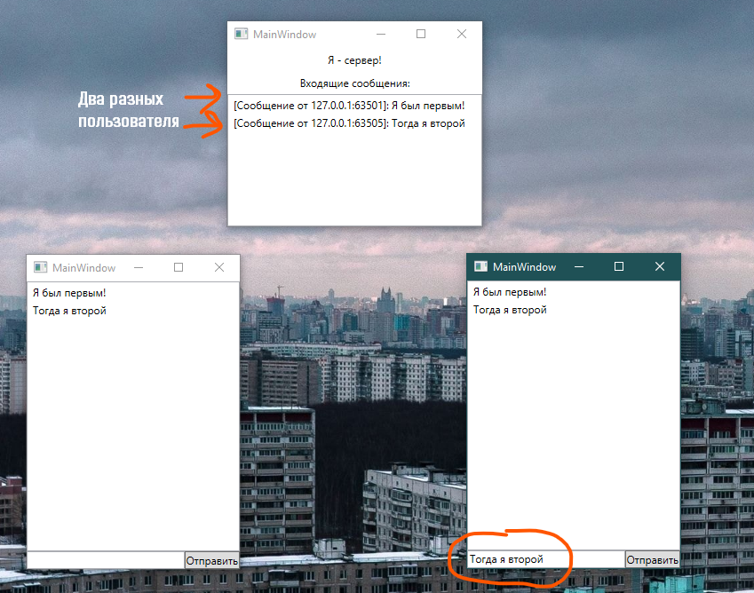

Однако для этого, вспомним что такое TCP/IP и сокеты.

> TCP/IP — это названия протоколов, которые лежат в основе интернета.
>
> Благодаря им компьютеры обмениваются данными, не мешая друг другу. Оба протокола отвечают за передачу данных, но IP просто отправляет их в сеть, а TCP ещё следит за тем, чтобы эти данные попали по нужному адресу.
>
> Сокет — это один конец двустороннего канала связи между двумя программами, работающими в сети. Соединяя вместе два сокета, можно передавать данные между разными процессами (локальными или удаленными).

Чтобы наша передача данных работала, нам нужен сокет как сервер, и сокет как клиент, который будет подключаться к нашему серверу. Начнем с разработки сервера.

## Сервер

Создам приложение, которое будет принимать в себя подключения разных клиентов. Именно через него у нас будет реализована связь остальных приложений. Интерфейс приложения будет следующим.

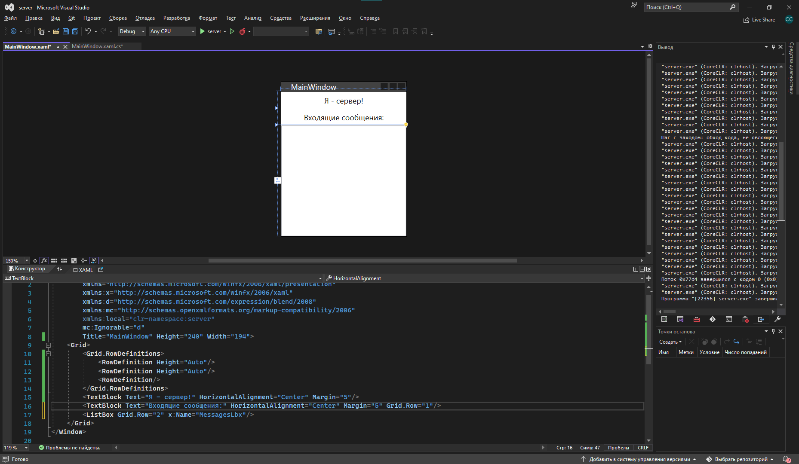

Сервер должен создаваться сразу после открытия окна, так что код я пропишу под `InitializeComponent`. Начнем.

### Создание точки и сокета

Для начала мне нужно создать конечную точку, к которой будут подключаться все клиенты. Создаю я её при помощи `IPEndPoint`. Внутри круглых скобок я пишу какие именно IP я жду для подключения (в данном случае все — `IPAddress.Any`), и по какому порту я их жду — `8888`.

```csharp
IPEndPoint ipPoint = new IPEndPoint(IPAddress.Any, 8888);
```

Дальше я создам новый канал — сокет — который будет работать внутри текущей сети через TCP/IP. Сам сокет я сделаю глобальным, чтобы я могла работать с ним из всех других методов.

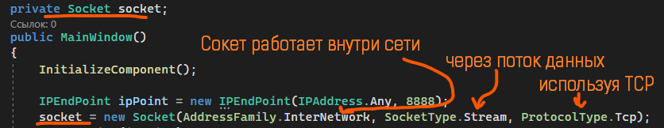

Затем я привязываю точку к сокету.

```csharp
socket.Bind(ipPoint);
```

И разрешаю подключаться максимум 1000 людям. Я жду их подключения, я слушаю канал чтобы их дождаться.

```csharp
socket.Listen(1000);
```

Мой полный код будет выглядеть вот так.

```csharp
public partial class MainWindow : Window
{
    private Socket socket;

    public MainWindow()
    {
        InitializeComponent();

        IPEndPoint ipPoint = new IPEndPoint(IPAddress.Any, 8888);
        socket = new Socket(AddressFamily.InterNetwork, SocketType.Stream, ProtocolType.Tcp);
        socket.Bind(ipPoint);
        socket.Listen(1000);
    }
}
```

### Бесконечное ожидание клиентов

Теперь мне нужно _бесконечно ждать подключения_ моих клиентов.

Бесконечность я сделаю при помощи `while(true)`, а чтобы у меня интерфейс работал параллельно с циклом, я сделаю отдельный [Task](/wpf/async-await). Помним, что все таски у меня асинхронные, так как работают не вместе с интерфейсом.

```csharp
private async Task ListenToClients()
{
    while (true)
    {

    }
}
```

Внутри цикла я буду принимать все входящие подключения. Но чтобы их принять, мне для начала нужно их дождаться при помощи `await`. Только дождавшись подключения я буду продолжать свой код.

```csharp
private async Task ListenToClients()
{
    while (true)
    {
        await socket.AcceptAsync();
    }
}
```

Этот метод я вызову сразу же после включения прослушки сокета. Его я ждать не буду, пусть крутится себе на фоне.

```csharp
socket.Listen(1000);

ListenToClients();
```

### Как работает клиент-серверное приложение

Что же делать с моими клиентами? Для этого нужно определиться как будет работать наше клиент-серверное приложение. Я зарисую.

Скажем, к моему серверу подключились 4 компьютера. 1 из них отправляет сообщение на сервер. Сам компьютер ещё не видит, что он отправил сообщение, он только нажал на кнопку «Отправить».

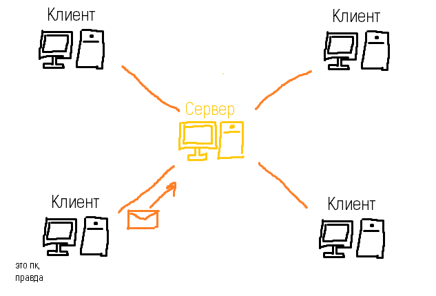

Как только сервер получит это сообщение, он отправит его обратно всем клиентам, которые к нему подключены, включая клиента, который отправил это сообщение.

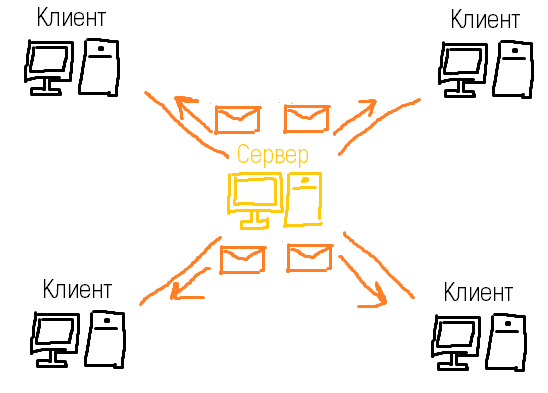

И уже как только клиент получил сообщение с сервера обратно, он его отобразит у себя на экране. Так мы будем уверены, что если сообщение отобразилось у нас, оно отобразилось у всех. Однако для того, чтобы сервер смог отправить сообщение всем клиентам, каждый раз, когда подключился новый клиент, мы должны:

- добавить его в какой-то список, например, `List<Socket> clients`;
- включить прослушку сообщений для каждого нового клиента.

### Список клиентов

Начнем с листа. Создам новый лист с сокетами и после того, как я дождалась подключения нового человека, я добавлю его в лист.

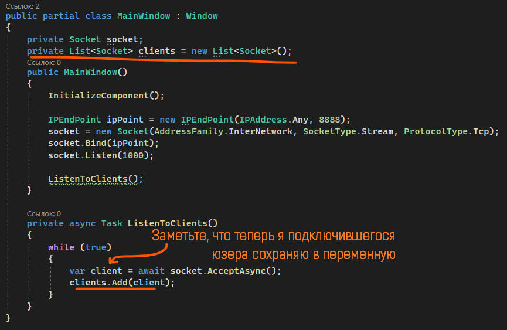

### Приём сообщений от клиента

С прослушкой немного сложнее. Мне опять же нужно сделать бесконечный цикл, который постоянно будет слушать поступающие сообщения именно от этого сокета. Я сделаю ещё один асинхронный таск с бесконечным циклом внутри. Таск будет принимать сокет-клиент, переменную с ним назову `client`. На этот раз, внутри цикла, я буду ждать данных от сокета при помощи `client.ReceiveAsync()`.

Сам метод я вызову сразу после добавления сокета-клиента в лист. Ждать его я не буду.

```csharp
clients.Add(client);
RecieveMessage(client);
```

Однако метод просит какие-то значения внутри круглых скобок — коллекцию байтов и настройка сокета. Что нам ему дать?

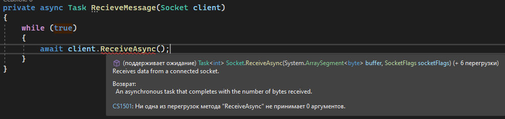

Вспомним, что TCP/IP делит само сообщение на байты, а потом каждый байт отправляет отдельным пакетом. Когда мы получаем сообщение, нам нужно место, куда сокет запишет полученные байты. Для этого чуть выше создадим пустой массив байтов на, скажем, 1024 байта. Этот пустой массив передадим внутрь метода, как контейнер для сообщений.

![Код byte[] bytes = new byte[1024]; await client.ReceiveAsync(bytes); — оранжевая стрелка от объявления массива к параметру](../../assets/wpf/tcp-ip/08_receive_buffer_annotated.png)

Никакие особые настройки сокета нам не нужны, так что просто пометим `SocketFlags.None` после запятой.

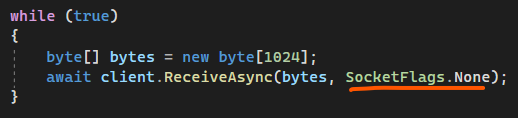

Чтобы получить это сообщение обратно в текстовый вид, нам необходимо конвертировать байты в текст. Отделаться обычным `Convert.ToString()` здесь не получится — нам необходимо получить строку из кодировки UTF8. Делается это следующим образом. ЗАМЕТЬТЕ, что мы берем `Encoding`, не `Encoder`.

Полученное сообщение мы в будущем сможем использовать где угодно — вывести его в `MessageBox`, поместить в текстовое поле или `ListBox`.

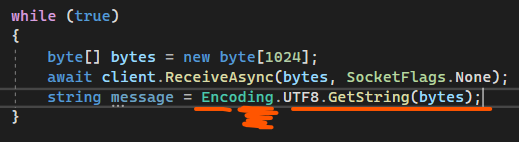

Кстати о нем. Вспомним, что у нас на интерфейсе есть `ListBox`. Давайте поместим туда сообщение в формате: `[Сообщение от <IP адрес клиента>]: <сообщение>`. Чтобы взять IP адрес клиента, нужно взять `RemoteEndPoint` из сокета-клиента.

```csharp
MessagesLbx.Items.Add($"[Сообщение от {client.RemoteEndPoint}]: {message}");
```

### Рассылка сообщения всем клиентам

После того, как мы получили сообщение от клиента, это сообщение нужно отправить всем остальным клиентам. Вспомним, что у нас есть лист с сокетами-клиентами, по которому мы можем пробежаться через цикл. Так и сделаем.

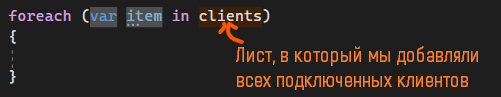

Внутри я хочу отправить сообщение этому клиенту. Для этого я сделаю отдельный метод-таск по отправке. Внутрь я также передам сокет-клиент и сообщение, которое я хочу отправить.

Этот метод я вызову внутри цикла. Опять же, ждать я этот метод не буду, пусть он на фоне одновременно отправит всем остальным клиентам это сообщение.

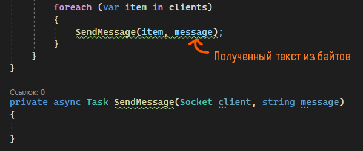

Внутри метода `SendMessage` мне опять необходимо преобразовать текст в массив байтов при помощи `Encoding.UTF8`, но уже для отправки я буду использовать не `RecieveAsync()`, а `SendAsync()`. Её содержимое идентично `RecieveAsync()` — массив с байтами и настройки сокета. Саму отправку я уже буду ждать.

![Код SendMessage: byte[] bytes = Encoding.UTF8.GetBytes(message); await client.SendAsync(bytes, SocketFlags.None); — оранжевые подписи «Получаем биты из текста», «Настройки нам не нужны, так что ставим None»](../../assets/wpf/tcp-ip/13_sendmessage_body_annotated.png)

### Запуск сервера

На этом создание сервера у нас будет окончено. Запустим приложение и увидим, что при первом запуске брандмауэр Windows просит нас разрешить доступ к другим компьютерам в этой сети. Обязательно разрешаем, так как иначе сокеты работать не будут.

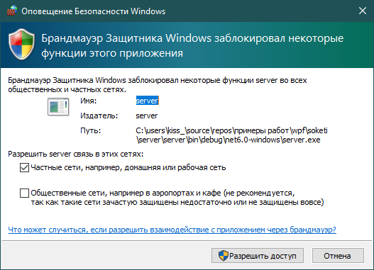

Разрешили, запустили, и видим, что приложение работает — уже хорошо. Чтобы посмотреть его полный функционал, нам осталось написать клиент.

## Клиент

Для клиента я создам отдельное приложение с очень простым интерфейсом — списком с сообщениями, текстовым полем `MessageTxt`, и кнопкой «Отправить». Каждый раз, когда мы будем получать сообщение от сервера, мы будем добавлять их внутрь списка `MessagesLbx`.

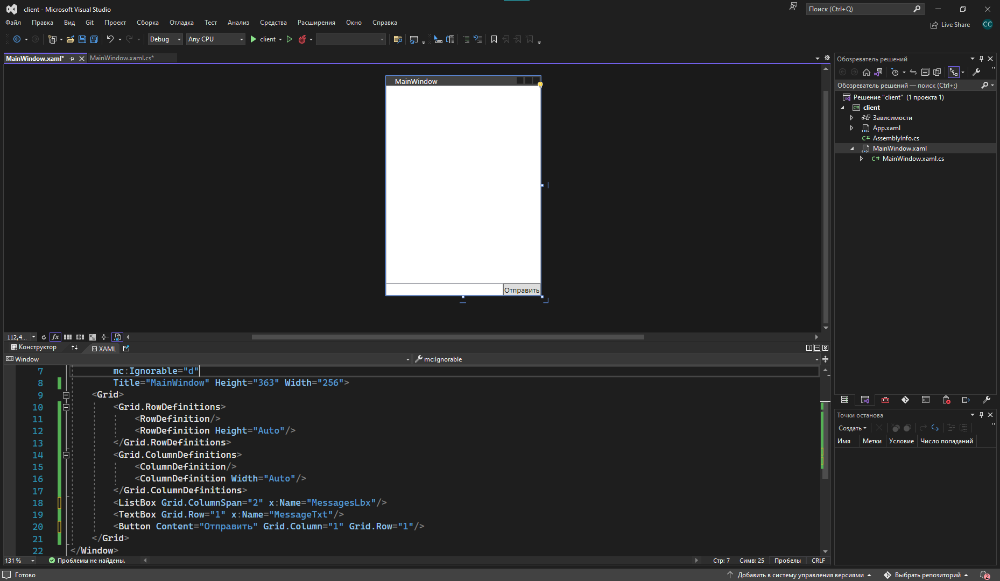

### Подключение к серверу

Начнем с того, что прямо при запуске окна мы должны подключиться к нашему серверу, так что код я буду писать сразу после `InitializeComponent()`. Делаем мы это следующим образом:

Также, как и на сервере, нам нужно создать сокет. Сокет будет иметь те же параметры — внутри сети, работать через поток через протокол TCP/IP. Сразу сделаю сокет глобальной переменной, чтобы я могла взаимодействовать с ним везде. В данном случае, это будет сокет, к которому я подключаюсь, так что это будет сокет сервера.

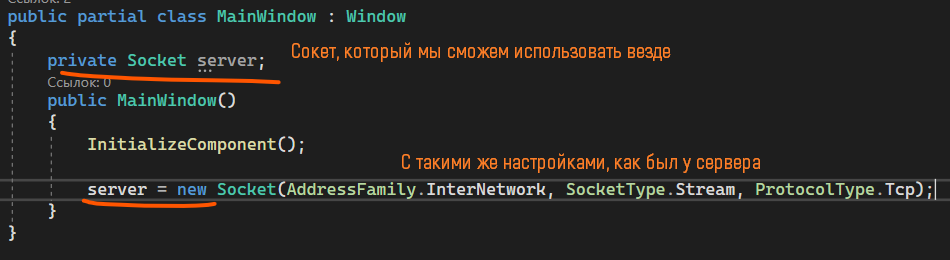

Теперь, подключимся к серверу при помощи `server.Connect(<IP адрес>, <порт>);`. Порт мы возьмем тот же, что и указали в коде — `8888`, а вот с IP интереснее. Если я проверяю работу приложения на своем локальном компьютере, я впишу адрес `127.0.0.1` — локалхост. Если я проверяю работу на других компьютерах, я впишу адрес компьютера, на котором запущен сервер. Для такой проверки используйте Radmin VPN или любое другое приложение, при помощи которого вы в майнкрафт по локалке играли или прочее. Подождем подключение, чтобы всё работало корректно.

```csharp
server.Connect("127.0.0.1", 8888);
```

### Перенос методов из сервера

После подключения я вольна делать всё что угодно — отправлять или получать сообщения с сервера. Вспомним, что мы уже писали для сервера методы по отправке и получению данных, так что я скопирую и вставлю код из другого проекта.

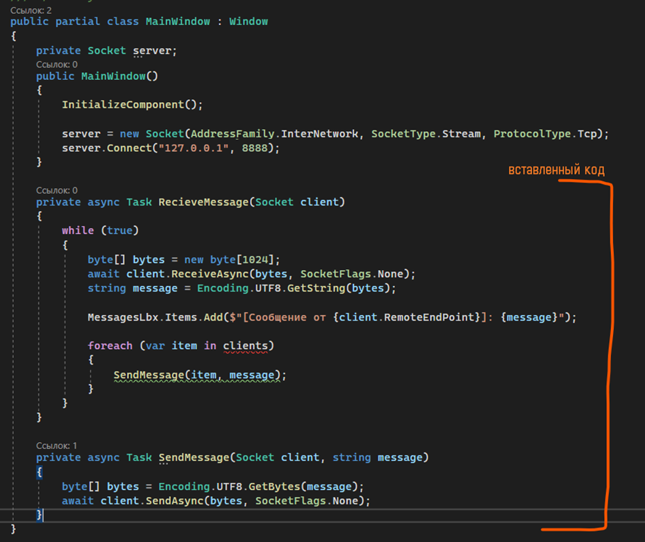

Видоизменю эти методы под нужды клиента.

- Самому клиенту уже не нужно отправлять сообщения всем клиентам разом, так что `foreach` и его содержимое я удалю.
- Сообщение внутрь `ListBox` также видоизменю — просто вставлю полученное сообщение.
- Все параметры `client` из `Send` и `RecieveMessage` я удалю и заменю его на мою переменную `server`, так как я жду/отправляю сообщения только в него.

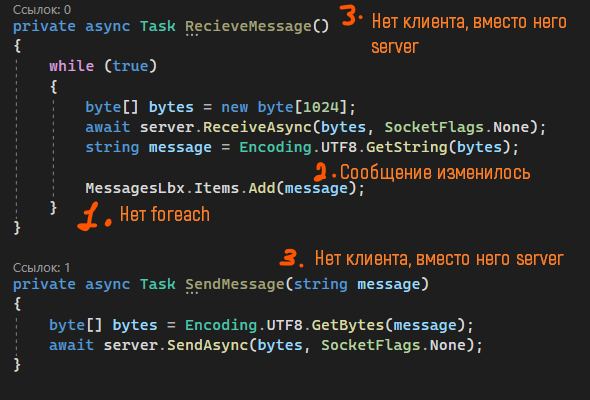

### Вызов методов из клиента

Осталось только в нужных местах вызвать эти методы.

Метод `RecieveMessage()` я вызову сразу после подключения к серверу. Опять же, ждать его я не буду, он будет получать сообщения на фоне.

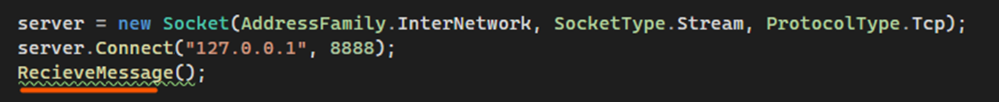

`SendMessage()` я помещу внутрь нажатия на кнопку, чтобы отправлять сообщение. Внутрь метода передам текст из текстбокса `MessageTbx`.

```csharp
private void Button_Click(object sender, RoutedEventArgs e)
{
    SendMessage(MessageTxt.Text);
}
```

### Проверка

Осталось проверить как всё работает. Запущу 1 приложение-сервер и 2 приложения-клиента, дважды нажав на незаполненный плей в Visual Studio. Начну отправлять сообщения из одного приложения и из другого. Так будет выглядеть сообщение из одного клиента, и так будет выглядеть из другого.

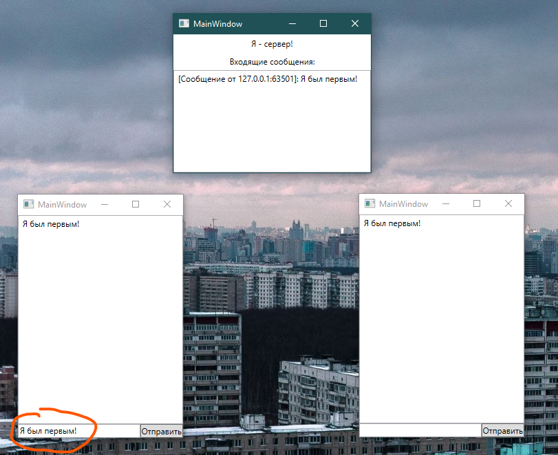


При помощи такого кода мы можем подключать сколько угодно приложений-клиентов, до тысячи (столько же, сколько мы указали в `Listen`).

Дальнейший функционал можно настраивать согласно тому, какое именно сообщение нам пришло. Например, если сообщение содержит `/username` (`if (message.Contains("/username"))`), значит внутри него будет имя пользователя, которое нужно обрезать и прочее. Таким образом мы можем работать с основой передачи данных в локальной сети.

## Полный код примера

### Сервер

`server/MainWindow.xaml` — простой интерфейс с лог-листом входящих:

```xml
<Window x:Class="server.MainWindow"
        xmlns="http://schemas.microsoft.com/winfx/2006/xaml/presentation"
        xmlns:x="http://schemas.microsoft.com/winfx/2006/xaml"
        Title="Я — сервер" Height="367" Width="256">
    <Grid>
        <Grid.RowDefinitions>
            <RowDefinition Height="Auto"/>
            <RowDefinition/>
        </Grid.RowDefinitions>
        <TextBlock Text="Входящие сообщения" HorizontalAlignment="Center" Margin="10"/>
        <ListBox Grid.Row="1" x:Name="MessagesLbx" Margin="10"/>
    </Grid>
</Window>
```

`server/MainWindow.xaml.cs` — слушаем подключения, принимаем сообщения, рассылаем всем:

```csharp
using System.Collections.Generic;
using System.Net;
using System.Net.Sockets;
using System.Text;
using System.Threading.Tasks;
using System.Windows;

namespace server
{
    public partial class MainWindow : Window
    {
        private Socket socket;
        private List<Socket> clients = new List<Socket>();

        public MainWindow()
        {
            InitializeComponent();

            IPEndPoint ipPoint = new IPEndPoint(IPAddress.Any, 8888);
            socket = new Socket(AddressFamily.InterNetwork, SocketType.Stream, ProtocolType.Tcp);
            socket.Bind(ipPoint);
            socket.Listen(1000);

            ListenToClients();
        }

        private async Task ListenToClients()
        {
            while (true)
            {
                var client = await socket.AcceptAsync();
                clients.Add(client);
                RecieveMessage(client);
            }
        }

        private async Task RecieveMessage(Socket client)
        {
            while (true)
            {
                byte[] bytes = new byte[1024];
                await client.ReceiveAsync(bytes, SocketFlags.None);
                string message = Encoding.UTF8.GetString(bytes);

                MessagesLbx.Items.Add($"[Сообщение от {client.RemoteEndPoint}]: {message}");

                foreach (var item in clients)
                {
                    SendMessage(item, message);
                }
            }
        }

        private async Task SendMessage(Socket client, string message)
        {
            byte[] bytes = Encoding.UTF8.GetBytes(message);
            await client.SendAsync(bytes, SocketFlags.None);
        }
    }
}
```

### Клиент

`client/MainWindow.xaml` — список сообщений, поле ввода, кнопка «Отправить»:

```xml
<Window x:Class="client.MainWindow"
        xmlns="http://schemas.microsoft.com/winfx/2006/xaml/presentation"
        xmlns:x="http://schemas.microsoft.com/winfx/2006/xaml"
        Title="MainWindow" Height="367" Width="256">
    <Grid>
        <Grid.RowDefinitions>
            <RowDefinition/>
            <RowDefinition Height="Auto"/>
        </Grid.RowDefinitions>
        <ListBox x:Name="MessagesLbx" Margin="10"/>
        <Grid Grid.Row="1">
            <Grid.ColumnDefinitions>
                <ColumnDefinition/>
                <ColumnDefinition Width="Auto"/>
            </Grid.ColumnDefinitions>
            <TextBox x:Name="MessageTxt" Margin="10"/>
            <Button Grid.Column="1" Content="Отправить" Margin="10" Click="Button_Click"/>
        </Grid>
    </Grid>
</Window>
```

`client/MainWindow.xaml.cs` — подключение к `127.0.0.1:8888`, приём и отправка через тот же сокет:

```csharp
using System.Net.Sockets;
using System.Text;
using System.Threading.Tasks;
using System.Windows;

namespace client
{
    public partial class MainWindow : Window
    {
        private Socket server;

        public MainWindow()
        {
            InitializeComponent();

            server = new Socket(AddressFamily.InterNetwork, SocketType.Stream, ProtocolType.Tcp);
            server.Connect("127.0.0.1", 8888);
            RecieveMessage();
        }

        private void Button_Click(object sender, RoutedEventArgs e)
        {
            SendMessage(MessageTxt.Text);
        }

        private async Task RecieveMessage()
        {
            while (true)
            {
                byte[] bytes = new byte[1024];
                await server.ReceiveAsync(bytes, SocketFlags.None);
                string message = Encoding.UTF8.GetString(bytes);
                MessagesLbx.Items.Add(message);
            }
        }

        private async Task SendMessage(string message)
        {
            byte[] bytes = Encoding.UTF8.GetBytes(message);
            await server.SendAsync(bytes, SocketFlags.None);
        }
    }
}
```
