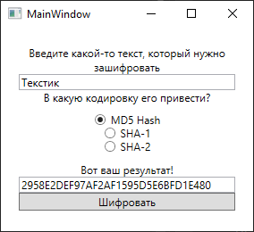
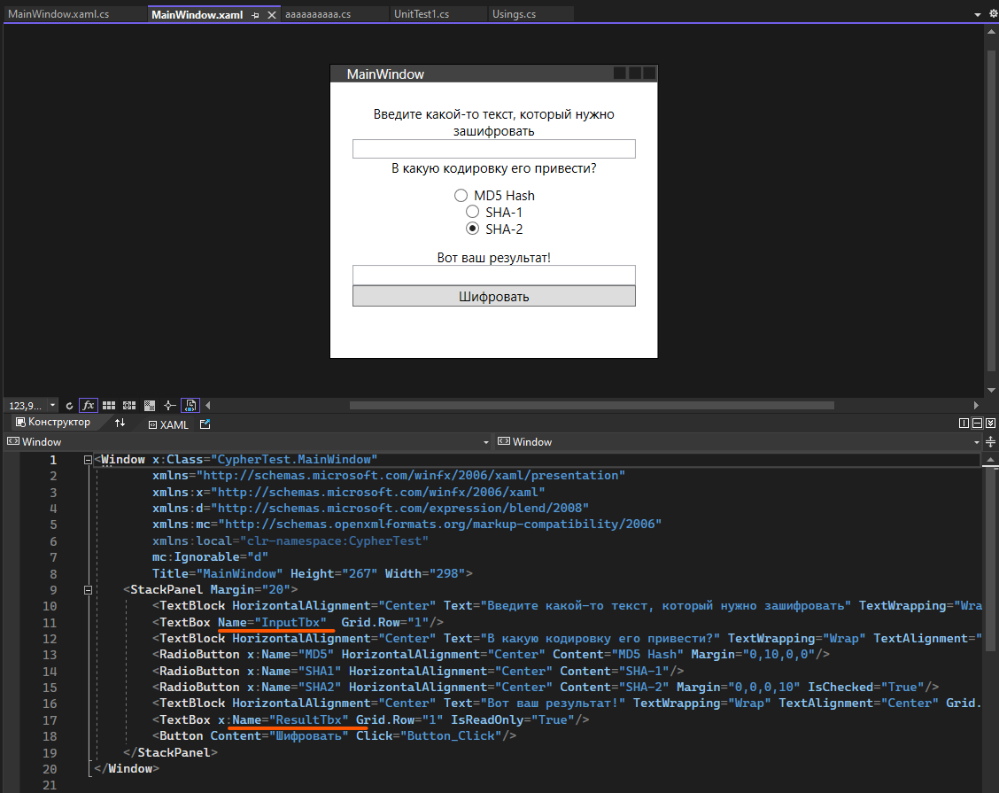
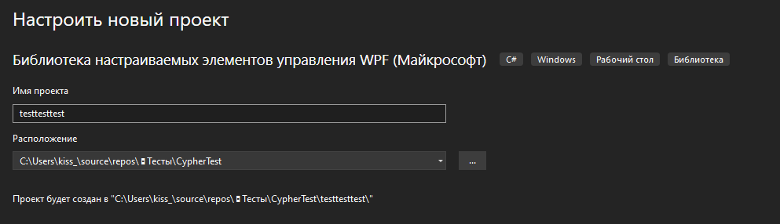
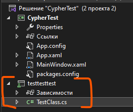
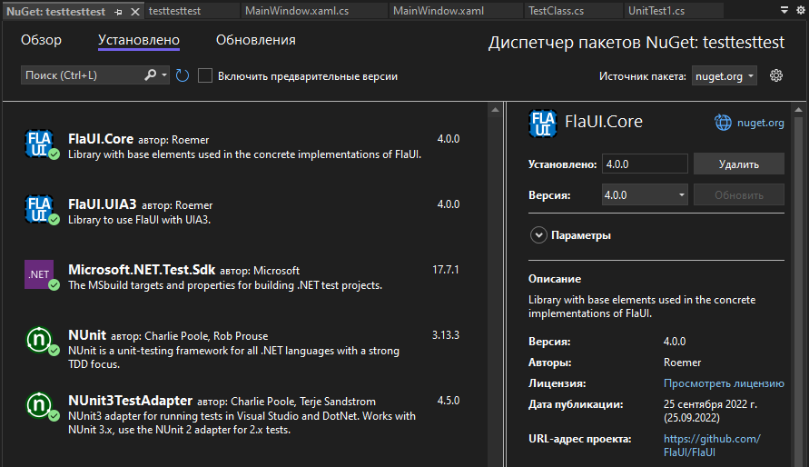
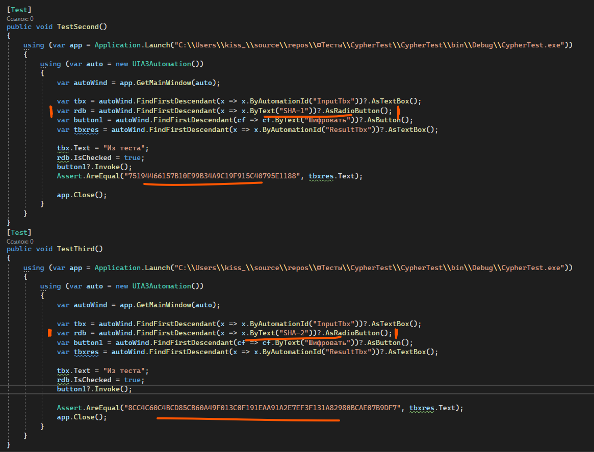
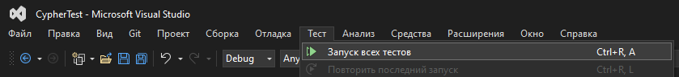

## UI-тесты — тест интерфейса

Если мы постоянно тестируем какой-то функционал, мы можем его автоматизировать, чтобы не тратить наши человеко-часы на постоянное нажимание кнопок. [Код тестировать](/csharp/tests) мы уже научились, теперь научимся и интерфейс тестировать.

Для этого нам понадобится библиотека FlaUI. Тестирование мы будем также проводить при помощи [NUnit](/csharp/tests).

Для тестирования я создала маленькое приложение — пользователь вводит текст, выбирает шифровку, и ему отображается этот текст в хешированном виде.



Вёрстка выглядит следующим образом. Обратите внимание, что текстовые поля названы как `InputTbx` и `ResultTbx`, это понадобится для будущего тестирования.



Код для кнопки просто оформляет нужное хеширование в зависимости от выбранного пункта — MD5, SHA-1 и SHA-2, а потом выводит её в текстовое поле `ResultTbx`.

```csharp
private void Button_Click(object sender, RoutedEventArgs e)
{
    StringBuilder sb = new StringBuilder();
    byte[] result;

    if (MD5.IsChecked.Value)
    {
        using (MD5 md5 = System.Security.Cryptography.MD5.Create())
        {
            result = md5.ComputeHash(Encoding.UTF8.GetBytes(InputTbx.Text));
        }
    }
    else if (SHA1.IsChecked.Value)
    {
        using (SHA1Managed sha1 = new SHA1Managed())
        {
            result = sha1.ComputeHash(Encoding.UTF8.GetBytes(InputTbx.Text));
        }
    }
    else
    {
        using (SHA256Managed sha1 = new SHA256Managed())
        {
            result = sha1.ComputeHash(Encoding.UTF8.GetBytes(InputTbx.Text));
        }
    }

    foreach (byte b in result)
    {
        sb.Append(b.ToString("X2"));
    }

    ResultTbx.Text = sb.ToString();
}
```

## Создание тестового проекта

Для тестирования такого приложения нам нужна библиотека, которая будет поддерживать WPF. Создадим её прямо внутри решения с приложением. Сделаем библиотеку пользовательских или настраиваемых элементов управления WPF, не важно, главное, чтобы библиотека поддерживала WPF.

Назову её как `testtesttest`. Я создаю приложение «Майкрософт», работу на .NET Framework не проверяла.



Из библиотеки мне надо удалить все сгенерированные файлы и создать свой новый класс для тестов — `TestClass` например.



Для проекта также необходимо докачать несколько библиотек. Начнем с библиотек для тестирования, они такие же, как и для [тестирования функционала](/csharp/tests) — NUnit, NUnit Test Adapter и `Microsoft.NET.Test.Sdk`. А для автоматизации интерфейса необходимы 2 библиотеки — `FlaUI.Core` и `FlaUI.UIA3`.



Вспоминая проект с NUnit, первоначальный класс с тестами выглядит следующим образом:

```csharp
namespace TestProject1
{
    public class Tests
    {
        [SetUp]
        public void Setup()
        {
        }

        [Test]
        public void Test1()
        {
            Assert.Pass();
        }
    }
}
```

В случае с UI-тестами, каждый тест будет выглядеть следующим образом:

```csharp
using FlaUI.Core;
using FlaUI.Core.AutomationElements;
using FlaUI.UIA3;
using NUnit.Framework;

namespace testtesttest
{
    public class TestClass
    {
        [SetUp]
        public void Setup()
        {
        }

        [Test]
        public void Test1()
        {
            using (var app = Application.Launch("путь до программы"))
            {
                using (var auto = new UIA3Automation())
                {
                    var autoWind = app.GetMainWindow(auto);

                    /*
                     * код для проверки. Сюда же вставляются Assert
                     * Assert.Pass();
                     */

                    app.Close();
                }
            }
        }
    }
}
```

`Application.Launch()` будет запускать приложение, которое мы собрались тестировать. `Application` обязательно должен быть из библиотеки FlaUI.

`UIA3Automation()` отвечает за автоматические действия в приложении.

`app.GetMainWindow(auto)` берет главное отображаемое окно, с которым мы уже начнем работать. `MainWindow` здесь это не файл `MainWindow.xaml`, а самое первое активное, главное (main) окно.

Уже внутри кода, при помощи переменной `autoWind` мы будем брать переменные, читать/изменять их значения, и проверять через [Assert](/csharp/tests).

## Структура UI-теста

Для моего примера я хочу сделать 3 теста, проверку на правильное хеширование данных для MD5, SHA-1 и SHA-2. Для всех трех тестов возьму условное значение для хеширования — «Из теста».

На сторонних сайтах найду, какое значение должно получиться из этого текста в 3-х разных хешированиях:

- Из теста (MD5) — `0DF12831A29337900C506EF7DF93D3B8`
- Из теста (SHA-1) — `75194466157B10E99B34A9C19F915C40795E1188`
- Из теста (SHA2-256) — `8CC4C60C4BCD85CB60A49F013C0F191EAA91A2E7EF3F131A82980BCAE07B9DF7`

И начну писать тест. Последовательность теста будет следующая:

- В текстовое поле `InputTbx` вводится текст «Из теста».
- Выбирается нужный радиобаттон в зависимости от теста — MD5, SHA-1 или SHA-2.
- Нажимается кнопка «Шифровать».
- Берётся текст из текстового поля `ResultTbx`.
- Через `Assert` сравниваем ожидаемый результат (из блока сверху) с тем, что получился в `ResultTbx`. Если они равны — тест пройден.

## Поиск элементов и взаимодействие

Для начала нам необходимо взять все объекты для тестирования. Взять мы их можем несколькими способами: найти объект по его содержимому, по подсказке внутри объекта (актуально для `TextBox`), по его имени в XAML, по тому, что это за объект (`TextBox`, `RadioButton`).

Для себя самыми актуальными вариантами я нашла следующие варианты: по содержимому и по имени в XAML.

```csharp
// Берётся следующим образом
// Из текущего окна берётся первый объект, который он найдёт в XAML по нужному условию.
// Потом говорим вид объекта, который мы берём
var tbx = autoWind.FindFirstDescendant(x => x.ByAutomationId("InputTbx"))?.AsTextBox();    // ByAutomationId — взять по имени в XAML
var rdb = autoWind.FindFirstDescendant(x => x.ByText("MD5 Hash"))?.AsRadioButton();         // ByText — взять по содержимому в объекте
```

В конце мы всегда должны указать что за объект мы ожидаем на выходе — текстовое поле, текстовый блок, флаг и т.п. Тоже самое проворачиваем и со всеми другими объектами, которые мне понадобятся для теста — два текстовых поля, флаг, кнопка.

```csharp
using (var auto = new UIA3Automation())
{
    var autoWind = app.GetMainWindow(auto);

    var tbx     = autoWind.FindFirstDescendant(x  => x.ByAutomationId("InputTbx"))?.AsTextBox();    // InputTxt — текстовое поле, куда вводим значение
    var rdb     = autoWind.FindFirstDescendant(x  => x.ByText("MD5 Hash"))?.AsRadioButton();        // MD5 Hash — беру радиобаттон, где внутри написано MD5 Hash
    var button1 = autoWind.FindFirstDescendant(cf => cf.ByText("Шифровать"))?.AsButton();           // Шифровать — беру кнопку, где внутри написано Шифровать
    var tbxres  = autoWind.FindFirstDescendant(x  => x.ByAutomationId("ResultTbx"))?.AsTextBox();   // ResultTbx — текстовое поле, откуда берём значение
}
```

Уже так мы можем с ними взаимодействовать — они подключены к окну. Взаимодействие точно такое же, как и в обычном коде: `имя.Свойство = значение` (`tbx.Text = "текст"` и прочее). Меняется только нажатие на какие-то объекты — вместо вызова `Click` тут будет `Invoke`.

Сделаем то, что задумывали: введём текст в текстовое поле, поставим галочку на нужном флаге и нажмём на кнопку.

```csharp
tbx.Text = "Из теста";
rdb.IsChecked = true;
button1.Invoke();
```

Потом, при помощи `Assert`, проверим, верное ли значение мы получили по итогу.

```csharp
Assert.AreEqual("0DF12831A29337900C506EF7DF93D3B8", tbxres.Text);
```

И в конце у нас закрывается это окно. Вот полный тест:

```csharp
[Test]
public void TestFirst()
{
    using (var app = Application.Launch("C:\\Users\\kiss_\\source\\repos\\◘Тесты\\CypherTest\\CypherTest\\bin\\Debug\\CypherTest.exe"))
    {
        using (var auto = new UIA3Automation())
        {
            var autoWind = app.GetMainWindow(auto);

            var tbx     = autoWind.FindFirstDescendant(x  => x.ByAutomationId("InputTbx"))?.AsTextBox();
            var rdb     = autoWind.FindFirstDescendant(x  => x.ByText("MD5 Hash"))?.AsRadioButton();
            var button1 = autoWind.FindFirstDescendant(cf => cf.ByText("Шифровать"))?.AsButton();
            var tbxres  = autoWind.FindFirstDescendant(x  => x.ByAutomationId("ResultTbx"))?.AsTextBox();

            tbx.Text = "Из теста";
            rdb.IsChecked = true;
            button1.Invoke();
            Assert.AreEqual("0DF12831A29337900C506EF7DF93D3B8", tbxres.Text);

            app.Close();
        }
    }
}
```

Остальные 2 теста будут выглядеть таким же образом, только радиобаттон будет меняться, а также сам тест в `Assert`.



Так как все методы помечены атрибутом `Test`, то и запускать мы их будем через тесты.



Как вы понимаете, FlaUI можно использовать не только в качестве тестов, но и внутри основного приложения. Логика такая же — запуск приложения, создание автоматизации, поиск главного окна, и уже через него берутся объекты, на которые можно нажимать, менять, блокировать и прочее.

## Полный код примера

Все три теста для MD5, SHA-1 и SHA-2 в одном классе:

```csharp
using FlaUI.Core;
using FlaUI.Core.AutomationElements;
using FlaUI.UIA3;
using NUnit.Framework;

namespace testtesttest
{
    public class TestClass
    {
        private const string AppPath = "C:\\путь\\до\\CypherTest.exe";

        [Test]
        public void TestMD5()
        {
            RunCipherTest("MD5 Hash", "0DF12831A29337900C506EF7DF93D3B8");
        }

        [Test]
        public void TestSHA1()
        {
            RunCipherTest("SHA-1", "75194466157B10E99B34A9C19F915C40795E1188");
        }

        [Test]
        public void TestSHA2()
        {
            RunCipherTest("SHA-2", "8CC4C60C4BCD85CB60A49F013C0F191EAA91A2E7EF3F131A82980BCAE07B9DF7");
        }

        private void RunCipherTest(string rdbText, string expectedHash)
        {
            using (var app = Application.Launch(AppPath))
            using (var auto = new UIA3Automation())
            {
                var autoWind = app.GetMainWindow(auto);

                var tbx     = autoWind.FindFirstDescendant(x  => x.ByAutomationId("InputTbx"))?.AsTextBox();
                var rdb     = autoWind.FindFirstDescendant(x  => x.ByText(rdbText))?.AsRadioButton();
                var button1 = autoWind.FindFirstDescendant(cf => cf.ByText("Шифровать"))?.AsButton();
                var tbxres  = autoWind.FindFirstDescendant(x  => x.ByAutomationId("ResultTbx"))?.AsTextBox();

                tbx.Text = "Из теста";
                rdb.IsChecked = true;
                button1.Invoke();

                Assert.AreEqual(expectedHash, tbxres.Text);

                app.Close();
            }
        }
    }
}
```
