Практически со всеми файлами C# нам позволяет работать при помощи встроенных функций. Практически. Word и Excel выбиваются из этой категории, потому что они по факту не файлы, а архивы. Но нам всё равно придется с ними работать, так что давайте разбираться.

Для работы с ними мы будем использовать библиотеку `Spire.Office`. Внутри них есть 2 библиотеки — `Spire.Doc` — для ворда и `Spire.Xls` — для экселя. Создам пустое приложение и докачаю туда эту библиотеку. Бесплатную версию конечно же.

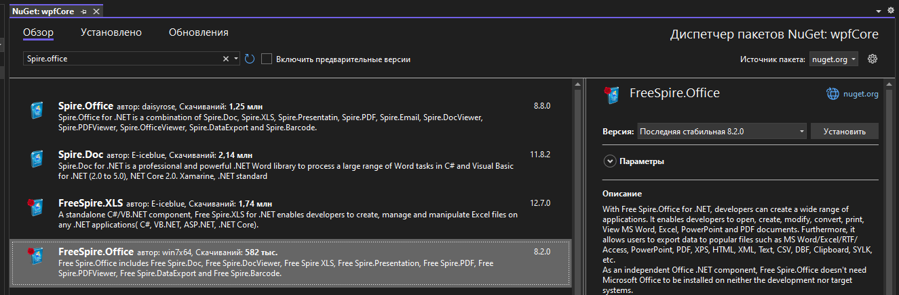

Работать мы начнем с ворда. Разберём загрузку и выгрузку файлов из Word-файла в `RichTextBox` (спойлер — файл нужно будет конвертировать в RTF и обратно).

## Word

Создам вот такой интерфейс для нашей задумки. `RichTextBox` назову как `rtb`.

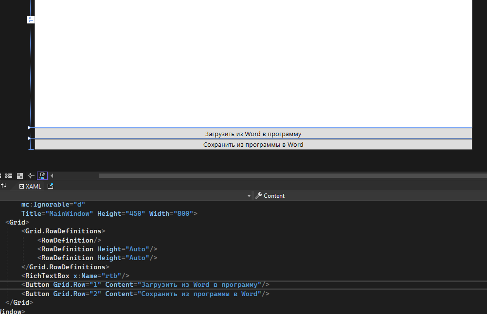

### Загрузка Word в RichTextBox

Сначала сделаем загрузку, чтобы нам было с чем работать.

Работа с документами всегда начинается с создания `Document`. Уже потом загружаем туда данные в одном формате, и можем выгрузить в другом. Так и поступим.

Создам документ и при помощи `LoadFromFile` выгружу данные из заранее подготовленного вордовского документа. Выглядит он вот так и валяется у меня на рабочем столе.

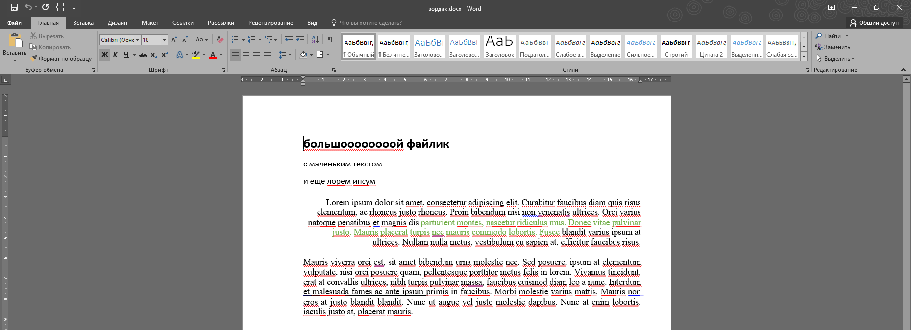

Для работы с `Document` мне нужно через `Alt+Enter` (или лампочку или ПКМ → Быстрые действия и рефакторинг) добавить библиотеку `Spire.Doc`.

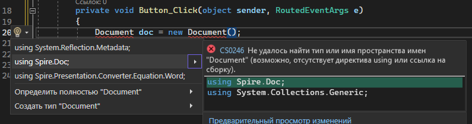

И загружаю через `LoadFromFile`. После этого `doc` будет содержать все данные из ворда.

```csharp
private void Button_Click(object sender, RoutedEventArgs e)
{
    Document doc = new Document();
    doc.LoadFromFile(@"D:/Рабочий стол/вордик.docx");
}
```

Чтобы отобразить эти данные в `RichTextBox`, нам нужно этот файл сохранить в формате `Rtf`, а затем, используя чтение файла `Rtf` из [прошлой лекции](/wpf/richtextbox), загрузить его обратно в приложение.

Сохраняю файл при помощи `SaveToFile`. Кроме пути (который будет являться просто название файла, чтобы он сохранил его в проект), мне также нужно указать его формат при помощи `FileFormat`. Выберу `Rtf`.

```csharp
Document doc = new Document();
doc.LoadFromFile(@"D:/Рабочий стол/вордик.docx");
doc.SaveToFile("конвертировали.rtf", FileFormat.Rtf);
```

(Кроме `Rtf` вы также можете сохранить файл в огромное количество вариаций, начиная от версий ворда и заканчивая форматом электронной книги — `epub`.)

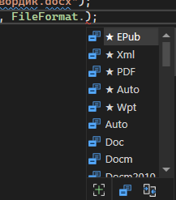

И теперь, при помощи кода из [предыдущей лекции](/wpf/richtextbox), возьму всё содержимое из файла «конвертировали.rtf» и выгружу его в `RichTextBox`.

```csharp
var range = new TextRange(rtb.Document.ContentStart, rtb.Document.ContentEnd);
var fs = new FileStream("конвертировали.rtf", FileMode.OpenOrCreate);
range.Load(fs, DataFormats.Rtf);
fs.Close();
```

Запустим программу и посмотрим, как прекрасно работает выгрузка.

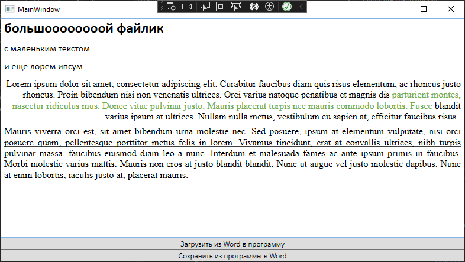

### Сохранение RichTextBox в Word

Для сохранения данных из программы в файл нужно сделать те же действия, но наоборот. Обработаем нажатие на 2 кнопку — сохранить.

Загрузим все данные из `RichTextBox` в файл «конвертанули.rtf» (но уже не при помощи `load`, а через `save` и вместо `OpenOrCreate` — `Create`).

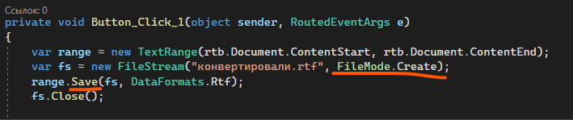

```csharp
private void Button_Click_1(object sender, RoutedEventArgs e)
{
    var range = new TextRange(rtb.Document.ContentStart, rtb.Document.ContentEnd);
    var fs = new FileStream("конвертировали.rtf", FileMode.Create);
    range.Save(fs, DataFormats.Rtf);
    fs.Close();
}
```

Создам `Document` и загружу туда данные из этого файлика.

```csharp
Document d = new Document();
d.LoadFromFile("конвертировали.rtf");
```

А затем сохраню этот файл в формате `Docx` на рабочий стол (или куда вам нужно).

```csharp
d.SaveToFile(@"D:/Рабочий стол/из проги.docx", FileFormat.Docx);
```

Запущу программу, введу какой-нибудь отформатированный текст.

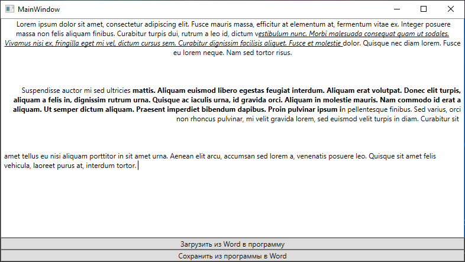

Сохраню и проверю рабочий стол. Здесь всё хорошо, можем приступить к Excel.

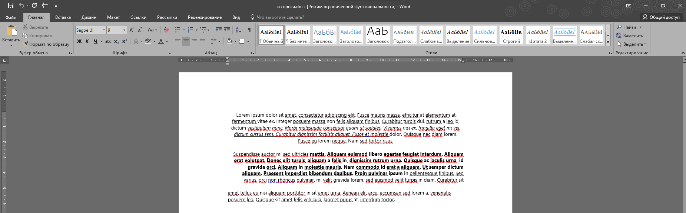

## Excel

Логика тут похожа на вордовскую, только таблицу мы будем выгружать не в `RichTextBox`, а в `DataGrid`. Заменю `RichTextBox` на `DataGrid` и поменяю название на `griiiiiiid`.

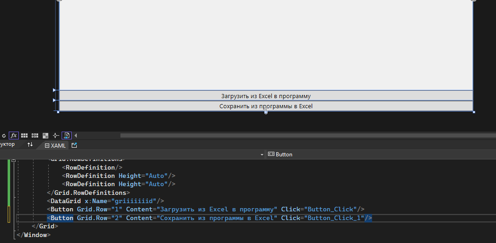

Код очищу.

```csharp
private void Button_Click(object sender, RoutedEventArgs e)
{
    // загрузить в прогу
}

private void Button_Click_1(object sender, RoutedEventArgs e)
{
    // сохранить из проги
}
```

### Загрузка Excel в DataGrid

Также начнем с загрузки данных из файла. Если в Word всё начиналось с `Document`, то здесь всё начинается с `Workbook` — книги.

```csharp
Workbook wb = new Workbook();
```

В книгу мы также загружаем данные из файла. Тестовый файл также валяется на рабочем столе и выглядит вот так. Данные специально разрозненные, чтобы программе плохо было.


Загружаем также — при помощи `LoadFromFile`.

```csharp
Workbook wb = new Workbook();
wb.LoadFromFile(@"D:/Рабочий стол/ок.xlsx");
```

А дальше начинается интересное. Книга состоит из листов, в листах есть ячейки. Нам нужно это всё поэтапно взять, чтобы мы смогли нужные ячейки поместить в датагрид.

```csharp
Worksheet sheet = wb.Worksheets[0];           // Сначала берём первую страницу
CellRange locatedRange = sheet.AllocatedRange; // Потом берём область ячеек, в которых есть данные
```

Всё это нам понадобится, чтобы сделать `DataTable` — таблицу с данными. Её мы уже можем поставить как источник данных для датагрида (вспомните учебную практику, там мы брали таблицу при помощи `GetData()`. Этот метод возвращал нам `DataTable` и мы спокойно пихали его в таблицу).

Таблицу с данными можно взять при помощи `ExportDataTable` у страницы. Внутрь этого метода нужно поместить область ячеек, и сказать, что первая строка — это столбцы.

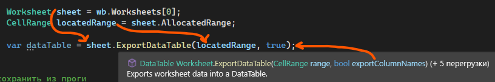

Эту `DataTable` ставим как источник, с припиской `DefaultView`, так как напрямую таблицу он не принимает, только `DataView`.

```csharp
var dataTable = sheet.ExportDataTable(locatedRange, true);
griiiiiiid.ItemsSource = dataTable.DefaultView;
```

Запускаем и смотрим. Даже если названий для колонок не хватило, WPF заменит пустоту на дефолтное название колонки — `Column1`, `2` … `n`, чтобы отобразить все пустые ячейки, которые находились в нужном диапазоне и разместить всё правильно. Все ячейки также можно менять, можно добавлять строки.

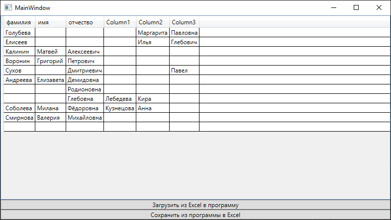

Единственное, к чему нужно делать дополнительный функционал — к добавлению колонок. Но здесь нюанс — если я поставила источником данных `DataTable`, то и колонки мне надо добавлять к `DataTable`, а потом снова поставить его как источник данных.

### Сохранение DataGrid в Excel

Перейдём к сохранению таблички из программы. Для этого возьмём `ItemsSource` как `DataView` и сохраним её в переменную.

```csharp
private void Button_Click_1(object sender, RoutedEventArgs e)
{
    var dataTable = griiiiiiid.ItemsSource as DataView;
}
```

Для сохранения таблицы в файл также создадим книгу и страницу. Страницу сразу добавим в книгу при помощи `Add`, назвав как угодно, например, `Лист 1`.

```csharp
var dataTable = griiiiiiid.ItemsSource as DataView;

Workbook wb = new Workbook();
Worksheet sheet = wb.Worksheets.Add("Лист 1");
```

Внутрь листа загрузим данные о таблице при помощи `ImportDataView` (потому что вытянули мы тоже `view`). Внутрь метода мы укажем таблицу, есть ли названия колонок, и по какому индексу расположить таблицу — индекс строки и индекс колонки. По умолчанию `1` и `1`.

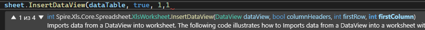

```csharp
sheet.InsertDataView(dataTable, true, 1, 1);
```

А затем, также с помощью `SaveToFile` сохраняем всю книгу на рабочий стол. В формате указываем версию экселя. Если не знаете в какую версию — создайте экселевский файл, откройте учетную запись и посмотрите какого года у вас офис.

Однако может появится проблема — `FileFormat` может подсвечиваться красным.

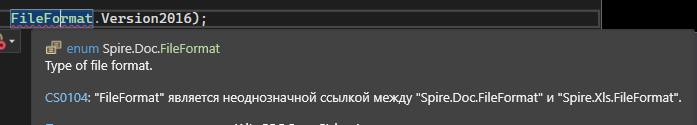

Такое может быть, если у нас импортированы сразу две библиотеки — `Spire.Doc` и `Spire.Xls`. Код не может решить, из какой именно нужно взять `FileFormat`, о чём он и говорит.

Всё что нужно — спереди дописать что именно я использую. Если я сохраняю вордовский файл — перед `FileFormat` напишу `Spire.Doc`. Сохраняю экселевский — напишу `Spire.Xls`.

```csharp
wb.SaveToFile(@"D:/Рабочий стол/из проги.xlsx", Spire.Xls.FileFormat.Version2016);
```

Сохраним, запустим, и проверим как всё это работает. Например, я удалила несколько строк внизу.

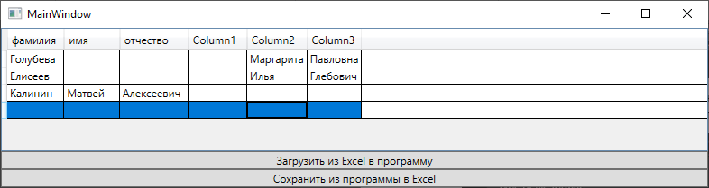

Выгружаем в файл и видим, что всё выгрузилось прекрасно.


Кроме одного — я заметила, что у меня слишком много листов внизу.


Чтобы от этого избавиться, мне нужно немного доработать свой код с сохранением. В тот момент, когда я создаю книгу, мне нужно добавить строчку очищения всех листов, что были до этого. И тогда новых листов появляться не будет.

```csharp
Workbook wb = new Workbook();
wb.Worksheets.Clear();
```

## Полный код примера

`MainWindow.xaml` (вариант для Word) — `RichTextBox` и две кнопки:

```xml
<Window x:Class="WpfApp1.MainWindow"
        xmlns="http://schemas.microsoft.com/winfx/2006/xaml/presentation"
        xmlns:x="http://schemas.microsoft.com/winfx/2006/xaml"
        Title="MainWindow" Height="450" Width="800">
    <Grid>
        <Grid.RowDefinitions>
            <RowDefinition/>
            <RowDefinition Height="Auto"/>
            <RowDefinition Height="Auto"/>
        </Grid.RowDefinitions>
        <RichTextBox x:Name="rtb"/>
        <Button Grid.Row="1" Content="Загрузить из Word в программу" Click="Button_Click"/>
        <Button Grid.Row="2" Content="Сохранить из программы в Word" Click="Button_Click_1"/>
    </Grid>
</Window>
```

`MainWindow.xaml.cs` для Word — Document.LoadFromFile/SaveToFile + TextRange:

```csharp
using System.IO;
using System.Windows;
using System.Windows.Documents;
using Spire.Doc;

namespace WpfApp1
{
    public partial class MainWindow : Window
    {
        public MainWindow()
        {
            InitializeComponent();
        }

        private void Button_Click(object sender, RoutedEventArgs e)
        {
            Document doc = new Document();
            doc.LoadFromFile(@"D:/Рабочий стол/вордик.docx");
            doc.SaveToFile("конвертировали.rtf", FileFormat.Rtf);

            var range = new TextRange(rtb.Document.ContentStart, rtb.Document.ContentEnd);
            var fs = new FileStream("конвертировали.rtf", FileMode.OpenOrCreate);
            range.Load(fs, DataFormats.Rtf);
            fs.Close();
        }

        private void Button_Click_1(object sender, RoutedEventArgs e)
        {
            var range = new TextRange(rtb.Document.ContentStart, rtb.Document.ContentEnd);
            var fs = new FileStream("конвертировали.rtf", FileMode.Create);
            range.Save(fs, DataFormats.Rtf);
            fs.Close();

            Document d = new Document();
            d.LoadFromFile("конвертировали.rtf");
            d.SaveToFile(@"D:/Рабочий стол/из проги.docx", FileFormat.Docx);
        }
    }
}
```

`MainWindow.xaml.cs` для Excel — Workbook + Worksheet.AllocatedRange + ExportDataTable / InsertDataView:

```csharp
using System.Data;
using System.Windows;
using Spire.Xls;

namespace WpfApp1
{
    public partial class MainWindow : Window
    {
        public MainWindow()
        {
            InitializeComponent();
        }

        private void Button_Click(object sender, RoutedEventArgs e)
        {
            Workbook wb = new Workbook();
            wb.LoadFromFile(@"D:/Рабочий стол/ок.xlsx");

            Worksheet sheet = wb.Worksheets[0];
            CellRange locatedRange = sheet.AllocatedRange;

            var dataTable = sheet.ExportDataTable(locatedRange, true);
            griiiiiiid.ItemsSource = dataTable.DefaultView;
        }

        private void Button_Click_1(object sender, RoutedEventArgs e)
        {
            var dataTable = griiiiiiid.ItemsSource as DataView;

            Workbook wb = new Workbook();
            wb.Worksheets.Clear();
            Worksheet sheet = wb.Worksheets.Add("Лист 1");

            sheet.InsertDataView(dataTable, true, 1, 1);
            wb.SaveToFile(@"D:/Рабочий стол/из проги.xlsx", Spire.Xls.FileFormat.Version2016);
        }
    }
}
```
