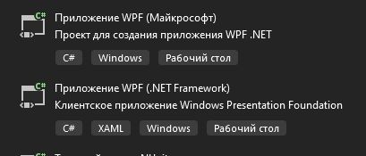
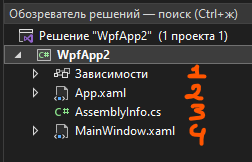
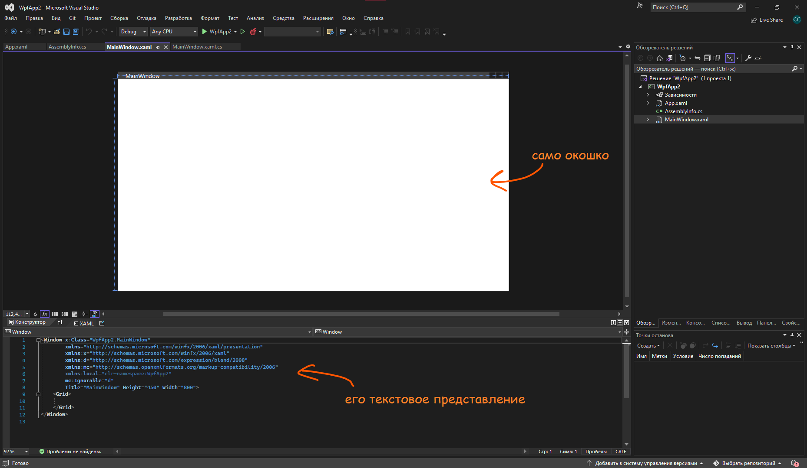
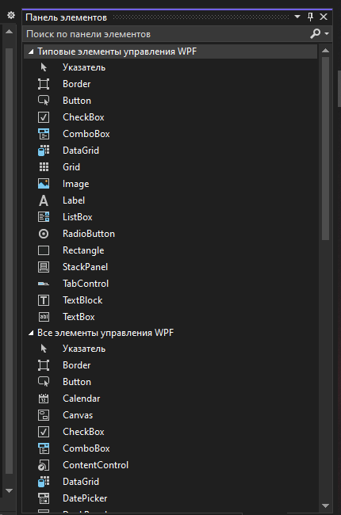
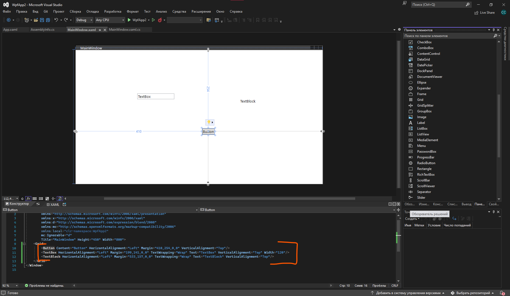
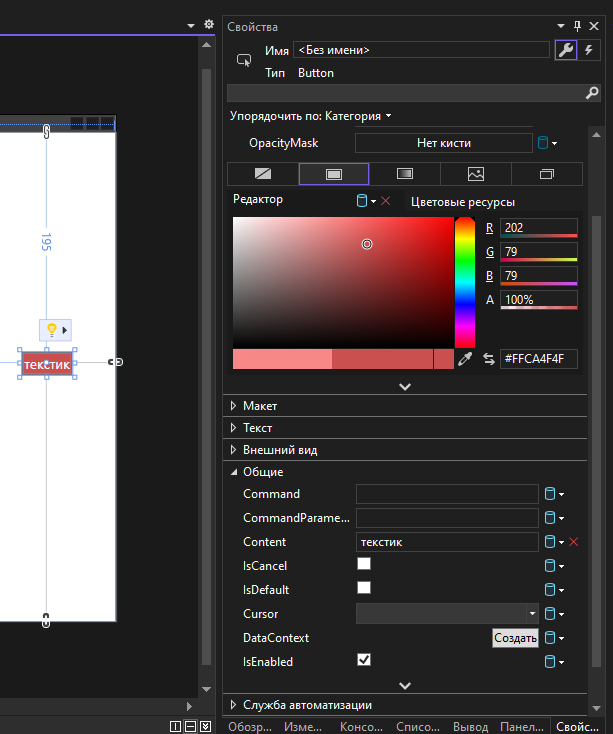

Мы наконец отходим от консоли и начинаем создавать полноценные оконные приложения на системе WPF — Windows Presentation Foundation. Давайте начнем с того, что мы просто создадим проект, и посмотрим из чего он состоит.

## Создание проекта

Для создания приложения WPF нам необходимо создать один из этих проектов. На данный момент, разницы нет. Разницы в версии .NET тоже нет, главное просто создать.



## Структура проекта

Как только мы создали и загрузили проект, перед нами появится окно с интерфейсом, но, чтобы лучше понять что за что отвечает в этом проекте, давайте посмотрим на его структуру в обозревателе решений.



Всего у нас 4 «файлика»:

1. **Зависимости.** Там хранится информация о всех подключенных пакетах.
2. **App.xaml.** Там хранится информация о приложении, например, именно там мы можем сказать, какое окно будет запускаться первым. Состоит из XAML-разметки — языка разметки для приложения, основанной на XML.
3. **AssemblyInfo.cs.** Внутри находится информация о сборке проекта, в принципе, для нас бесполезный файл.
4. **MainWindow.xaml.** Тут то вся магия и будет происходить. Это главное окно приложения, сам интерфейс. Этот файл состоит из двух — `MainWindow.xaml` и `MainWindow.xaml.cs`. Xaml отвечает за интерфейс, а xaml.cs — за логику этого интерфейса. Давайте его и рассмотрим.

Содержимое `App.xaml` выглядит так:

```xml
<Application x:Class="WpfApp2.App"
             xmlns="http://schemas.microsoft.com/winfx/2006/xaml/presentation"
             xmlns:x="http://schemas.microsoft.com/winfx/2006/xaml"
             xmlns:local="clr-namespace:WpfApp2"
             StartupUri="MainWindow.xaml">
    <Application.Resources>

    </Application.Resources>
</Application>
```

За первое запускаемое окно отвечает атрибут `StartupUri` — в нашем примере это `MainWindow.xaml`.

## Главное окно и Grid

Окно состоит из двух частей — из самого окошка (конструктора), и его текстового представления. Текстовое представление также использует язык разметки XAML. Внутри текстового представления мы можем увидеть, что сейчас окно состоит из большого тега `Window`, и какого-то `Grid` внутри. Если кратко, прямо в окне мы не можем начать что-то размещать, нам нужна какая-то сетка для размещения элементов. И именно `Grid` является этой сеткой.



## Панель элементов

Элементы на окне можно располагать двумя способами — вручную, прописывая их в XAML, и через панель элементов. Чтобы открыть панель элементов, необходимо открыть **Вид → Панель элементов**, либо нажать **Ctrl+Alt+X**. У нас откроется вот такое окно с элементами управления.



Логика создания элементов максимально простая — выбираете нужный вам элемент, и перетаскиваете его на экран. Быстро пробежимся по основным элементам:

- **Button** — кнопка, на нее можно нажимать (потрясающе).
- **TextBox** — текстовое поле для ввода.
- **TextBlock** или **Label** — обычный текст (например, туда можно пихнуть фразу «Добро пожаловать в мое приложение!» и человек не сможет его менять).
- **ComboBox** — список.
- **RadioButton** — флаг с одиночным выбором.
- **CheckBox** — флаг с множественным выбором.
- **Slider** — ползунок.
- **Image** — контейнер для картинки.

## Размещение элементов

Располагая несколько элементов на экране, мы видим, что они были созданы как в конструкторе, так и в XAML. Теперь, запуская проект, мы сразу увидим эти объекты и сразу сможем с ними взаимодействовать.



## Свойства элементов

Менять свойства этих элементов можно двумя способами — через окошко «Свойства», либо через XAML. Чтобы его открыть, необходимо правой кнопкой мыши нажать по любому из этих элементов и нажать на «Свойства». В этом окне будет максимально подробная настройка любого из этих объектов — текст внутри, фоновый цвет, ширина, высота, отцентровка, размер шрифта и прочее.



Как вы можете заметить, напротив каждого элемента написано его название, например, напротив текста написано `Content`. Чтобы менять свойства через XAML, нужно знать название этого элемента. Например, если я хочу поменять название элемента через XAML, внутри тэга `<Button/>` мне необходимо написать `Content="<значение>"`. То же самое и с другими свойствами.

```xml
<Button Content="текстик" Background="#FFCA4F4F" Foreground="White"/>
```

## Полный код примера

Соберём всё вместе. Файл `MainWindow.xaml` для приложения с одной кнопкой, у которой через XAML задан текст и цвета, выглядит так:

```xml
<Window x:Class="WpfApp2.MainWindow"
        xmlns="http://schemas.microsoft.com/winfx/2006/xaml/presentation"
        xmlns:x="http://schemas.microsoft.com/winfx/2006/xaml"
        xmlns:d="http://schemas.microsoft.com/expression/blend/2008"
        xmlns:mc="http://schemas.openxmlformats.org/markup-compatibility/2006"
        xmlns:local="clr-namespace:WpfApp2"
        mc:Ignorable="d"
        Title="MainWindow" Height="450" Width="800">
    <Grid>
        <Button Content="текстик" Background="#FFCA4F4F" Foreground="White"/>
    </Grid>
</Window>
```
